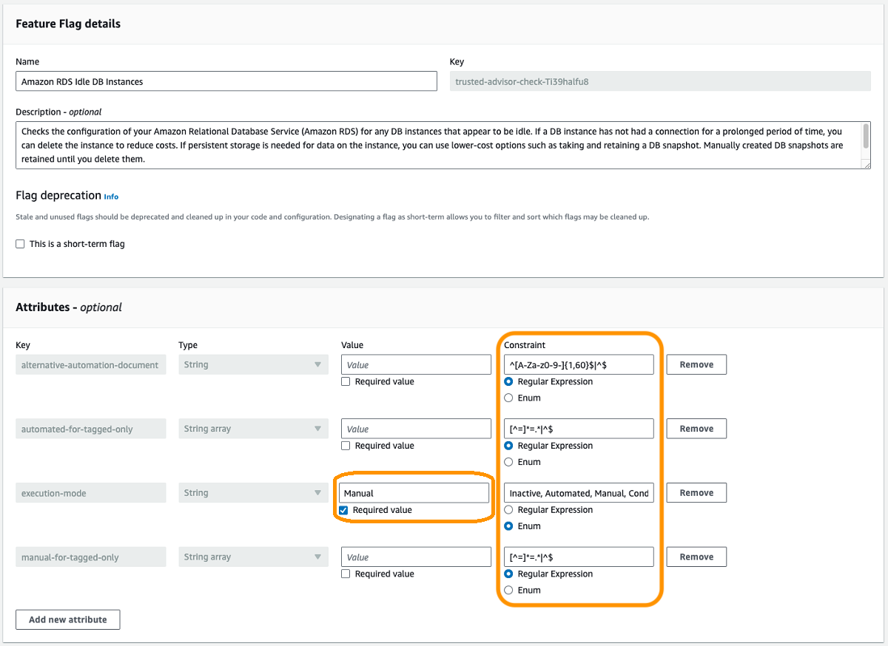
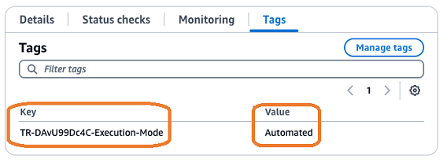

# Configure Trusted Advisor check remediation in Trusted Remediator

Configurations are stored in AWS AppConfig as part of the Trusted Remediator application. Each Trusted Advisor check category has a separate configuration profile.
For more information on Trusted Advisor categories, see
[View check categories](../../../awssupport/latest/user/get-started-with-aws-trusted-advisor.md#view-check-categories "../../../awssupport/latest/user/get-started-with-aws-trusted-advisor.md#view-check-categories").

You can request to configure remediations on a per-resource basis or per Trusted Advisor check basis. You can apply exceptions using resource tags.

###### Note

The remediation of Trusted Advisor findings is currently configured using AWS AppConfig, and this feature is fully supported today. AMS anticipates that this will change in the future.
It's a best practice to avoid building automations that depend on AWS AppConfig, as this method is subject to change. Be aware that you might need to update or modify automations built
around the current AWS AppConfig implementation in the future for compatibility.

Compute Optimizer -> EC2 instances feature flag has extra parameters:

- **allow-upscale** To allow upscale under-provisioned not-optimized EC2 instances. The default value is "false".
- **min-savings-opportunity-percentage** The minimum savings percentage opportunity for automated remediation.
  The default value is 10%

## Default remediation configurations

The configurations for individual Trusted Advisor checks are stored as AWS AppConfig flags. The flag name matches the check name. Each check configuration contains the following attributes:

- **execution-mode:** Determines how Trusted Remediator performs default remediation:
  - **Automated:** Trusted Remediator automatically remediates resources by creating an OpsItem, running the SSM document, and then resolving the OpsItem
    after successful execution.
  - **Manual:** An OpsItem is created, but the SSM document isn't executed automatically. You review the OpsItem and run remediation
    using the automated RFC. For more information, see [Work with remediations in Trusted Remediator](tr-remediation.md "tr-remediation.md").
  - **Conditional:** Remediation is disabled by default. You can enable it for specific resources using tags. For more information, see the following
    sections [Customize remediation with resource tags](#tr-con-rem-customize-tags "#tr-con-rem-customize-tags") and
    [Customize remediation with resource override tags](#tr-con-rem-resource-override "#tr-con-rem-resource-override").
  - **Inactive:** Remediation doesn't occur and no OpsItem are created. You can't override the execution mode for the Trusted Advisor check that's set to
    inactive.

- **preconfigured-parameters:** Enter values for SSM document parameters that are required for automated remediation, in the format of
  `Parameter=Value` , separated by a comma (,). See [Trusted Advisor checks supported by Trusted Remediator](tr-supported-checks.md "tr-supported-checks.md") for supported preconfigured
  parameters for the associated SSM document for each check.
- **alternative-automation-document:** This attribute helps override the existing automation document with another supported document (if available
  for the specific check). By default, this attribute isn't selected.

###### Note

The `alternative-automation-document` attribute doesn't support custom automation documents. You can use the existing supported Trusted Remediator
automation documents listed in [Trusted Advisor checks supported by Trusted Remediator](tr-supported-checks.md "tr-supported-checks.md").

For example, for check `Qch7DwouX1`, there are three associated SSM documents:
AWSManagedServices-StopEC2Instance, AWSManagedServices-ResizeInstanceByOneLevel, and AWSManagedServices-TerminateInstance. The value for
`alternative-automation-document` can be either AWSManagedServices-ResizeInstanceByOneLevel or AWSManagedServices-TerminateInstance
(AWSManagedServices-StopEC2Instance is the default SSM document to remediate `Qch7DwouX1`).

The value for each attribute must match the constraints of that attribute.

###### Tip

Before you apply the default configurations for your Trusted Advisor checks, it's a best practice to consider using the Resource tagging and Resource override features described
in the following sections. The default configurations apply to all resources within the account, which might not be desirable in all cases.

The following is an example console screenshot with the **execution-mode** set to **Manual** and the attributes matching
their constraints.



## Customize remediation with resource tags

The **automated-for-tagged-only** and **manual-for-tagged-only** attributes in the check configuration allow you to specify resource tags
for how you want to remediate individual checks. It's a best practice to use this method when you need to apply a consistent remediation behavior to a group of resources that
share the same tag or tags. The following are descriptions for these tags:

- **automated-for-tagged-only:** Specify resource tags (one or more tag pairs, comma separated) for checks to remediate automatically, regardless of the default execution mode.
- **manual-for-tagged-only:** Specify resource tags (one or more tag pairs, comma separated) for remediations that should be executed manually, regardless of the default execution mode.

For example, if you want to enable automated remediation for all non-production resources and enforce manual remediation for production resources, you might set your
configuration as follows:

```
"execution-mode": "Conditional",
"automated-for-tagged-only": "Environment=Non-Production",
"manual-for-tagged-only": "Environment=Production",

```

With the preceding configurations set on your resources, check remediation behavior is as follows:

- Resources tagged with 'Environment=Non-Production' are remediated automatically.
- Resources tagged with 'Environment=Production' require manual intervention for remediation.
- Resources without the 'Environment' tag follow the default execution mode (`Conditional`, in this case. So, no actions is taken on the remaining resources).

For additional support with your configurations, contact your Cloud Architect.

## Customize remediation with resource override tags

Resource override tags allow you to customize the remediation behavior for individual resources, regardless of their tags. By adding a specific tag to a resource, you override
the default execution mode for that resource and the Trusted Advisor check. The resource override tag takes precedence over the default configuration and the resource tagging settings.
So, if you set the default execution mode to **Automated**, **Manual**, or **Conditional** for a resource using the resource
override tag, it overrides the default execution mode and any resource tagging configurations.

To override the execution mode for a resource, complete the following steps:

1. Identify the resources for which you want to override the remediation configuration.
2. Determine the Trusted Advisor check ID for the check that you want to override. You can find the check IDs for supported Trusted Advisor checks in
   [Trusted Advisor checks supported by Trusted Remediator](tr-supported-checks.md "tr-supported-checks.md").
3. Add a tag to the resources with the following key and value using the
   [Tag | Update](../ctref/management-advanced-tag-update.md "../ctref/management-advanced-tag-update.md") or
   [Tag | Bulk Update](../ctref/management-advanced-tag-bulk-update.md "../ctref/management-advanced-tag-bulk-update.md") change type:
   - **Tag key:** `TR-`Trusted Advisor check ID`-Execution-Mode` (case-sensitive)

   In the preceding tag key example, replace `Trusted Advisor check ID` with the unique identified of the Trusted Advisor check that you want to override.
   - **Tag value:** Use one of the following values for the tag value:
     - **Automated:** Trusted Remediator automatically remediates the resource for this Trusted Advisor check.
     - **Manual:** An OpsItem is created for the resource, but remediation isn't performed automatically. You review and run the
       remediation using the automated. For more information, see [Work with remediations in Trusted Remediator](tr-remediation.md "tr-remediation.md").
     - **Inactive:** Remediation and OpsItem creation isn't performed for this resource and the specified Trusted Advisor check.

For example, to automatically remediate an Amazon EBS volume with the Trusted Advisor check ID `DAvU99Dc4C` add a tag to the EBS volume. The **tag key** is
`TR-DAvU99Dc4C-Execution-Mode` and the **tag value** is `Automated`.

The following is an example of the console showing the **Tags** section:


