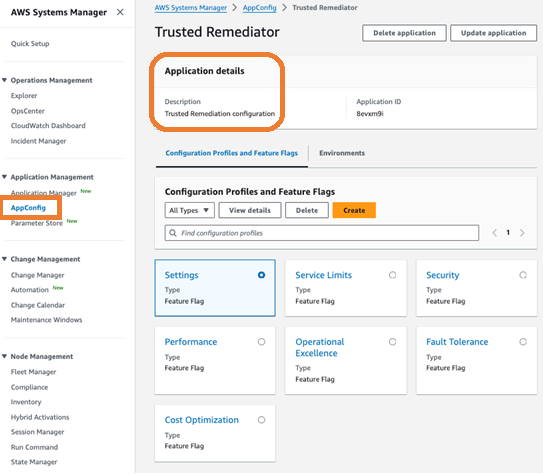

# Get started with Trusted Remediator in AMS

Trusted Remediator is available in AMS at no additional charge. Trusted Remediator supports single account and multi-account configurations.

## Onboard to Trusted Remediator

To onboard your AMS accounts to Trusted Remediator, email your Cloud Architects or Cloud Service Delivery Managers (CSDMs). In the email, include the following
information:

- **AWS accounts:** The twelve-digit account identification number. All accounts that you want to onboard to Trusted Remediator must belong to the
  same AMS Advanced customer.
  - **Delegated administrator account:** The account that is used for Trusted Advisor,
    Compute Optimizer and Security Hub CSPM check configuration for single or multiple accounts.
  - **Member accounts:** These are the accounts linked to the delegated administrator account. These accounts inherit the configurations from the
    delegated administrator account. You can have one member account or multiple member accounts.

  ###### Note

  Member accounts inherit the configurations from the delegated administrator account. If you need different configurations for specific accounts, then onboard
  multiple delegated administrator accounts with your preferred configurations. Plan the account structure and the configurations with your Cloud Architects before you
  onboard.

- **AWS Region:** The AWS Region where your resources are located. For a list of AWS Regions, see
  [AWS services by Region](https://aws.amazon.com/about-aws/global-infrastructure/regional-product-services/ "https://aws.amazon.com/about-aws/global-infrastructure/regional-product-services/").
- **Remediation schedule and time:** Your preferred remediation schedule (daily or weekly). Trusted Remediator gathers Trusted Advisor checks and initiates
  remediation at the scheduled time. For example, you can set the remediation schedule for 1:00 AM Sunday every week, Australian Eastern Standard Time.
- **Notification email:** Trusted Remediator uses the notification email to notify you daily if there are remediations.
  The notification email subject is "Trusted Remediator remediation summary" and the contents provide information on Trusted Remediator remediations run in the
  last 24 hours.

###### Note

Review your applications and resources after every scheduled remediation. For additional support, contact AMS.

After you submit your onboard request with the required details to your CA or CSDM, AMS onboards your accounts to Trusted Remediator. Trusted Remediator uses AWS AppConfig,
a capability of AWS Systems Manager, to define the configuration for the Trusted Advisor checks. These configurations are a set of attributes that are stored in AWS AppConfig. To prevent
unauthorized charges to your resources, all supported Trusted Advisor checks are set to **Inactive** when accounts are onboarded to Trusted Remediator. These
configurations help you to automatically remediate specific Trusted Advisor checks, or to assess and manually remediate the remaining checks. The configurations are
highly customizable, allowing you to apply configurations for each Trusted Advisor check. For more information, see
[Configure Trusted Advisor check remediation in Trusted Remediator](tr-configure-remediations.md "tr-configure-remediations.md").

## Configure Trusted Remediator in your AWS accounts

When onboarding is complete, your CA or CDSM notifies you and the default configurations are created in your delegated administrator AWS account.
The configuration is stored in AWS AppConfig under the Trusted Remediator application. You can use the RFC
[Management | Trusted Remediator | Remediation
configuration | Update](../ctref/management-trusted-remediation-configuration-update.md "../ctref/management-trusted-remediation-configuration-update.md") to request configuration updates. For more information, see
[Configure Trusted Advisor check remediation in Trusted Remediator](tr-configure-remediations.md "tr-configure-remediations.md").

To view the default Trusted Remediator configurations, complete the following steps:

1. Open the AWS Systems Manager console at [https://console.aws.amazon.com/systems-manager/](https://console.aws.amazon.com/systems-manager/ "https://console.aws.amazon.com/systems-manager/").

###### Note

Make sure that you're in the delegated administrator account. 2. Choose **Application Management**, **AppConfig**. 3. Select **Trusted Remediator** from the list of applications.

The following is an example of the AWS AppConfig console showing Trusted Remediator configurations:

## Choose the checks and recommendations to remediate

By default, remediation execution mode is **Inactive** for all
Trusted Advisor checks, Compute Optimizer recommendations, and Security Hub CSPM recommendations in your configuration. This
prevents unauthorized remediation and protects resources. AMS provides curated SSM
automation documents for Trusted Advisor check remediation.

To select the checks that you want to remediate with Trusted Remediator, complete the following steps:

1. Review the list of supported [Trusted Advisor](tr-supported-checks.md "tr-supported-checks.md"), [Compute Optimizer recommendations](tr-supported-recommendations-co.md "tr-supported-recommendations-co.md"), [Security Hub CSPM recommendations](tr-supported-sec-hub-recommendations.md "tr-supported-sec-hub-recommendations.md"), and the
   name of the associated SSM automation documents to decide which checks and
   recommendations you want to remediate with Trusted Remediator.
2. Submit a
   [Management | Trusted Remediator | Remediation configuration | Update](../ctref/management-trusted-remediation-configuration-update.md "../ctref/management-trusted-remediation-configuration-update.md") request to update configuration for your selected Trusted Advisor checks.
   For instructions on how to select checks, see [Configure Trusted Advisor check remediation in Trusted Remediator](tr-configure-remediations.md "tr-configure-remediations.md").

## Track your remediations in Trusted Remediator

After you update your account-level configuration, Trusted Remediator creates OpsItems for each remediation. Trusted Remediator runs the SSM document for automated remediation of
OpsItems according to
your remediation schedule. For instructions on how to view all remediation OpsItems from the Systems Manager OpsCenter console, see
[Track remediations in Trusted Remediator](tr-remediation.md#tr-remediation-track "tr-remediation.md#tr-remediation-track").

## Run manual remediations in Trusted Remediator

You can manually remediate Trusted Advisor checks using an automated RFC. When you choose manual remediation, Trusted Remediator creates a manual execution OpsItem.
For more information, see [Run manual remediations in Trusted Remediator](tr-remediation.md#tr-remediation-run "tr-remediation.md#tr-remediation-run").
