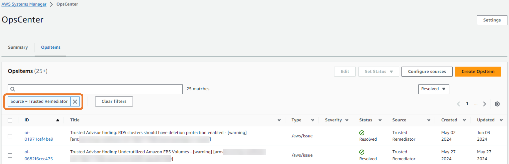
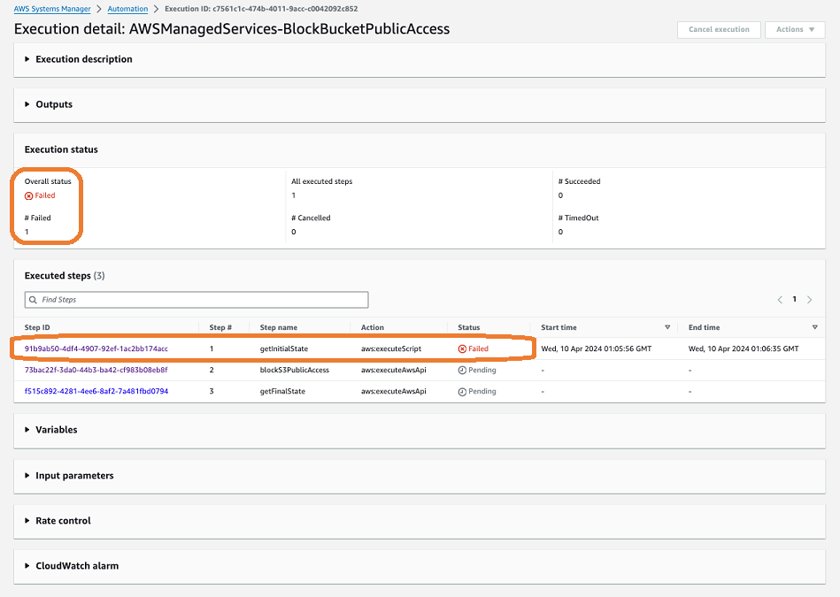

# Work with remediations in Trusted Remediator

## Track remediations in Trusted Remediator

To track OpsItems remediations, complete the following steps:

1. Open the AWS Systems Manager console at [https://console.aws.amazon.com/systems-manager/](https://console.aws.amazon.com/systems-manager/ "https://console.aws.amazon.com/systems-manager/").
2. Choose **Operations Management**, **OpsCenter**.
3. (Optional) Filter the list by **Source=Trusted Remediator** to include only Trusted Remediator OpsItems in the list.

The following is an example of the OpsCenter screen filtered by **Source=Trusted Remediator**:

###### Note

In addition to viewing OpsItems from the OpsCenter, you can view remediation logs in the AMS S3 bucket. For more information, see
[Remediation logs in Trusted Remediator](tr-logging.md "tr-logging.md").

## Run manual remediations in Trusted Remediator

Trusted Remediator creates OpsItems for checks configured for manual remediation. You must review these checks and begin the remediation process manually.

To manually remediate the OpsItem, complete the following steps:

1. Open the AWS Systems Manager console at [https://console.aws.amazon.com/systems-manager/](https://console.aws.amazon.com/systems-manager/ "https://console.aws.amazon.com/systems-manager/").
2. Choose **Operations Management**, **OpsCenter**.
3. (Optional) Filter the list by **Source=Trusted Remediator** to include only Trusted Remediator OpsItems in the list.
4. Choose the OpsItem that you want to review.
5. Review the operational data of the OpsItem. The operational data includes the following items:
   - **trustedAdvisorCheckCategory:** The category of the Trusted Advisor check ID. For example, Fault tolerance
   - **trustedAdvisorCheckId:** The unique Trusted Advisor check ID.
   - **trustedAdvisorCheckMetadata:** The resource metadata, including the resource ID.
   - **trustedAdvisorCheckName:** The name of the Trusted Advisor check.
   - **trustedAdvisorCheckStatus:** The status of the Trusted Advisor check detected for the resource.
   - **trustedAdvisorCheckManualRemediation:** The custom data that provides reference details for manual remediation.
     - **ManualExecutionInput:** An object that defines parameters that you can modify values for when executing manual remediation.
       - **DocumentName:** The name of the runbook (SSM document).
       - **CustomizableParameters:** Parameter names that you can modify.

     - **DefaultInput:** An object that defines parameter names and values to be used for manual remediation. The values populate based on preconfigured-parameters.

6. To manually remediate the OpsItem, complete the following steps:
   1. Use [Trusted Remediator | Finding | Remediate ct-1c7ch8z5phrjp](../ctref/management-trusted-finding-remediate.md "../ctref/management-trusted-finding-remediate.md") change type
   2. Enter values for the following parameters:
      - **DocumentName:** Must be `AWSManagedServices-RemediateTrustedRemediatorFinding`.
      - **Region:** The AWS Region, in the form us-east-1.
      - **Parameters:** Enter the manual remediation parameters:
        - **OpsItemId:** The ID of the Ops Item.
        - **RemediationDocumentName:** The name of the SSM automation document to use. The document must be associated with the Ops Item. If multiple documents are associated with the Ops Item, then the **DocumentName** must be specified.
        - **RemediationParameters:** A key/value map of parameters for the automation execution, in the form: `{\"`ParameterName1`\":[\"`ParameterValue1`\"],\"`ParameterName2`\":[\"`ParameterValue2`\"]}`. You can only use parameters that are present in the Ops Item **trustedAdvisorCheckManualRemediation CustomizableParameters**. If not specified, parameters and values are retrieved from the Ops Item.

   3. Choose **Run**. If there are no errors, then the **RFC successfully created** page displays with the submitted RFC details, and the initial **Run output**.
   4. Monitor the RFC execution's progress.
   5. After the execution completes, the OpsItem is resolved. If the RFC failed, then follow the steps in [Troubleshoot remediations in Trusted Remediator](#tr-remediation-troubleshoot "#tr-remediation-troubleshoot"). For additional troubleshooting support, contact AMS.

## Troubleshoot remediations in Trusted Remediator

For assistance with manual remediations and remediation failures, contact AMS.

To view remediation status and results, complete the following steps:

1. Open the AWS Systems Manager console at [https://console.aws.amazon.com/systems-manager/](https://console.aws.amazon.com/systems-manager/ "https://console.aws.amazon.com/systems-manager/").
2. Choose **Operations Management**, **OpsCenter**.
3. (Optional) Filter the list by **Source=Trusted Remediator** to include only Trusted Remediator OpsItems in the list.
4. Choose the OpsItem that you want to review.
5. In the **Automation Executions** section review the **Document Name** and **Status and results**.
6. Review the following common automation failures. If your issues isn't listed here, then contact your CSDM for assistance.

**Common remediation errors**

No executions associated with the OpsItem might indicate that the execution failed to start due to incorrect parameter values.

###### Troubleshooting steps

1. In the **Operational data**, review the `trustedAdvisorCheckAutoRemediation` property value.
2. Verify that the **DocumentName** and **Parameters** values are correct. For the correct values, review
   [Configure Trusted Advisor check remediation in Trusted Remediator](tr-configure-remediations.md "tr-configure-remediations.md") for details on how to configure SSM parameters. To review supported
   check parameters, see [Trusted Advisor checks supported by Trusted Remediator](tr-supported-checks.md "tr-supported-checks.md")
3. Verify that values in the SSM document match allowed patterns. To view parameters details in the document content, select the document name in the
   **Runbooks** section.
4. After you review and correct the parameters, manually remediate the OpsItem. For the remediation steps, see
   [Run manual remediations in Trusted Remediator](#tr-remediation-run "#tr-remediation-run").
5. To prevent this error from reoccurring, make sure that you configure the remediation with the correct **parameter** values in your
   configuration. For more information, see [Configure Trusted Advisor check remediation in Trusted Remediator](tr-configure-remediations.md "tr-configure-remediations.md")
   Remediation documents contain multiple steps that interact with AWS services performing various actions through APIs. To identify a specific cause for the
   failure, complete the following steps:

###### Troubleshooting steps

1. To view the individual execution steps, choose the **Execution ID**, link in the **Automation Executions** section.
   The following is an example of the Systems Manager console showing the **Exection steps** for a selected automation:

 2. Choose the step with the **Failed** status. The following are example error messages:

    * `NoSuchBucket - An error occurred (NoSuchBucket) when calling the GetPublicAccessBlock operation: The specified bucket does not exist`

    This error indicates that the incorrect bucket name was specified in the remediation configuration's preconfigured-parameters.

    To resolve this error, [manually run the automation](tr-remediation.md "tr-remediation.md") using the correct bucket name. To prevent this issue from reoccurring,
     [update the remediation configuration](tr-configure-remediations.md "tr-configure-remediations.md") with the correct bucket name.
    * `DB instance my-db-instance-1 is not in available status for modification.`

    This error indicates that the automation couldn't make the expected changes because the DB instance was in an invalid state.

    To resolve this error, [manually run the automation](tr-remediation.md "tr-remediation.md").
