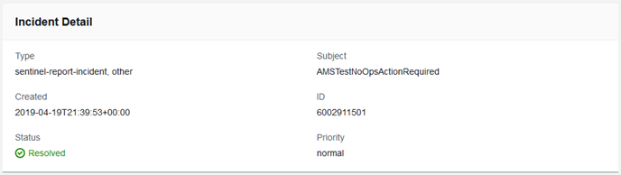

# Monitoring and updating service requests in AMS

You can update, monitor, and review incident reports and service requests, both called cases, by using
the AMS console, or programmatically using the Support API. For information on using the Support API, see
[`DescribeCases`](../../../awssupport/latest/APIReference/API_DescribeCases.md "../../../awssupport/latest/APIReference/API_DescribeCases.md") operation.

To monitor a case, incident or service request, using the AMS console, follow these steps.

1. In the AMS console **Incident reports** or **Service requests** dashboard,
   browse to a case and choose the **Subject** to open a details page with current status and correspondences.

When a reported incident or service request case is updated by the AMS operations team, you receive an email and a link to the incident in the AMS
console so you can respond. You can't respond to incident correspondence by replying to the email.

###### Important

You must have entered an email address to receive notifications of state change for a service request or incident case. Notifications only
go to the email address added to the case when it's created.

The link in the notification email will not work unless you are using an email server on your AMS federated network. However, you can respond to the
correspondence by going to your AMS console and using the case details page. 2. If there are many cases in the list, you can use the **Filter** option:

    * **All open** (default): Use this filter to see all cases that have not been resolved.
    * **Unassigned**: Use if you've just submitted the case and have not received any
     notice that the case state has changed. Note, incidents and service request cases are addressed with different promptness depending on the submitted
     priority (incidents) or your service level agreement (service requests).
    * **Open**: Use if you have received notice that the case is "Pending Amazon" action; this means that the case
     has been assigned but work has not yet begun.
    * **Reopened**: Use if you have received notice that the case was reopened after having been resolved.
    * **Work in progress**: Use if you have received notice that an operator has begun to work on the case.
    * **Pending customer action**: Use if you have received an operator request for action on your part.
    * **Customer action completed**: Use if you have received notice that your action on the case has been processed.
    * **Resolved**: Use to view cases that you know have been resolved. Resolved cases are maintained in history for twelve months.
    * **Any status**: Use this filter to see all cases, regardless of status.

3. To check the latest status, refresh the page.
4. If there are so many correspondences that they do not all appear on the page, choose **Load More**.
5. To provide an update to the case status, choose **Reply**, enter the new correspondence, and then choose **Submit**.
6. To close out the case after it has been resolved to your satisfaction, choose **Close case**.

Be sure to rate the service through the 1-5 star rating to let AMS know how we're doing!
