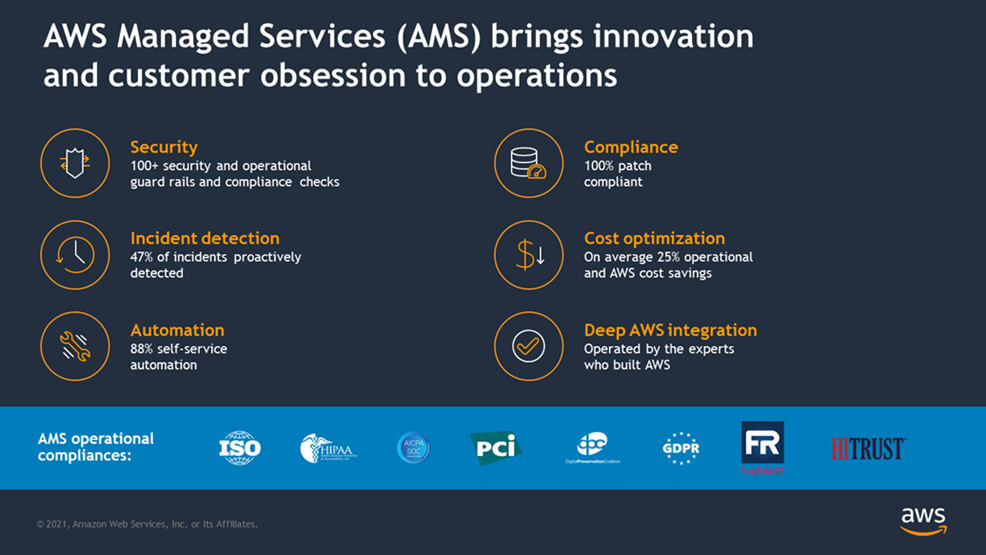
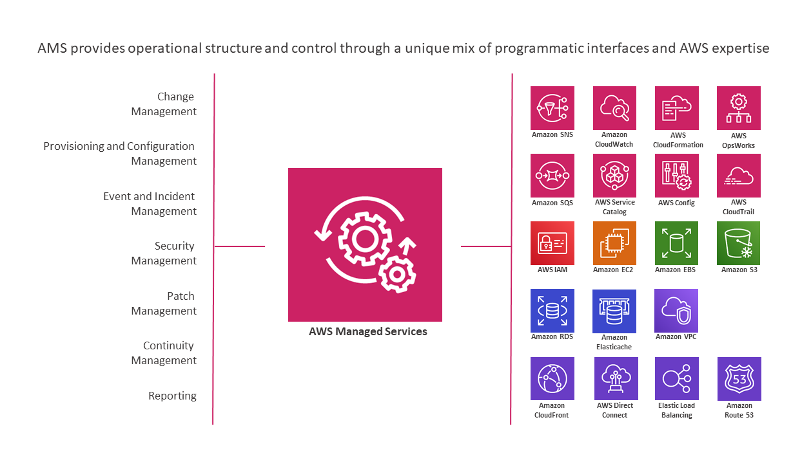

# What is AWS Managed Services?

Welcome to AWS Managed Services (AMS), infrastructure operations management for Amazon Web Services (AWS). AMS is an enterprise
service that provides ongoing management of your AWS infrastructure.

This user guide is intended for IT and application developer professionals. A basic understanding of
IT functionality, networking, and application deployment terms and practices is assumed.

AMS implements best practices and maintains your infrastructure to reduce your
operational overhead and risk. AMS provides full-lifecycle services to provision, run, and
support your infrastructure, and automates common activities such as change requests,
monitoring, patch management, security, and backup services. AMS enforces your corporate
and security infrastructure policies, and enables you to develop solutions and applications
using your preferred development approach.

To better understand AMS architecture, see
[these diagrams](https://d1.awsstatic.com/architecture-diagrams/ArchitectureDiagrams/AWS-managed-services-for-operational-excellence-ra.pdf "https://d1.awsstatic.com/architecture-diagrams/ArchitectureDiagrams/AWS-managed-services-for-operational-excellence-ra.pdf").

###### Topics

- [About this AMS user guide](#about-guide "#about-guide")
- [AMS operations plans](what-is-ams-op-plans.md "what-is-ams-op-plans.md")
- [Getting started with AWS Managed Services](get-start.md "get-start.md")
- [AMS key terms](key-terms.md "key-terms.md")
- [Service description](ams-sd.md "ams-sd.md")
- [AMS information resources](ams-info-resources.md "ams-info-resources.md")
- [AMS compliance](ams-compliance.md "ams-compliance.md")
- [AMS Amazon Machine Images (AMIs)](ams-amis.md "ams-amis.md")
- [How integration between AD FS and AMS works](how-integ-between-adfs-and-ams-works.md "how-integ-between-adfs-and-ams-works.md")
- [AMS Managed Active Directory](ams-managed-AD.md "ams-managed-AD.md")
- [AMS application deployments](ams-deployments.md "ams-deployments.md")

###### Note

New AWS Regions are added frequently. For the most recent AMS-supported AWS Regions, and the most recent
AMS-supported operating systems, see [Supported configurations](supported-configs.md "supported-configs.md").

To learn more about AWS Regions, see
[Managing AWS Regions](../../../general/latest/gr/rande-manage.md "../../../general/latest/gr/rande-manage.md").

AMS seeks to continuously improve our services based on your feedback. We use several mechanisms to enable
your self-service, to automate repetitive tasks,
and to implement new AWS services and features as they are released. You can submit an AMS service request at
any time to suggest new features or feature improvements.

AMS business hours are 24 hours a day, 7 days a week, 365 days a year.

AMS follows a set of practices for IT service management (ITSM) that focuses on aligning IT services with
the needs of your business.

## About this AMS user guide

This user guide is intended for AMS Advanced customers with either a multi-account or single-account landing zone.
For more details about the AMS landing zone offerings, see the
[AMS Key Terms](key-terms.md "key-terms.md"); also see
[Multi-Account Landing Zone architecture](malz-net-arch.md "malz-net-arch.md") and
[Single-Account Landing Zone architecture](ams-net-arch.md "ams-net-arch.md").
