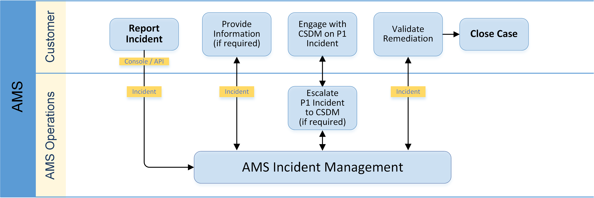
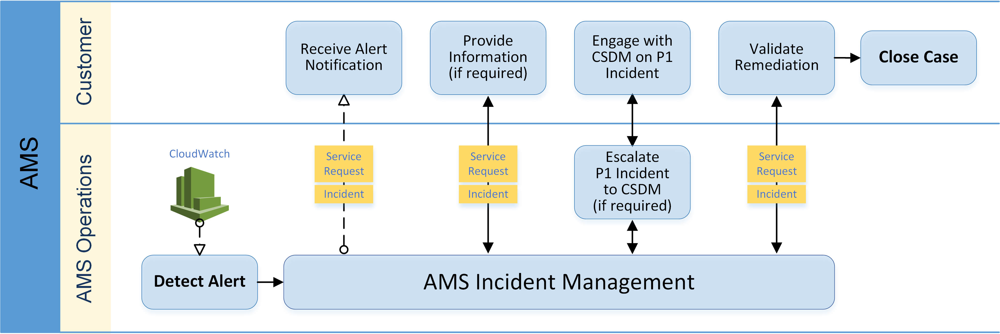

# What is incident management?

Incident management is the process AMS uses to record, act on,
communicate progress of, and provide notification of, active incidents.

The goal of the incident management process is to ensure that normal operation of your managed service is
restored as quickly as possible,
the business impact is minimized, and all concerned parties are kept informed.

Examples of incidents include (but are not restricted to) loss of or degradation of
network connectivity, a non-responsive process or API, or a scheduled task not being
performed (for example, a failed backup).

The following graphic depicts the workflow of an incident reported by you to AMS.

This graphic depicts the workflow of an incident reported by AMS to you.

## Incident priority

Incidents created in AWS Support center, console or Support API (SAPI), have different classifications than incidents
created in the AMS console.

- Low: Non-critical functions of your business service, or application, related to
  AWS or AMS resources are impacted.
- Medium: A business service or application related to AWS and/or AMS resources is
  moderately impacted and is functioning in a degraded state.
- High: Your business is significantly impacted. Critical functions of your application
  related to AWS and/or AMS resources are unavailable. Reserved for the most critical outages affecting
  production systems.

###### Note

The AWS Support Console offers five levels of incident priority that we translate to the three
AMS levels.

## Problem vs incident

When AMS believes that an incident reveals a larger defect or misconfiguration and could recur, it is
considered a problem rather than just an incident. In such
cases, AMS undertakes analyses of the problem and offers suggestions to resolve the problem.
