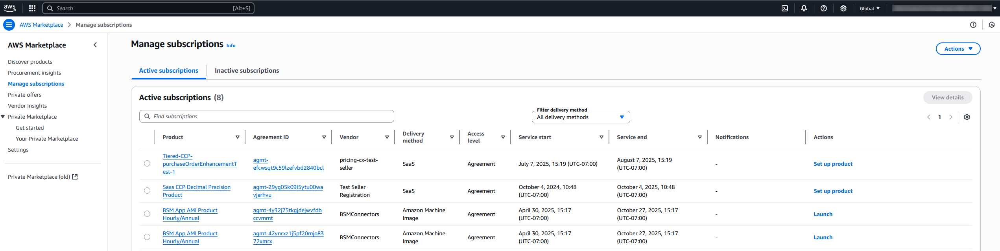
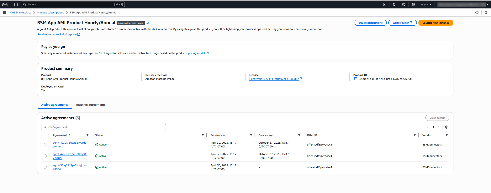
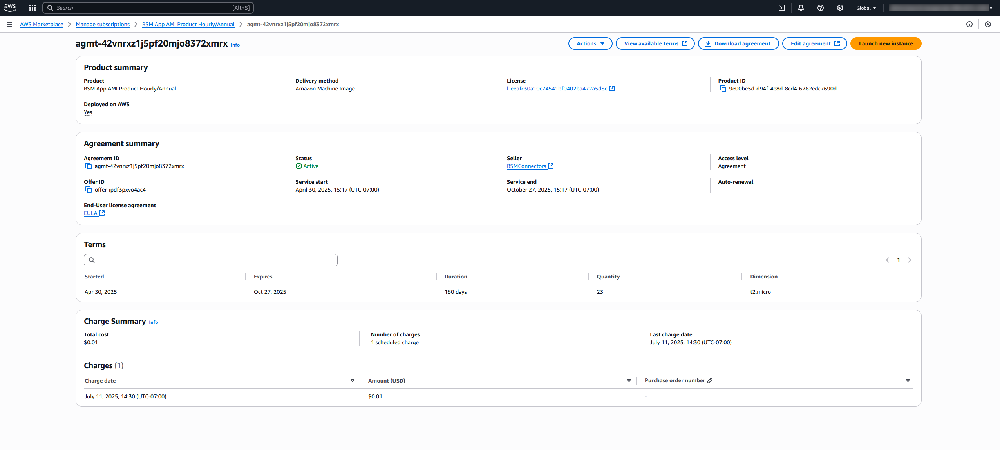

# Managing subscriptions in AWS Marketplace

You can view and manage your subscriptions in the AWS Marketplace console on the [**Manage subscriptions**](https://aws.amazon.com/marketplace/management/subscriptions "https://aws.amazon.com/marketplace/management/subscriptions") page.

## Viewing your subscriptions

The **Manage subscriptions** page displays all of your active and inactive subscriptions. You can use this page to:

- View subscription details including start and end dates, vendor information, and agreement status
- Access product-specific agreements
- View detailed agreement information

By default, the page displays your active subscriptions. You can toggle between **active** and **inactive** subscriptions using the tabs at the top of the page.

### Understanding subscription information

The **Manage subscriptions** page includes the following information for each subscription:

**Product**

The name of the product you've subscribed to. Choose the product name to view all active and inactive agreements related to this product on the **subscription detail** page.

**Start date**

The date when your subscription began.

**End date**

The date when your subscription will end or has ended.

**Vendor**

The company that provides the product.

**Agreement ID**

A unique identifier for your subscription agreement. Choose the agreement ID to view detailed information about the agreement.

**Agreement status**

The current status of your agreement. See the **Agreement status** section for more details.

### Agreement status

Your subscription agreements can have the following statuses:

| Status     | Description                                                                              |
| ---------- | ---------------------------------------------------------------------------------------- | ----------------------------------------------------------------------------------------------------------------------------------------------------------------------------------------------------------------------------------------------------------------------------------------------------------------------------------------------------------------------------------------------------------------------------------------------------------------------------------------------------------------------------------------------------------------------------------------------------------------------------------------------------------------------------------------------------------------------------------------------------------------------------------------------------------------------------------------------------------------------------------------------------------------------------------------------------------------------------------------------------------------------------------------------------------------------------------------------------------------------------------------------------------------------------------------------------------------------------------------------------------------------------------------------------------------------------------------------------------------------------------------------------------------------------------------------------------------------------------------------------------------------------------------- |
| Active     | Agreement terms are in effect.                                                           |
| Pending    | Agreement submitted and being processed. While processing, some actions are unavailable. |
| Expired    | Agreement ended on the contract end date.                                                |
| Renewed    | Agreement continues with a new agreement and updated terms.                              |
| Cancelled  | Agreement ended by your request.                                                         |
| Replaced   | Agreement ended and transitioned to a new offer.                                         |
| Terminated | Agreement ended prematurely by AWS.                                                      |
| Archived   | Agreement ended without a specified reason.                                              | Inactive agreements include those that are expired, cancelled, terminated, replaced, renewed, and archived. ## Viewing subscription details To view detailed information about a specific subscription, choose the product name in the **Manage subscriptions** page. This opens the **subscription detail** page, which shows all active and inactive agreements related to that product. The **subscription detail** page provides a comprehensive view of your relationship with a specific product, including all past and current agreements.  ## Viewing agreement details To view detailed information about a specific agreement, choose the agreement ID in either the **Manage subscriptions** page or the **subscription detail** page. This opens the **agreement detail** page, which provides comprehensive information about the agreement, including:  • Agreement terms and conditions  • Pricing information  • Charge summary and associated purchase orders  • [Purchase order details](buyer-purchase-orders.md "buyer-purchase-orders.md") (if applicable)  • Deployed on AWS status  • Option to download the agreement as a PDF From the **agreement detail** page, you can manage your subscription and access all related information in one place.  |
