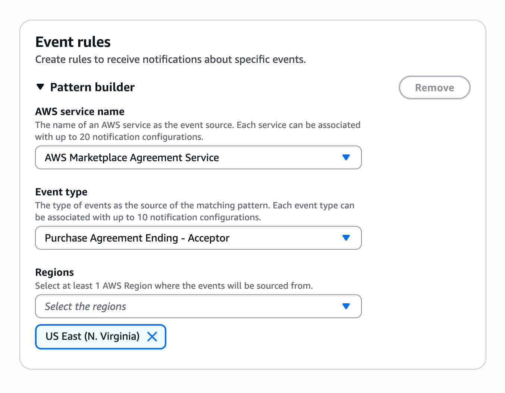

# Email and chatbot notifications for AWS Marketplace events

###### Default Email Notifications

As a buyer in AWS Marketplace, you automatically receive email notifications when the following events occur:

- You accept an offer
- A seller publishes a private offer set to your account
- A seller publishes a new private offer that is related to a private offer that you
  accepted previously
- A seller publishes an update to a previously accepted offer
- An agreement is expiring in the next 30, 60, or 90 days (contract model)
  These notifications are sent by default to the email address associated with your AWS account ID. No setup is required.

###### Note

If you are missing AWS Marketplace emails, check your spam folder or adjust email settings. Email
notifications from AWS Marketplace are sent from `no-reply@marketplace.aws`. Providers such
as Google and Yahoo may filter these. For instructions, see [Prevent valid emails from going to Spam (Google)](https://support.google.com/mail/answer/1366858?sjid=4026678185875351798-NA#unmark_spam "https://support.google.com/mail/answer/1366858?sjid=4026678185875351798-NA#unmark_spam") or [Block and unblock email addresses in Yahoo
Mail](https://help.yahoo.com/kb/SLN28140.html "https://help.yahoo.com/kb/SLN28140.html").

###### Custom Notifications with AWS User Notifications

For more flexibility and control, you can use _AWS User Notifications_ to route specific AWS Marketplace events to custom delivery channels. This allows you to:

- **Target specific teams** - Send agreement expiration notices to procurement, billing updates to finance teams, etc.
- **Choose delivery channels** - Receive notifications via email distribution lists, Amazon Chime, Microsoft Teams, or Slack
- **Create custom notification rules** - Configure exactly which events trigger notifications and who receives them

###### Example: Notifying Your Procurement Team About Expiring Agreements

If you'd like to notify your procurement team when agreements are expiring, you can:

1. Navigate to the AWS User Notifications Console
2. Find the **Notification Configurations** section
3. Click on **Create notification configuration**
4. Add a name and description
5. **Create an Event Rule:**
   - Choose **AWS Marketplace Agreement Service** as the service name
   - For event type, choose **Purchase Agreement Ending - Acceptor**
   - For the region, select the AWS Regions where your service data is located

6. **Add delivery channels:**
   - Choose email as your delivery channel
   - Enter your procurement team's distribution list email like `procurement@acme.org`
   - Save the notification configuration

###### Note

In order to verify the email address, make sure that a user with access to the AWS console is part of the distribution list. From there, you may add and remove emails to the list without having to verify again.

###### Learn More

For more information on AWS User Notifications, see the following topics:

- [AWS User Notifications User Guide](../../../notifications/latest/userguide/what-is-service.md "../../../notifications/latest/userguide/what-is-service.md")
- [Notification Configurations User Guide](../../../notifications/latest/userguide/managing-notifications.md "../../../notifications/latest/userguide/managing-notifications.md")
- [Creating your first notification configuration in AWS User Notifications](../../../notifications/latest/userguide/getting-started.md#getting-started-step1 "../../../notifications/latest/userguide/getting-started.md#getting-started-step1")
