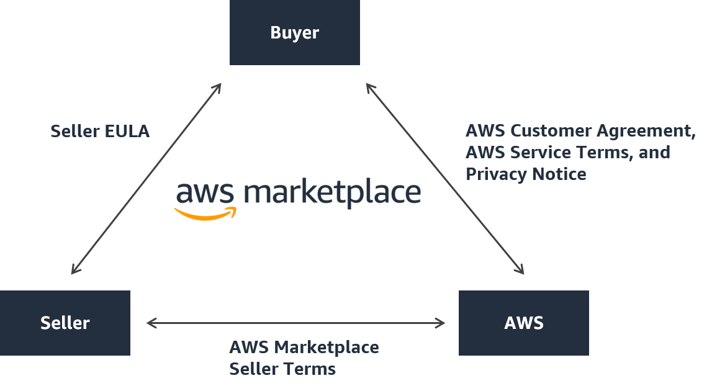

# Contracts for products sold in AWS Marketplace

Usage of the software, services, and data products sold on AWS Marketplace is governed by agreements
between buyers and sellers. AWS is not a party to these agreements.

###### Buyers in India

Contracts with sellers in India are governed by laws and regulations in India. For detailed information, see [Buyers in India FAQ](india-buyer-faq.md "india-buyer-faq.md").

As the buyer, your use of AWS Marketplace is governed by the [AWS Service Terms](https://aws.amazon.com/service-terms/ "https://aws.amazon.com/service-terms/"), the [AWS Customer Agreement](https://aws.amazon.com/agreement/ "https://aws.amazon.com/agreement/"), and the [Privacy
Notice](https://aws.amazon.com/privacy/ "https://aws.amazon.com/privacy/").

Seller agreements include the following:

- The seller's EULA is located on the product listing page for public software listings
  on AWS Marketplace. Many sellers use the [Standard Contract for AWS Marketplace
  (SCMP)](#standard-contracts-for-aws-marketplace "#standard-contracts-for-aws-marketplace") as their default EULA. They can also use the SCMP as the basis
  for negotiations in private offers and use the amendment template to modify the SCMP.
  Private offers can also include custom contract terms negotiated between the
  parties.
- [AWS Marketplace
  Seller Terms](https://aws.amazon.com/marketplace/management/seller-settings/terms "https://aws.amazon.com/marketplace/management/seller-settings/terms") govern the seller's activity in AWS Marketplace.
  The following graphic shows the contract structure for AWS Marketplace.

## EULA updates

Sellers have the option to update the EULA for each of their products. The effective
date of any updates will depend on your EULA, the offer type, and the pricing model.

The following table provides information on when a new EULA will take effect.

###### Note

If you and the seller have a custom agreement, the following may not be
applicable.

| Offer type | Pricing model             | When updated EULA takes effect                                                                                                                                                         |
| ---------- | ------------------------- | -------------------------------------------------------------------------------------------------------------------------------------------------------------------------------------- |
| Public     | Usage                     | You cancel your subscription and resubscribe.                                                                                                                                          |
| Public     | Contract                  | Your current contract ends and renews into a new public offer contract.                                                                                                                |
| Public     | Contract with consumption | Your current contract ends and renews into a new public offer contract.                                                                                                                |
| Private    | Usage                     | Your current private offer expires and auto-renews into a new public offer contract. Renewals to the private offer are dependent on the specific private offer.                  |
| Private    | Contract                  | Your current private offer expires and you resubscribe to the public offer or to a new private offer. Renewals to the private offer are dependent on the specific private offer. |
| Private    | Contract with consumption | Your current private offer expires and you resubscribe to the public offer or to a new private offer. Renewals to the private offer are dependent on the specific private offer. |

## Standard contracts for

AWS Marketplace

As you prepare to purchase a product, review the associated EULA or standardized
contract. Many sellers offer the same standardized contract on their listings, the [Standard Contract for AWS Marketplace (SCMP)](https://s3.amazonaws.com/aws-mp-standard-contracts/Standard-Contact-for-AWS-Marketplace-2022-07-14.pdf "https://s3.amazonaws.com/aws-mp-standard-contracts/Standard-Contact-for-AWS-Marketplace-2022-07-14.pdf"). AWS Marketplace developed the SCMP in collaboration
with buyer and seller communities to govern usage and define the obligations of buyers and
sellers for digital solutions. Examples of digital solutions include server software,
software as a service (SaaS), and artificial intelligence and machine learning (AI/ML)
algorithms.

Instead of reviewing custom EULAs for each purchase, you only need to review the SCMP
once. The [contract terms](https://s3.amazonaws.com/aws-mp-standard-contracts/Standard-Contact-for-AWS-Marketplace-2022-07-14.pdf "https://s3.amazonaws.com/aws-mp-standard-contracts/Standard-Contact-for-AWS-Marketplace-2022-07-14.pdf") are the same for all products that use the SCMP.

Sellers may also use the following addendums with the SCMP:

- [Enhanced Security Addendum](https://s3.amazonaws.com/aws-mp-standard-contracts/Enhanced-Security-Addendum-for-Standard-Contract-for-AWS-Marketplace-SCMP-2022-06-17.pdf "https://s3.amazonaws.com/aws-mp-standard-contracts/Enhanced-Security-Addendum-for-Standard-Contract-for-AWS-Marketplace-SCMP-2022-06-17.pdf") – Supports transactions with elevated data
  security requirements.
- [HIPAA Business Associate Addendum](https://s3.amazonaws.com/aws-mp-standard-contracts/Business-Associate-Addendum-for-Standardized-Contracts-for-AWS-Marketplace-2022-06-17.pdf "https://s3.amazonaws.com/aws-mp-standard-contracts/Business-Associate-Addendum-for-Standardized-Contracts-for-AWS-Marketplace-2022-06-17.pdf") – Supports transactions with Health
  Insurance Portability and Accountability Act of 1996 (HIPAA) compliance
  requirements.
- [Federal Addendum](https://d1.awsstatic.com/awsmp/solutions/mk-sol-files/standardized-contracts/Federal-Addendum-for-Standard-Contract-for-AWS-Marketplace.pdf "https://d1.awsstatic.com/awsmp/solutions/mk-sol-files/standardized-contracts/Federal-Addendum-for-Standard-Contract-for-AWS-Marketplace.pdf") – Supports transactions with customized terms for software purchases involving the U.S. Government.

To find product listings that offer standardized contracts, use the **Standard
Contract** filter when searching for products. For private offers, ask the seller
if they can replace their EULA with the SCMP and apply agreed upon amendments as necessary
to support transaction-specific requirements.

For more information, see [Standardized Contracts in AWS Marketplace](https://aws.amazon.com/marketplace/features/standardized-contracts "https://aws.amazon.com/marketplace/features/standardized-contracts").
