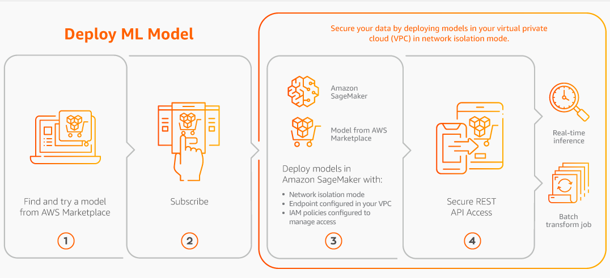

# Process overview for finding and deploying machine learning products

The following diagram shows an overview of the process to find, subscribe, and deploy a
machine learning product on Amazon SageMaker AI.

1. Find and try a model from AWS Marketplace
2. Subscribe to the ML product
3. Deploy models in Amazon SageMaker AI
4. Use secure REST APIs
5. Perform
   - Real-time inference
   - Batch transform job

You pay only for your usage, with no minimum fees or upfront commitments. AWS Marketplace provides a
consolidated bill for algorithms and model packages, and AWS infrastructure usage charges.
