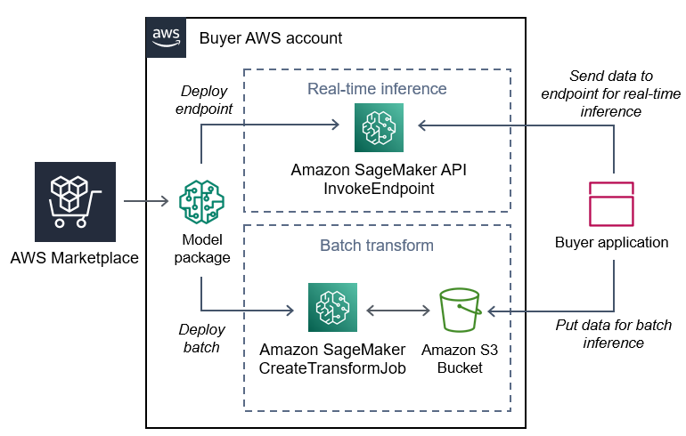
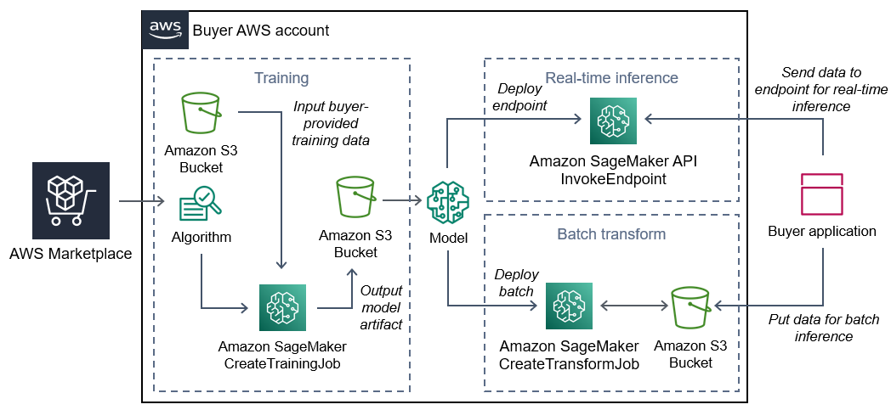

# Machine learning products in AWS Marketplace

The Machine Learning category in AWS Marketplace includes products such as machine learning (ML) model packages and algorithms.

To assess the quality and suitability of a model, you can review product descriptions,
usage instructions, customer reviews, sample [Jupyter notebooks](../../../sagemaker/latest/dg/nbi.md "../../../sagemaker/latest/dg/nbi.md"),
pricing, and support information. You deploy models directly from the Amazon SageMaker AI console, through
a Jupyter notebook, with the Amazon SageMaker AI SDK, or using the AWS Command Line Interface AWS CLI. Amazon SageMaker AI provides a
secure environment to run your training and inference jobs by running a static scan on all
marketplace products.

## Amazon SageMaker AI model package

An **Amazon SageMaker AI _model package_** is a
unique pretrained ML model that is identified by an Amazon Resource Name (ARN) on Amazon SageMaker AI.
Customers use a model package to create a model in Amazon SageMaker AI. Then, the model can be used with
hosting services to run real-time inference or with batch transform to run batch inference in
Amazon SageMaker AI.

The following diagram shows the workflow for using model package products.

1. On AWS Marketplace, you find and subscribe to a model package product.
2. You deploy the inference component of the product in SageMaker AI to perform inference (or
   prediction) in real time or in batches.

## Amazon SageMaker AI algorithm

An **Amazon SageMaker AI _algorithm_** is a unique
Amazon SageMaker AI entity that is identified by an ARN. An algorithm has two logical components:
training and inference.

The following diagram shows the workflow for using algorithm products.

1. On AWS Marketplace, you find and subscribe to an algorithm product.
2. You use the training component of the product to create a training job or tuning job
   using your input dataset in Amazon SageMaker AI to build machine learning models.
3. When the training component of the product completes, it generates the model artifacts
   of the machine learning model.
4. SageMaker AI saves the model artifacts in your Amazon Simple Storage Service (Amazon S3) bucket.
5. In SageMaker AI, you can then deploy the inference component of the product using those
   generated model artifacts to perform inference (or prediction) in real time or in batches.

