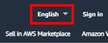

# Supported languages

By default, the AWS Marketplace website uses U.S. English. However, AWS Marketplace translates the text for key workflows into the following languages:

- French (fr-FR)
- Japanese (ja-JP)
- Korean (ko-KR)
- Spanish (es-ES)

###### Note

AWS Marketplace uses English as its "source of truth" language. If you have questions about a translation, refer to the English text.

You only need to choose a language once. A cookie saves your language choice for future visits. You can switch languages at any time.

The following steps explain how to switch languages.

1. Navigate to the [AWS Marketplace website](https://aws.amazon.com/marketplace "https://aws.amazon.com/marketplace").
2. On the header, open the language list. The list displays **English** by default, as shown in this image:

 3. Select the desired language.

The text on the [AWS Marketplace website](https://aws.amazon.com/marketplace "https://aws.amazon.com/marketplace") and the AWS console changes to the selected language.

###### Note

- Some pages remain in English.
- To provide feedback about a translation, choose the feedback button on the product
  detail page. You can provide feedback in any of the supported languages.

- AWS Marketplace sellers can opt out of having their content translated, so you may see text in English and the local language. For information about how sellers can opt out,
  see [Translation and languages](../userguide/translation.md "../userguide/translation.md") in the _AWS Marketplace Seller Guide_.

## Downloading translated standard contracts

AWS Marketplace provides example standard contracts in the supported languages for reference only. The contracts are not legally binding.
Select any of these links to download a zipped contract in the chosen language.

- [French](samples/French.md "samples/French.md")
- [Japanese](samples/Japanese.md "samples/Japanese.md")
- [Korean](samples/Korean.md "samples/Korean.md")
- [Spanish](samples/Spanish.md "samples/Spanish.md")
