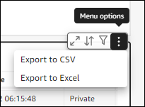
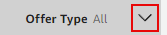

# Using the dashboard

The following sections explain how to use the AWS Marketplace **Procurement insights** dashboard.

###### Note

To view data for all the accounts in your organization, you must belong to an AWS Organizations
management account or a delegated administrator account.

For more information about management accounts, follow the [links in the introduction](procurement-insights.md "procurement-insights.md") above.
For more information about delegated administrators, see
[Using delegated administrators](management-delegates.md "management-delegates.md"), later in this section.

###### Topics

- [Starting the dashboard](#start-agreements-dashboard "#start-agreements-dashboard")
- [Tips for using the dashboard](#dashboard-tips "#dashboard-tips")

## Starting the dashboard

You can use the **Procurement insights** dashboard in the AWS Marketplace console, or you can call it programmatically.
When you use the dashboard in the console, it provides two tabs, **Cost analysis** and **Agreements**.
The following steps explain how to open the dashboard in the console.

###### To start the dashboard

1.  Open the AWS Marketplace console at [https://console.aws.amazon.com/marketplace](https://console.aws.amazon.com/marketplace "https://console.aws.amazon.com/marketplace").
2.  In the navigation pane, choose **Procurement insights**.
3.  Do either of the following:

        * Use the charts and graphs on the **Cost analysis** tab for information about the amounts spent on products and sellers.
        * Use the charts and graphs on the **Agreements** tab to gain an overall view of the AWS Marketplace agreements across all the AWS accounts in your organization.

        ###### Important

        The tab's **Expired agreements** section only shows data for agreements that
         expired after the dashboard became available for use.

    For more information about using Quick Suite dashboards, see [Interacting with Quick Suite dashboards](../../../quicksight/latest/user/exploring-dashboards.md "../../../quicksight/latest/user/exploring-dashboards.md"), in the
    _Quick Suite User Guide_.

## Tips for using the dashboard

The following tips can help you use the **Procurement insights** dashboard.

- The dashboard uses Quick Suite to present your data. The system automatically chooses the charts and other display elements that most logically fit your data.
  For more information about using Quick Suite dashboards, see [Interacting with Quick Suite dashboards](../../../quicksight/latest/user/exploring-dashboards.md "../../../quicksight/latest/user/exploring-dashboards.md"), in the
  _Quick Suite User Guide_.
- You can download your data. Scroll down to the **Source data** table in either tab.
  Point to the upper-right corner of the table, then choose the vertical ellipsis to export your data. You can export to a CSV file, or to Microsoft Excel.

- Both tabs use the same data filters. The filters on a given tab only apply
  to that tab, but they apply to all the charts and graphs on the tab. The following table lists
  the filters and their default values.

| Filter                               | Default value                                                                                                                                                                                                                      |
| ------------------------------------ | ---------------------------------------------------------------------------------------------------------------------------------------------------------------------------------------------------------------------------------- |
| **Agreement end date**               | The past 12 months relative to today NoteOn the **Agreements\* • tab, the data in the **Expired agreements\* • section only shows values that date back to the dashboard's release date, not a full 12 months of data. |
| **Include pay-as-you-go agreements** | Yes, include Pay-as-you-go                                                                                                                                                                                                         |
| **Offer type**                       | All                                                                                                                                                                                                                                |

- To change the default filter values, select the arrow on the right side of the **Controls** bar.

For more information about using Quick Suite filters, see [Using filters on dashboard data](../../../quicksight/latest/user/filtering-dashboard-data.md "../../../quicksight/latest/user/filtering-dashboard-data.md")
and [Filtering data during your session](../../../quicksight/latest/user/subscriber-dashboards-filtering-your-view-of-the-data.md "../../../quicksight/latest/user/subscriber-dashboards-filtering-your-view-of-the-data.md"), both
in the _Quick Suite User Guide_.
