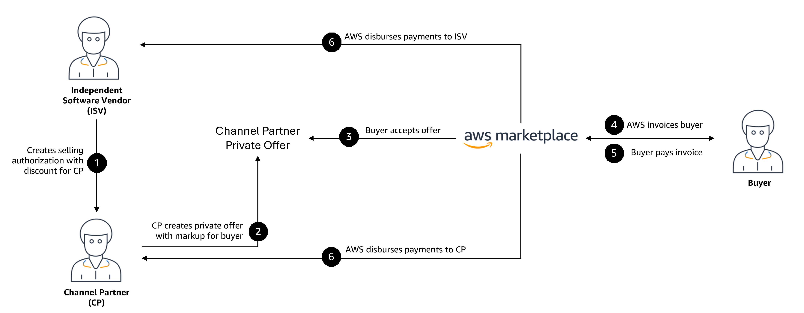

# Creating private offers as an AWS Marketplace Channel Partner

AWS Marketplace Channel partner private offers give channel partners the opportunity to resell
independent software vendors' (ISVs) products in AWS Marketplace. The AWS Marketplace channel partner and ISV
establish an agreement called a _selling authorization_ to resell one or more
of the ISV's products. The channel partner then extends a private offer to the buyer for that
product.

###### Important

To create, share, and accept selling authorizations, you must create a service-linked role
(SLR) that allows ISVs to create and share the
authorizations, and allows channel partners to accept them. For more information about
creating the SLR, see [Creating a service-linked role for AWS Marketplace](using-roles-for-resale-authorization.md#create-slr "using-roles-for-resale-authorization.md#create-slr").

The following diagram shows this relationship between an ISV, a channel partner, and a
buyer.

###### Note

For more information about creating a selling authorization for a channel partner, as an
ISV, see [Creating a selling authorization for an AWS Marketplace Channel Partner as an ISV](channel-partner-isv-info.md "channel-partner-isv-info.md").

Each AWS Marketplace channel partner private offer is visible only to a single buyer, with customized
pricing and unique commercial terms to meet that buyer's needs. When creating a private offer,
you start from a wholesale cost set by the ISV. Then you mark up that price to create the
buyer's offer price.

###### Note

When creating private offers, channel partners must use the currency that the ISV defines in the selling authorization.

You determine the wholesale cost in one of the following ways:

- **Recurring discount** – An ISV authorizes the AWS Marketplace
  Channel Partner to resell their product or products at an agreed to discount from their list
  price with a recurring selling authorization. The AWS Marketplace Channel Partner can leverage this
  discount to continue reselling the product without further price negotiation with the ISV.
  This discount can be set up to last until a specified date, or indefinitely, until ended by
  either the ISV or the channel partner.
- **Non-recurring discount** – The selling
  authorization that the ISV gives the AWS Marketplace Channel Partner is a one-time discount intended
  to be used only with a specific buyer.
  In both cases, after the buyer pays for the private offer, AWS Marketplace uses the standard
  process to distribute the funds to the AWS Marketplace Channel Partner and the ISV based on the agreed-to
  pricing.

###### Tip

ISVs and Channel Partners can use the **Partners** menu on the [AWS Marketplace Management Portal](https://aws.amazon.com/marketplace/management/ "https://aws.amazon.com/marketplace/management/") to view selling authorizations.

For detailed instructions about creating private offers, see [AWS Marketplace Channel Partner Private Offer – Create Offer](<https://s3.us-west-2.amazonaws.com/external-mp-channel-partners/Consulting+Partner+Creates+(1).pdf> "https://s3.us-west-2.amazonaws.com/external-mp-channel-partners/Consulting+Partner+Creates+(1).pdf").

For information about third-party financing for private offers, see [Customer financing is now available in AWS Marketplace](https://s3.us-west-2.amazonaws.com/external-mp-channel-partners/Financing+External+Briefing+Document+Customer+Facing.pdf "https://s3.us-west-2.amazonaws.com/external-mp-channel-partners/Financing+External+Briefing+Document+Customer+Facing.pdf").

## Additional information

For additional information and questions, we encourage ISVs and channel partners to
connect with the AWS Marketplace channel team. If you don’t know who to contact specifically, send
an email message to [aws-mp-channel@amazon.com](mailto://aws-mp-channel@amazon.com "mailto://aws-mp-channel@amazon.com"), and someone on the team will respond to you within one
business day.
