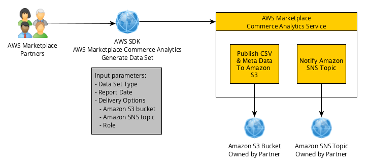

# Accessing product and customer data with the

AWS Marketplace Commerce Analytics Service

With the AWS Marketplace Commerce Analytics Service, you can programmatically access product and customer data through
AWS Marketplace. After you enroll in the service, you can access your usage, subscription, and billing
reports through the AWS SDKs. The data you request using the SDK tools is delivered to your
AWS account as datasets. Most of the datasets correspond to the same data as the text-based
reports available on the [AWS Marketplace Management Portal](https://aws.amazon.com/marketplace/management/tour "https://aws.amazon.com/marketplace/management/tour").
You can request datasets for a specific date, and the data is delivered to
the provided Amazon S3 bucket. You receive notification of data delivery through Amazon Simple Notification Service (Amazon SNS).
This topic provides the terms and conditions for using the AWS Marketplace Commerce Analytics Service.

The following visualization shows how the Commerce Analytics Service accesses your product and customer data in
AWS Marketplace and delivers it as data sets to your Amazon S3 bucket, initiating a notification through
Amazon SNS.

## Terms and conditions

These AWS Marketplace Commerce Analytics Service Terms and Conditions (these "**CAS
Terms**”) contain the terms and conditions specific to your use of and access to
the AWS Marketplace Commerce Analytics Service ("**CA Service**”) and are effective as of
the date you click an "I Accept” button or check box presented with these CAS Terms or, if
earlier, when you use any CA Service offerings. These CAS Terms are an addendum to the Terms
and Conditions for AWS Marketplace Sellers (the "**AWS Marketplace Seller
Terms**”) between you and Amazon Web Services, Inc. ("**AWS**,” "**we**,” "**us**” or "**our**”), the terms of which are hereby
incorporated herein. In the event of a conflict between these CAS Terms and the AWS Marketplace
Seller Terms, the terms and conditions of these CAS Terms apply, but only to the extent of
such conflict and solely with respect to your use of the CA Service. Capitalized terms used
herein but not defined herein shall have the meanings set forth in the AWS Marketplace Seller Terms.

1. **CA Services and CAS Data.** To qualify for access to the
   CA Service, you must be an AWS Marketplace Seller bound by existing AWS Marketplace Seller Terms.
   Information and data you receive or have access to in connection with the CA Service
   ("**CAS Data**”) constitutes Subscriber Information and
   is subject to the restrictions and obligations set forth in the AWS Marketplace Seller Terms.
   You may use CAS Data on a confidential basis to improve and target marketing and other
   promotional activities related to Your AWS Marketplace Content provided that you do not (a)
   disclose CAS Data to any third party; (b) use any CAS Data in any way inconsistent with
   applicable privacy policies or law; (c) contact a subscriber to influence them to make an
   alternative purchase outside of the AWS Marketplace; (d) disparage us, our affiliates, or any of
   their or our respective products; or (e) target communications of any kind on the basis of
   the intended recipient being an AWS Marketplace subscriber.
2. **CA Service Limitations and Security.** You will only
   access (or attempt to access) the CA Service by the means described in the CA Service
   documentation. You will not misrepresent or mask your identity or your client's identity
   when using the CA Service. We reserve the right, in our sole discretion, to set and
   enforce limits on your use of the CA Service, including, without limitation, with respect
   to the number of connections, calls and servers permitted to access the CA Service during
   any period of time. You agree to, and will not attempt to circumvent such limitations. We
   reserve the right to restrict, suspend or terminate your right to access the CA Service if
   we believe that you may be in breach of these CAS Terms or are misusing the CA Service.
3. **CA Service Credential Confidentiality and Security.** CA
   Service credentials (such as passwords, keys and client IDs) are intended to be used by
   you to identify your API client. You are solely responsible for keeping your credentials
   confidential and will take all reasonable measures to avoid disclosure, dissemination or
   unauthorized use of such credentials, including, at a minimum, those measures you take to
   protect your own confidential information of a similar nature. CA Service credentials may
   not be embedded on open source projects. You are solely responsible for any and all access
   to the CA Service with your credentials.
4. **Modification.** We may modify these CAS Terms at any time
   by posting a revised version on the AWS Site or providing you with notice in accordance
   with the AWS Marketplace Seller Terms. The modified terms will become effective upon posting or,
   if we notify you by email, as stated in the email message. By continuing use or access the
   CA Service after the effective date of any modifications to these CAS Terms, you agree to
   be bound by the modified terms.
5. **Termination.** These CAS Terms and the rights to use CAS
   Data granted herein will terminate, with or without notice to you upon termination of your
   AWS Marketplace Seller Terms for any reason. In addition, we may stop providing the CA Services
   or terminate your access to the CA Services at any time for any or no reason.

## Getting started

For more information about the AWS Marketplace Commerce Analytics Service, including onboarding, technical implementation, and troubleshooting information, see the following topics.

###### Topics

- [Onboarding to AWS Marketplace Commerce Analytics Service](on-boarding-guide.md "on-boarding-guide.md")
- [Using the AWS Marketplace Commerce Analytics Service with the AWS CLI and AWS SDK for Java](technical-implementation-guide.md "technical-implementation-guide.md")
- [Generating a dataset by using the AWS Marketplace Commerce Analytics Service](technical-documentation.md "technical-documentation.md")
- [Troubleshooting the AWS Marketplace Commerce Analytics Service](cas-troubleshooting.md "cas-troubleshooting.md")
