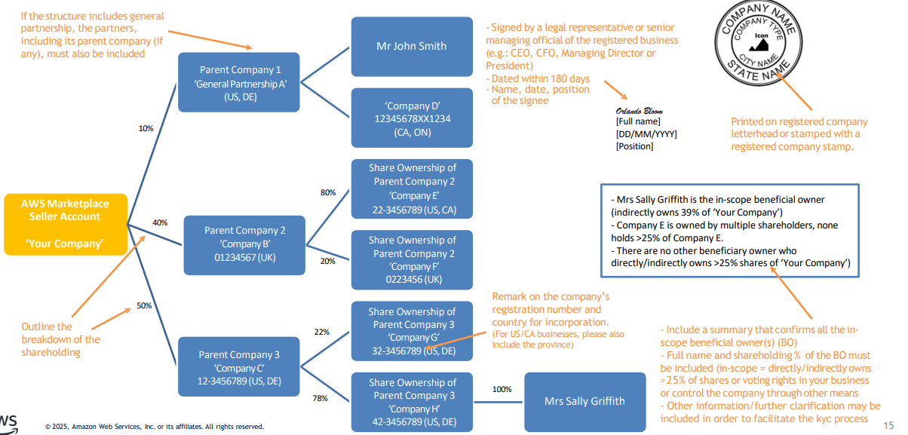

# Step 5: Complete the Know Your Customer (KYC) process

AWS Marketplace has established regional invoicing entities (also referred to as Marketplace Operators or MPOs) to facilitate transactions and support buyers' and sellers' localized business needs, such as tax, reporting, disbursements, and compliance. Invoicing entities are regional entities responsible for managing these localized aspects of AWS Marketplace for their respective regions. Each invoicing entity is subject to local laws and regulations. As AWS Marketplace sellers, you are required to complete verification steps to utilize certain invoicing entities in specific regions.

As part of this framework, the Know Your Customer (KYC) process is a verification procedure that helps AWS comply with regulatory requirements including EU anti-money laundering directives and Korean financial transaction reporting requirements. KYC verification is mandatory for you to transact and/or receive disbursements through the AWS Marketplace invoicing entities in the following regions:

1. Europe, Middle East, and Africa (transaction and disbursements)
2. South Korea (disbursements)

## Regional KYC requirements

EMEA

Sellers must complete the KYC process to use the AWS EMEA invoicing entity. AWS Marketplace transactions through the AWS EMEA invoicing entity are processed through Amazon Payments Europe, S.C.A. (APE), a licensed electronic money institution in Luxembourg. Until the KYC is completed, AWS Inc. will be used as the invoicing entity for the seller's transactions in this region.

In a Channel Partner Private Offer (CPPO), both the Channel Partner and the ISV need to be KYC verified to use AWS EMEA as the invoicing entity. AWS Inc. will be the default invoicing entity if either party is not KYC verified.

KYC verification is also required if either a channel partner or an ISV needs to utilize a UK bank account for disbursements. In that scenario, both parties require KYC verification to ensure the AWS EMEA invoicing entity can facilitate the transaction.

South Korea

To receive disbursements from the AWS South Korea invoicing entity, sellers must undergo KYC verification. Completing the KYC process for the EMEA region can expedite the verification for South Korea, and vice versa.

Japan (Japanese sellers only)

Sellers registered in Japan must provide business registration and legal representative details to the AWS Japan invoicing entity. This is a separate process from the KYC described on this page.

###### Sellers in India

This process doesn't apply to sellers in India as they can only sell to buyers in India. For detailed information, see [Getting started as a seller in India](getting-started-seller-india.md "getting-started-seller-india.md").

## KYC requirements

The KYC process requires you to provide additional information and documentation to verify your identity and business details. Before starting, ensure you can monitor your AWS account root email address, as the KYC team will send status updates and requests to that address. For more information about managing account communications, see [Managing account communications](managing-account-communications.md "managing-account-communications.md") in [Managing your seller account](seller-account-management.md "seller-account-management.md").

###### Note

You will also receive KYC status updates to the custom email address that you provide during registration. It is highly recommended to add key KYC stakeholders to the custom email notification so that important messages are not missed. For more information, see [Adding or updating email addresses](email-notifications.md#adding-updating-email-addresses "email-notifications.md#adding-updating-email-addresses").

KYC is a 3-step process:

Step 1: Business Verification

During this step, you will be required to provide information about your business entity, related documents associated to the business, and the registration and verification of key individuals within your organization (primary contacts, business owners, and legal representatives).

You will also need to provide identity verification documents and address verification documents for the nominated individuals. In some cases you might be asked to provide authorization documentation on a company letterhead, signed by a legal representative of the business, if a nominated individual is not legally authorized to represent the company.

Step 2: Bank Account Verification

After the business verification step is completed, your seller account will be KYC verified, but you must provide a bank statement on the **Payment information** tab before you can receive disbursements through Amazon Payments Europe. For detailed information, see [Step 6: Complete bank account verification](complete-bank-verification.md "complete-bank-verification.md").

Step 3: Secondary User Verification

Only authorized users are allowed to manage your KYC and financial details after KYC verification. The secondary user verification is an optional step used if you need to nominate other users within your organization to manage your KYC and financial details on AWS Marketplace, for example, if your finance team needs access to manage disbursement settings. For detailed information, see [Managing secondary users for Know Your Customer (KYC)](managing-secondary-users.md "managing-secondary-users.md").

###### Important

All provided documents must be clear, legible, and on official letterhead where applicable. Business documents should be signed by a legal representative and issued within 180 days unless otherwise specified.

The document requirements listed in this guide are not exhaustive. During the verification process, compliance teams may request additional information or documentation based on their assessment. Requirements are evaluated on a case-by-case basis.

## Steps to complete Step 1 of the KYC process - Business Verification

Follow these steps to complete Step 1 of the KYC process in AWS Marketplace:

###### Note

For accepted document types, templates, and formatting requirements referenced throughout these steps, see the [Templates and best practices for completing the KYC process](#kyc-best-practices "#kyc-best-practices") section at the end of this page.

1. Sign in to the AWS Marketplace Management Portal at [https://aws.amazon.com/marketplace/management/](https://aws.amazon.com/marketplace/management/ "https://aws.amazon.com/marketplace/management/") and choose **Settings**.
2. In the **Account summary** section, confirm that the **Country** that is shown is correct.

###### Note

Choose the **Info** link to see how to change your country. 3. In the same section, review your **KYC Verification** status to see where you are in the verification process. 4. To start or review your KYC journey, select the **Know your customer (KYC)** tab.

###### Note

In the main KYC tab, you can see a table with customer regions, invoicing entity, transaction status, and disbursement status. Use this table to understand which AWS invoicing entity your customer will get their invoices from. If your transaction or disbursement status is 'Blocked' for an invoicing entity, use the Next Steps column to understand what is required from you. 5. To start or review your business verification, choose **Update Business Verification**. You will be directed to the KYC Registration Portal. 6. Enter the **Basic details** as directed, including selecting your entity type (such as privately-owned business or publicly listed company). After you review the Amazon Payments Europe Terms & Conditions, choose **Agree and continue**.

###### Important

    * If the registered seller account name is not publicly listed on a stock exchange, please select 'privately-owned business'.
    * Ensure the business name you enter matches your AWS Marketplace seller account name, as this is the company being verified.
    * Input your business details exactly as shown in official registration documents (country of incorporation, entity type, name, registration number, etc.).
    * Any discrepancies or mismatched information may delay the verification process.

When you continue to the next page or next step in the KYC process, that action indicates that you accept the Amazon Payments Europe Terms & Conditions.

If you have questions, see **Frequently Asked Questions (FAQ)** located on the right side of the console. 7. Enter the required **Business information** as directed, and then choose **Next**.

###### Note

    * Registration Extract is your Company Registration or Incorporation Document.
    * For US companies, if the Registration Extract or Incorporation Document is older than 180 days, please additionally provide a certificate of good standing, certificate of (account) status, or valid (not expired) business license.
    * For accepted Proof of Address documents, see the templates section below.
    * Your information is saved every time you choose **Next** to go to the next step.

8. Enter the required **Point of contact information** as directed, and then choose **Next**.

###### Note

    * The Primary Contact person is the person who manages the AWS Marketplace account on behalf of the company, and where possible the root user for the seller account. This person must have legal capacity to represent the company; otherwise, a Letter of Authorization (LOA) is required to be uploaded in the 'Additional documents' section. See the templates section below for an LOA template.
    * Provide an accepted Identity document and Proof of Address. See the templates section below.

9. Choose whether the **Beneficial owner** is the same as the point of contact, add beneficial owners (up to four) if necessary, confirm your additions, and then choose **Next**.

###### Note

    * At least one Beneficial Owner or a Senior Management Official needs to be registered on the account if the Beneficial Owner is not the Point of Contact.
    * If privately owned company (beneficial owner required): An individual who directly or indirectly owns more than 25% of the shares or voting rights in your business must be registered on the account. If this is not applicable, please register an individual (senior managing official) who controls the company through other means (chief executive officer, chief financial officer, managing or executive director, or president).
    * If publicly listed company (senior manager always required): Any individual who holds the position of senior managing official, such as a chief executive officer, chief financial officer, managing or executive director, or president. (Please enter Senior Manager Official details and document uploads in the beneficial owner section.)
    * Provide an accepted Identity document and Proof of Address. See the templates section below.

10. Choose whether the **Legal representative** is the same as the point of contact or beneficial owner. If the legal representative is a different entity, provide the required information, save your entry, and then choose **Next**.
11. In the **Additional documents** section, upload your letter of authorization (if applicable) and statute documents.

###### Note

    * Letter of Authority (LOA): This is required to confirm the primary contact is authorized to act on behalf of the company. Provide this letter using the recommended template. See the templates section below.
    * Statute Document: This document should contain Articles of Association, bylaws, and/or a most recent share allotment document (statement of capital/annual return/share register). It is the governing document of a company. For privately owned companies, the statute document should include the full names of each beneficial owner who directly or indirectly owns more than 25% shareholding. If the above data point is missing, you would be required to provide an organization chart showing the entire structure of the registered business (see the templates section below). The exact requirements for statute documents vary by country and legal entity type; therefore, please provide a document that most closely aligns with the descriptions.Ensure all submitted documents are signed by a legal representative, are on letterhead or stamped, and dated within 180 days. If further documents are required, the KYC verification team will contact you via the main/root email address and where possible they will provide an example template.

12. On **Review and Submit**, review and verify all of the information that you have entered.

You can select **Edit** to return to any previous section if necessary. 13. Choose **Submit for verification**.

The status of your KYC compliance will be reviewed (typically within 24 hours). You will be notified through an email message after the review is complete.

You can return to the **Settings** tab to view the status of your KYC compliance on the **Account summary** card. For more information about your KYC status, choose the **Know your customer (KYC)** tab under the **Account summary** card. It will display **Under review** until the review has been completed.

###### Important

After your KYC is verified, you must provide a bank statement on the **Payment information** tab before you can receive disbursements through Amazon Payments Europe.

If you need to add secondary users who can manage KYC information and financial details, see [Managing secondary users for Know Your Customer (KYC)](managing-secondary-users.md "managing-secondary-users.md") in [Managing your seller account](seller-account-management.md "seller-account-management.md").

## Templates and best practices for completing the KYC process

### Accepted identity documents

If you need to provide an identity document for an individual, the following documents are accepted:

- Passport
- National identity card
- US passport card
- Driving license
- Residence permit

Requirements for identity documents:

- Document copy/image must be high quality, in color, unobstructed, and legible.
- Document size should be less than 10MB.
- Accepted formats include: .png, .tiff, .tif, .jpg, .jpeg, and .pdf.
- The document must be a copy of a government-issued ID document containing a photo and personal information.
- The document must contain full name, date of birth, place of birth, and country of citizenship. If a standalone ID document does not contain all the data points, please provide two ID documents in combination (for example, driving license and birth certificate).
- The document must not be expired.
- If the identity document has two sides, both sides must be uploaded.
- The signature page of the document should be provided, where applicable.

### Accepted proof of address documents

The following documents are accepted as proof of address:

- Utility bill (gas, water, electricity, TV, Internet, mobile phone, or landline)
- Bank statement (documents issued by a financial services provider other than a bank, such as third-party providers or online digital banks, are not acceptable as proof of address)
- Credit union or building society statement
- Credit card statement or bill
- Mortgage statement
- Rent receipt from a local council or letting agent

Requirements for proof of address documents:

- The proof of address must show the provider's logo.
- The proof of address must be addressed to the corresponding person or legal entity (names should match the ID/legal document provided).
- The full name and country of residence must be visible on the document. Other sensitive information such as account balance or card number can be covered.
- The document must not be a screenshot.
- The document must be dated within 180 days.

### Letter of authorization template

If you need a letter of authorization, you can use the following sample:

```
Letterhead of the company

POWER TO ACT ON BEHALF OF THE COMPANY
The undersigned **Enter Company name here** (herein after, the "Company"), duly represented by
(name, date of birth, and function) **add full name, date of birth, and function of the signatory here**,
confirms that **add full name of the Person of Contact here** is authorized to open an Amazon Web
Services Marketplace account with Amazon Payments, accept the User Agreement and other Policies,
have access to the Amazon Web Services Marketplace account, initiate transactions in the name and
on behalf of the Company and approve new Secondary users added to the account and if required,
grant them access to update listings, respond to buyers and initiate refunds.

    Dated this:

    Signed by:
```

### Organization chart template

As part of the statute document, you may be required to provide an organization chart showing the entire structure of the registered business. Example below:



### General best practices

Consider these best practices when completing the KYC process:

- Prepare all required documentation in advance to streamline the process.
- Ensure all documents are clear, legible, and current (typically issued within the last 3-6 months for address verification).
- Provide consistent information across all documents and verification steps.
- Respond promptly to any requests for additional information or clarification.
- If you're unsure about any requirements, contact AWS Marketplace Seller Support for assistance.

## Next steps

After completing the KYC process, you can proceed to the final step in the registration process: [Step 6: Complete bank account verification](complete-bank-verification.md "complete-bank-verification.md").
