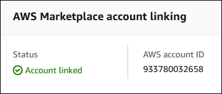

# Creating and managing private offers

As an AWS Marketplace seller, you can create and manage private offers. Private offers are
negotiated terms used to purchase a product from AWS Marketplace. This can involve a custom pricing
plan, end user license agreement (EULA), or custom solutions. The following sections describe
how to create and manage private offers.

###### Note

To be eligible to issue private offers, you must have at least one active public listing.
If you have a public listing, and you don't have access to the Private Offers tab, see [IAM Permissions](detailed-management-portal-permissions.md "detailed-management-portal-permissions.md") or [contact AWS Marketplace
support](https://aws.amazon.com/marketplace/management/contact-us "https://aws.amazon.com/marketplace/management/contact-us").

###### Topics

- [Starting a new private offer](#starting-new-private-offer "#starting-new-private-offer")
- [Understanding offer statuses](#understanding-offer-statuses "#understanding-offer-statuses")
- [Drafting and publishing the private
  offer](#drafting-and-publishing-private-offer "#drafting-and-publishing-private-offer")
- [Adding private offer and demo request buttons](#private-offer-requests-demos "#private-offer-requests-demos")
- [Sending a private offer to a buyer](#send-private-offer "#send-private-offer")
- [Cloning your private offer](#cloning-your-private-offer "#cloning-your-private-offer")
- [Downloading offer details](#download-offer-details "#download-offer-details")
- [Saving your private offer progress](#saving-private-offer "#saving-private-offer")
- [Updating the expiration of a private
  offer](#updating-private-offer-expiration "#updating-private-offer-expiration")
- [Cancelling a private offer](#cancelling-private-offer "#cancelling-private-offer")

## Starting a new private offer

The following steps explain how to use the Use the [AWS Marketplace Management Portal](https://aws.amazon.com/marketplace/management "https://aws.amazon.com/marketplace/management") to create a private offer and generate an offer ID. The process creates a blank offer in a draft state.

###### To start a private offer

1. Sign into the [AWS Marketplace Management Portal](https://aws.amazon.com/marketplace/management "https://aws.amazon.com/marketplace/management").
2. Open the **Offers** list and choose **Private offers**.
3. On the **Private offers** page, choose **Create private
   offer**.
4. On the **Create private offer** page, choose the offer type, product type, and the product
   that you want to create your private offer from. Processing takes up to 30 seconds. Don't close
   or refresh the page until processing finishes.

###### Note

    * You can't change the product type and product after you create the offer.
     For more information on private offers per product type, see [Supported product types](private-offers-supported-product-types.md "private-offers-supported-product-types.md").
    * AWS Marketplace channel partners must choose between creating an offer for
     their own products, or creating a channel partner private offer (CPPO) from a resale
     authorization. When creating a CPPO, choose the independent software vendor (ISV), product,
     and authorization. For more information about resale authorizations, see [Creating a selling authorization for an AWS Marketplace Channel Partner as an ISV](channel-partner-isv-info.md "channel-partner-isv-info.md") later in this guide.

5. Choose **Continue to offer details**.

A step-by-step experience guides you through the rest of the creation process.

###### Geo-targeting private offers:

You now have the option to select the countries in which buyers can view and accept private offers.

- If you extend the offer to a buyer outside of the selected countries, the buyer cannot accept the offer.
- You can select **All Countries** to make your offer available to buyers globally.
- India-based sellers can only sell to buyers located in India. This feature defaults to India for such sellers and cannot be changed.
- If the buyer is a linked account that is part of an AWS organization, then geo-targeting rules will apply based on the buyer's location and not the payer account's location.

## Understanding offer statuses

Offers have one of three statuses depending on the lifecycle:

- **Draft** – The offer is incomplete and still being prepared
  by you. Private offers in a draft status are not subject to a retention schedule. All required details must be completed and submitted to publish the offer and
  extend it to your buyer.
- **Active** – The offer is published and extended to the buyer.
  The offer hasn't expired, so buyers can subscribe to the offer.
- **Expired** – The offer is published and extended to the
  buyer. The offer has expired, so buyers can't subscribe to the offer. The expiration date
  can be updated to give your buyers more time to accept the offer. To update offer
  expiration, refer to [Updating the expiration of a private offer](creating-private-offer.md#updating-private-offer-expiration "creating-private-offer.md#updating-private-offer-expiration").

###### Note

After the offer is accepted, it will show up as an agreement in the
**Agreements** tab. The status of the offer won't change.

## Drafting and publishing the private

offer

Use the following process to draft and publish your private offer.

###### To draft and publish your private offer

1. On the **Provide offer information** page, provide the offer name,
   offer details, renewal type, and offer expiration date. If this is a renewal offer, you
   must choose either **Existing Customer on AWS Marketplace** for renewals
   intended to renew an existing agreement created in AWS Marketplace, or **Existing
   Customer Moving to AWS Marketplace** for renewals intended to migrate your existing
   customer to AWS Marketplace.

###### Note

The offer expiration date is the date that the offer becomes null and void. After
23:59:59 UTC on this date, the buyer won't be able to view and accept this private
offer.

###### Note

A renewal is defined as:

    * Any private offer to a customer with an existing or prior private offer for the product, including expansions and upsells.
    * Any private offer to a customer with an existing paid software subscription between seller and customer that didn't originate but was renewed through AWS Marketplace.A private offer that moves the customer from public AWS Marketplace subscription to private offer is not considered a renewal.

2. Choose **Next**.
3. On the **Configure offer pricing and duration** page, choose the
   pricing model, contract or usage duration, pricing, currency, and payment schedule. For
   pricing models that have an installment plan, see [Private offer installment plans](installment-plans.md "installment-plans.md").

###### Note

Private offers can be created in non-USD currencies for all pricing types. Make sure
you have configured your non-USD disbursement preferences. For more information,
see [Step 4: Set disbursement preferences](set-disbursement-preferences.md "set-disbursement-preferences.md").

All public offers and private offers with consumption pricing can only be created in
USD. 4. On the **Add buyers** page, provide an AWS account ID for each
AWS Marketplace buyer you are extending the private offer to. Each selected buyer must have an
AWS account in a AWS Region where the selected offer currency is supported. To add
another AWS account ID, choose **Add another buyer**. You can add up to
24 buyers to each private offer. 5. Choose **Next**. 6. On the **Configure legal terms and offer documents** page, choose one
of the following options:

    * Public offer end user license agreement (EULA) – Use the EULA from your
     public offer.
    * Standard contract for AWS Marketplace (SCMP) – Use the standard contract provided
     by AWS Marketplace.
    * Custom legal terms – Upload up to five files related to your private offer,
     including legal terms, a statement of work, a bill of materials, a pricing sheet, or
     other addendums. These files will be merged into one document when the offer is
     created.

7. On the **Review and create** page, review the details of your private
   offer. After you review and confirm, choose **Create offer** to publish
   the offer and extend it to the buyers you chose. Offer publishing includes a request to
   the AWS Marketplace Catalog API, so it can take up to an hour to validate and process the offer.
   This request can be viewed on the **Requests** page.

###### Note

The offer will be published and extended only if the request succeeds. If the
request fails, it won’t be extended to the customer. A failure means that there was either a
system error or an error you must correct before resubmitting.

## Adding private offer and demo request buttons

Sellers can add call-to-action buttons to their product detail pages. The buttons enable buyers to request private offers and guided product demos.
You can add one or both buttons to your product detail pages.

You can use the buttons with the following product types:

- Amazon Machine Image
- Software as a service (SaaS)
- Container
- CloudFormation templates

To use the buttons, you must belong to the APN Customer Engagements Program (ACE). When
buyers request an offer or a demo, they enter their contact data and request details into a form.
The AWS Demand generation team then qualifies the requests and transfers those qualified requests to you as AWS originated opportunities through ACE in
Partner Central. You then follow up with customers to discuss offer details or schedule a guided
demo. For more information about ACE, see the [APN Customer Engagements Program](https://aws.amazon.com/partners/programs/ace/ "https://aws.amazon.com/partners/programs/ace/") website and [Leads and Opportunities](https://partnercentral.awspartner.com/partnercentral2/s/article?category=ACE_Get_Started&article=ACE-Getting-Started-Frequently-Asked-Questions-FAQ#AWS-Originated-Referrals---Lead-and-Opportunity "https://partnercentral.awspartner.com/partnercentral2/s/article?category=ACE_Get_Started&article=ACE-Getting-Started-Frequently-Asked-Questions-FAQ#AWS-Originated-Referrals---Lead-and-Opportunity") in the _APN Customer Engagement (ACE) FAQs_.

Steps in the following topics explain how to add the buttons to your product detail pages.

###### Topics

- [Button prerequisites](#button-prerequisites "#button-prerequisites")
- [Enabling the buttons](#enabling-the-buttons "#enabling-the-buttons")

### Button prerequisites

Before you can add the call-to-action buttons to your product detail pages, you must have the following prerequisites:

- Make sure you can receive AWS referred leads and opportunities in AWS Partner Central. For more information, see
  the [APN Customer Engagements Program](https://aws.amazon.com/partners/programs/ace/ "https://aws.amazon.com/partners/programs/ace/") website.

###### Note

After you enroll in the ACE program, status updates occur every two weeks. The private offer and demo
request buttons appear only after the status update is complete. If you choose these options and receive a message,
your access is pending the next biweekly update.

- Link your AWS Partner Central and AWS Marketplace accounts. To
  do that, you must:
  - Create the `CreatePartnerCentralCloudAdminRole` IAM: policy. For more information, see the
    [prerequisites for account linking](../../../partner-central/latest/getting-started/account-linking.md#linking-prerequisites "../../../partner-central/latest/getting-started/account-linking.md#linking-prerequisites") in the
    _AWS Partner Central Getting Started Guide_.
  - Link your AWS Partner Central and AWS Marketplace accounts. For more information, see [Link
    your AWS Partner Central account to your AWS Marketplace account](../../../partner-central/latest/getting-started/account-linking.md#linking-apc-aws-marketplace "../../../partner-central/latest/getting-started/account-linking.md#linking-apc-aws-marketplace"), in the _AWS Partner Central Getting Started Guide_.

  After you link your AWS Partner Central and AWS Marketplace accounts, your Partner Central **Home** page displays the following status message:

  

For more information, sign in to Partner Central and see the following:

- The [AWS
  Partner Central & Marketplace account linking guide](https://partnercentral.awspartner.com/partnercentral2/s/article?article=AWS-Partner-Central&category=Introductory_resources#Introduction "https://partnercentral.awspartner.com/partnercentral2/s/article?article=AWS-Partner-Central&category=Introductory_resources#Introduction")
- The [AWS Partner and Marketplace Account Linking Demo](https://partnercentral.awspartner.com/partnercentral2/s/article?article=AWS-Partner-Central-and-Marketplace-Account-Linking-Demo&category=Introductory_resources "https://partnercentral.awspartner.com/partnercentral2/s/article?article=AWS-Partner-Central-and-Marketplace-Account-Linking-Demo&category=Introductory_resources") video

###### Note

You must sign in to use these resources.

### Enabling the buttons

Once you become ACE eligible to receive AWS referrals, you use the AWS Marketplace Management Portal to enable
one or both call-to-action buttons.

You follow separate processes to enable the buttons, depending on whether you create a new
product listing or update a current listing.

###### To enable buttons for new products

1. Use the [AWS Marketplace Management Portal](https://aws.amazon.com/marketplace/management "https://aws.amazon.com/marketplace/management") to create the following types of products and make them public:
   - AMI
   - SaaS
   - Container
   - Cloud Front template

2. As part of creating the product, under **Guided demo and private offer requests**,
   choose any combination of **Enable guided demo requests for buyers** and **Enable private offer requests for buyers**.

###### Note

The buttons only appear on the product detail pages in your private offers after you make the product public.

###### To enable buttons for existing products

1. In the [AWS Marketplace Management Portal](https://aws.amazon.com/marketplace/management "https://aws.amazon.com/marketplace/management"), on the **Products** tab, select the product that you want to change.
2. Open the **Request changes** list and choose **Update product information**.
3. Choose any combination of **Enable guided demo requests for buyers** and **Enable private offer requests for buyers**.

The buttons only appear on the product detail page after you save your changes.

## Sending a private offer to a buyer

After the private offer has been published, buyers can view it by navigating to the
**Available private offers** tab on the **Private offers**
page in the AWS Marketplace Management Portal. On the **Available private offers** tab, the buyer can
see offers extended by AWS Marketplace Channel Partners in the **Seller of record**
column. The independent software vendor (ISV) will display in the
**Publisher** column. A buyer can navigate to a private offer by choosing
the appropriate **Offer ID** in their offers list.

Buyers can view offer IDs that have been accepted or that have expired on the
**Accepted or expired offers** tab.

After the private offer has been published, you can send your buyer a URL to the
fulfillment page for the offer.

###### To send a private offer to your buyer

1. Sign into the [AWS Marketplace Management Portal](https://aws.amazon.com/marketplace/management "https://aws.amazon.com/marketplace/management"), and choose **Offers**.
2. Select the **radio button** next to the offer.
3. Choose **Actions** and then **Copy Offer
   URL**.
4. Send the URL to your buyer.

## Cloning your private offer

You can clone a private offer, including AWS Marketplace Channel Partner private offers. Use cloning to create a new offer using a template or to update and replace an existing offer.

###### To clone a private offer

1. Sign into the [AWS Marketplace Management Portal](https://aws.amazon.com/marketplace/management "https://aws.amazon.com/marketplace/management"), and choose **Offers**.
2. In the **Offers** table, select the option next to the offer you want to clone.
3. Choose **Clone offer**.
4. A new offer-creation experience will open with pre-populated information from the selected offer. Review and modify the offer details as needed.
5. (Optional) If you're cloning to replace an existing offer, select **Cancel the existing offer**. When selected, the original offer will automatically expire and not be accessible to the buyer when this new offer is published. This only affects the offer's accessibility and does not impact any existing subscriptions if the buyer has already accepted the original offer.
6. Choose **Clone private offer**. This will publish the offer and extend it to the buyers you selected previously.

## Downloading offer details

Use the following procedure to download offer details in a .pdf file.

###### To download offer details

1. Sign into the [AWS Marketplace Management Portal](https://aws.amazon.com/marketplace/management "https://aws.amazon.com/marketplace/management"), and choose **Offers**.
2. In the **Offers** table, select the option next to the offer and choose **View details**. Alternatively, you can choose the link for the offer in the **Offer ID** column.
3. On the offer detail page, choose **Download PDF**.

## Saving your private offer progress

Use the following process to save your progress and resume later.

###### To save and resume your work

1. At any completed step, choose **Save and exit**. In the dialog box,
   confirm that you're saving the content in a draft state and review any validation errors.
   If there are any validation errors or missing details, you can choose **Fix
   it** to go to the step and resolve the issue. When you're ready, choose
   **Save and exit** to save your changes.

After you save and exit, the request is under review while it's processing. It could
take a few minutes or hours to finish processing. You can't continue the steps or modify
the request until it has succeeded. After the request has succeeded, you have
completed the save. If the request fails, there was either a system error or an error
you must correct before resubmitting. 2. To resume working on your offer, open the **Offers** page, choose
your offer, and then choose **Resume offer creation**. 3. When you're finished, you can choose either **Save and exit** to save
your progress or **Create offer** to publish and extend the private offer
to your selected buyers.

## Updating the expiration of a private

offer

Use the following process to update the expiration date of a private offer.

###### To update the expiration date of a private offer

1. Sign into the [AWS Marketplace Management Portal](https://aws.amazon.com/marketplace/management "https://aws.amazon.com/marketplace/management"), and choose **Offers**.
2. On the **Offers** page, choose the **offer** you
   want to update.
3. Choose **Edit**.
4. Provide a new **offer expiration date**.
5. Choose **Submit**.

After the update is complete, the offer will change to an **Active**
status and your buyer can accept the offer.

## Cancelling a private offer

Use the following process to cancel the private offer.

1. Sign into the [AWS Marketplace Management Portal](https://aws.amazon.com/marketplace/management "https://aws.amazon.com/marketplace/management"), and choose **Offers**.
2. On the **Offers** page, choose the **offer** you
   want to update.

###### Note

Cancelling the offer will modify the offer expiration date, so the offer will
display as expired for buyers who were extended this offer. 3. Choose **Action** and then choose **Cancel
offer**.
