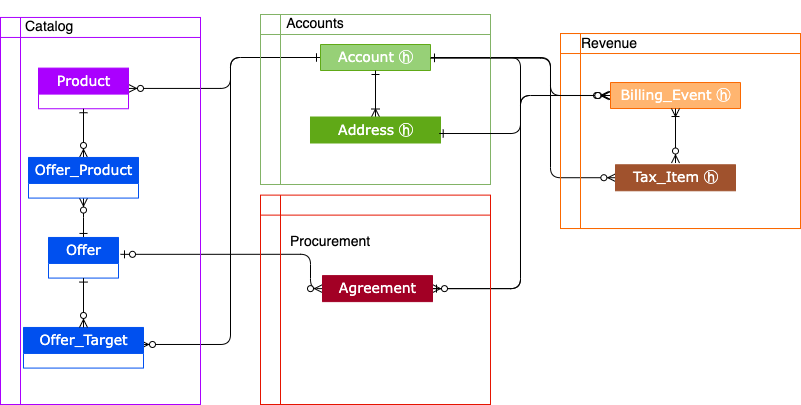
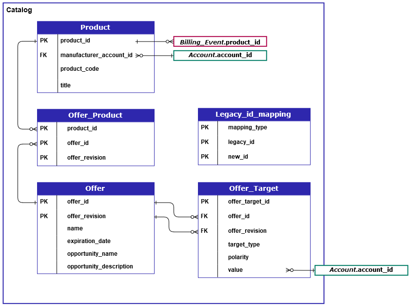
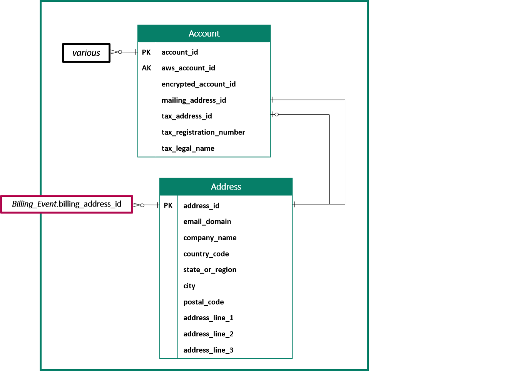
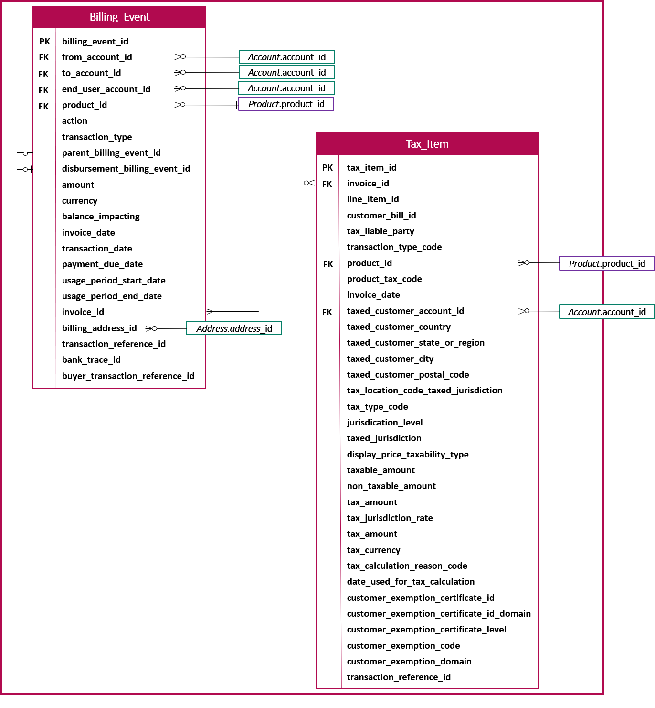

# Data feed tables overview

AWS Marketplace provides data feeds as a set of tables that you can join together to
provide more context for your queries.

AWS Marketplace provides the following general domains, or categories of interest, in your data feeds:

- **Catalog** – Includes information about the
  products and offers in your account.
- **Accounts** – Includes information about the
  accounts that provide or purchase products on AWS Marketplace (your own accounts or accounts
  of parties that you work with such as channel partners or buyers).
- **Revenue** – Includes information about
  billing, disbursements, and taxes.
- **Procurement** – includes information about
  the agreements for the product offers you have created as the seller of record.
  This diagram shows the tables in the Catalog, Accounts, and Revenue domains.

## Catalog-related tables

The following diagram shows the relationships between tables in the Catalog domain, as
well as the fields within the tables.

The `Product`, `Offer_Product`, `Offer`,
`Offer_Target`, and `Legacy_id_mapping`\_tables are in the
Catalog domain.

The `Offer_Target` table includes a value field for the
`account_id` of the target, but only when the `target_type`
value is `account`.

The `Legacy_id_mapping` table is not used for current data.

###### Note

For more information about these tables, including a description of each field in
the table and the joins that can be created, see the following topics:

- [Product data feed](data-feed-product.md "data-feed-product.md")
- [Offer product data feed](data-feed-offer-product.md "data-feed-offer-product.md")
- [Offer data feed](data-feed-offer.md "data-feed-offer.md")
- [Offer target data feed](data-feed-offer-target.md "data-feed-offer-target.md")
- [Legacy mapping data feed](data-feed-legacy-mapping.md "data-feed-legacy-mapping.md")

## Accounts-related tables

The following diagram shows the relationships between the `Account` and
`Address` tables in the Accounts domain, as well as the fields within the
tables.

###### Note

For more information about these tables, including a description of each field in
the table and the joins that you can create, see the following topics:

- [Account data feed](data-feed-account.md "data-feed-account.md")
- [Address data feed](data-feed-address.md "data-feed-address.md")

## Revenue-related tables

The following diagram shows the relationships between the `Billing_Event`
and `Tax_Item` tables in the Revenue domain, as well as the fields within the
tables. The `Billing_Event` table includes information about disbursements,
as well as billing events.

###### Note

For more information about these tables, including a description of each field in
the table and the joins that you can create, see the following topics:

- [Billing event data feed](data-feed-billing-event.md "data-feed-billing-event.md")
- [Tax item data feed](data-feed-tax-item.md "data-feed-tax-item.md")

### Procurement related tables

The following diagram shows the fields within the Agreement table in the
Procurement domain.

###### Note

For more information about these tables, including a description of each field
in the table and the joins that can be created, see [Agreements data feed](data-feed-agreements.md "data-feed-agreements.md"), in
this guide.

The following sections provide _entity relationship_ (ER) diagrams
for each domain. Each ER diagram shows the tables and the fields within each table, as
well as the fields that you can use to join the tables.

###### Note

The ER diagrams in this section do not include the common fields for all data
feeds. For more information about the common fields, see [Storage and structure of AWS Marketplace data feeds](data-feed-details.md "data-feed-details.md").

The following table describes the symbols that are used in the ER diagrams.

| Symbol                                                                       | Description                                                                                                                                                                                                                                                                                                                                                                                              |
| ---------------------------------------------------------------------------- | -------------------------------------------------------------------------------------------------------------------------------------------------------------------------------------------------------------------------------------------------------------------------------------------------------------------------------------------------------------------------------------------------------- | --------------------------------------------------------------------------------------------- |
| An image of the letters "PK" as a symbol.                                    | **Primary key** – A primary key for the table. When used with the `valid_from` and `update_date` fields, it is unique. For more details about using these fields together, see [Historization of the data](data-feed-details.md#data-feed-historization "data-feed-details.md#data-feed-historization"). If more than one field is marked as primary key, then the fields together form the primary key. |
| An image of the letters "FK" as a symbol.                                    | **Foreign key** – A field that represents a primary key in a different table. Not necessarily unique in the table. Note In some cases, the foreign key can be blank if the record in the current table does not have a corresponding record in the foreign table.                                                                                                                                        |
| An image of the letters "AK" as a symbol.                                    | **Alternate key** – A key that can be used as a key in the table. Follows the same uniqueness rules as the primary key.                                                                                                                                                                                                                                                                                  |
| An image of a line with a cross at one end and circle and fork at the other. | **Connector** – Lines between fields represent a connection, which is two fields that can be used to join tables. The ends of the line represent the type of connection. This example represents a one-to-many connection.                                                                                                                                                                               | **Connector types** The following table shows the types of ends that each connector can have. |
| Connector type                                                               | Description                                                                                                                                                                                                                                                                                                                                                                                              |
| ---                                                                          | ---                                                                                                                                                                                                                                                                                                                                                                                                      |
| An image of a line with a cross at one end.                                  | **One to n** – A connector with this end represents a join that has exactly one value on this side of the join.                                                                                                                                                                                                                                                                                          |
| An image of a line with a cross and circle at one end.                       | **Zero or one to n** – A connector with this end represents a join that has zero or one values on this side of the join.                                                                                                                                                                                                                                                                                 |
| An image of a line with a circle and fork at one end.                        | **Zero or more to n** – A connector with this end represents a join that has zero, one, or many values on this side of the join.                                                                                                                                                                                                                                                                         |
| An image of a line with a cross and fork at one end.                         | **One or more to n** – A connector with this end represents a join that has one or many values on this side of the join.                                                                                                                                                                                                                                                                                 |
