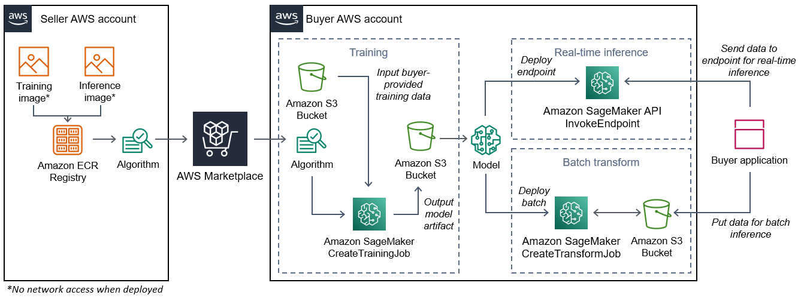

# Creating algorithm images

An Amazon SageMaker AI algorithm requires that the buyer bring their own data to train before it makes
predictions. As an AWS Marketplace seller, you can use SageMaker AI to create machine learning (ML) algorithms
and models that your buyers can deploy in AWS. The following sections you how to create
algorithm images for AWS Marketplace. This includes creating the Docker training image for training your
algorithm and the inference image that contains your inference logic. Both the training and
inference images are required when publishing an algorithm product.

###### Topics

- [Overview](#ml-algorithm-images-overview "#ml-algorithm-images-overview")
- [Creating a training image for
  algorithms](#ml-creating-a-training-image-for-algorithms "#ml-creating-a-training-image-for-algorithms")
- [Creating an inference image
  for algorithms](#ml-creating-an-inference-image-for-algorithms "#ml-creating-an-inference-image-for-algorithms")

## Overview

An algorithm includes the following components:

- A training image stored in [Amazon ECR](https://aws.amazon.com/ecr/ "https://aws.amazon.com/ecr/")
- An inference image stored in Amazon Elastic Container Registry (Amazon ECR)

###### Note

For algorithm products, the training container generates model artifacts that are
loaded into the inference container on model deployment.

The following diagram shows the workflow for publishing and using algorithm
products.



The workflow for creating a SageMaker AI algorithm for AWS Marketplace includes the following steps:

1. The seller creates a training image and an inference image (no network access when
   deployed) and uploads it to the Amazon ECR Registry.
2. The seller then creates an algorithm resource in Amazon SageMaker AI and publishes their ML
   product on AWS Marketplace.
3. The buyer subscribes to the ML product.
4. The buyer creates a training job with a compatible dataset and appropriate
   hyperparameter values. SageMaker AI runs the training image and loads the training data and
   hyperparameters into the training container. When the training job completes, the model
   artifacts located in `/opt/ml/model/` are compressed and copied to the
   buyer’s [Amazon S3](https://aws.amazon.com/s3/ "https://aws.amazon.com/s3/") bucket.
5. The buyer creates a model package with the model artifacts from the training stored in
   Amazon S3 and deploys the model.
6. SageMaker AI runs the inference image, extracts the compressed model artifacts, and loads the
   files into the inference container directory path `/opt/ml/model/`
   where it is consumed by the code that serves the inference.
7. Whether the model deploys as an endpoint or a batch transform job, SageMaker AI passes the
   data for inference on behalf of the buyer to the container via the container’s HTTP
   endpoint and returns the prediction results.

###### Note

For more information, see [Train Models](../../../sagemaker/latest/dg/train-model.md "../../../sagemaker/latest/dg/train-model.md").

## Creating a training image for

algorithms

This section provides a walkthrough for packaging your training code into a training
image. A training image is required to create an algorithm product.

A _training image_ is a Docker image containing your
training algorithm. The container adheres to a specific file structure to allow SageMaker AI to copy
data to and from your container.

Both the training and inference images are required when publishing an algorithm
product. After creating your training image, you must create an inference image. The two
images can be combined into one image or remain as separate images. Whether to combine the
images or separate them is up to you. Typically, inference is simpler than training, and you
might want separate images to help with inference performance.

###### Note

The following is only one example of packaging code for a training image. For more
information, see [Use your own algorithms and
models with the AWS Marketplace](../../../sagemaker/latest/dg/your-algorithms-marketplace.md "../../../sagemaker/latest/dg/your-algorithms-marketplace.md") and the [AWS Marketplace
SageMaker AI examples](https://github.com/aws/amazon-sagemaker-examples/tree/master/aws_marketplace "https://github.com/aws/amazon-sagemaker-examples/tree/master/aws_marketplace") on GitHub.

###### Steps

- [Step 1: Creating the container
  image](#ml-step-1-creating-the-container-image-1 "#ml-step-1-creating-the-container-image-1")
- [Step 2: Building and
  testing the image locally](#ml-step-2-building-and-testing-the-image-locally-1 "#ml-step-2-building-and-testing-the-image-locally-1")

### Step 1: Creating the container

image

For the training image to be compatible with Amazon SageMaker AI, it must adhere to a specific
file structure to allow SageMaker AI to copy the training data and configuration inputs to specific
paths in your container. When the training completes, the generated model artifacts are
stored in a specific directory path in the container where SageMaker AI copies from.

The following uses Docker CLI installed in a development environment on an Ubuntu
distribution of Linux.

- [Prepare your
  program to read configuration inputs](#ml-prepare-your-program-to-read-configuration-inputs "#ml-prepare-your-program-to-read-configuration-inputs")
- [Prepare your program to
  read data inputs](#ml-prepare-your-program-to-read-data-inputs "#ml-prepare-your-program-to-read-data-inputs")
- [Prepare your program
  to write training outputs](#ml-prepare-your-program-to-write-training-outputs "#ml-prepare-your-program-to-write-training-outputs")
- [Create the script for the
  container run](#ml-create-the-script-for-the-container-run-1 "#ml-create-the-script-for-the-container-run-1")
- [Create the
  Dockerfile](#ml-create-the-dockerfile-1 "#ml-create-the-dockerfile-1")

#### Prepare your

program to read configuration inputs

If your training program requires any buyer-provided configuration input, the
following is where those are copied to inside your container when ran. If required, your
program must read from those specific file paths.

- `/opt/ml/input/config` is the directory that contains information
  which controls how your program runs.
  - `hyperparameters.json` is a JSON-formatted dictionary of
    hyperparameter names and values. The values are strings, so you may need to
    convert them.
  - `resourceConfig.json` is a JSON-formatted file that describes
    the network layout used for [distributed training](../../../sagemaker/latest/dg/your-algorithms-training-algo-running-container.md#your-algorithms-training-algo-running-container-dist-training "../../../sagemaker/latest/dg/your-algorithms-training-algo-running-container.md#your-algorithms-training-algo-running-container-dist-training"). If your training image does not support
    distributed training, you can ignore this file.

###### Note

For more information about configuration inputs, see [How
Amazon SageMaker AI Provides Training Information](../../../sagemaker/latest/dg/your-algorithms-training-algo-running-container.md "../../../sagemaker/latest/dg/your-algorithms-training-algo-running-container.md").

#### Prepare your program to

read data inputs

Training data can be passed to the container in one of the following two modes. Your
training program that runs in the container digests the training data in one of those two
modes.

**File mode**

- `/opt/ml/input/data/<channel_name>/` contains the input data
  for that channel. The channels are created based on the call to the
  `CreateTrainingJob` operation, but it's generally important that channels
  match what the algorithm expects. The files for each channel are copied from [Amazon S3](https://aws.amazon.com/s3/ "https://aws.amazon.com/s3/") to this directory, preserving the tree
  structure indicated by the Amazon S3 key structure.

**Pipe mode**

- `/opt/ml/input/data/<channel_name>_<epoch_number>` is
  the pipe for a given epoch. Epochs start at zero and increase by one each time you
  read them. There is no limit to the number of epochs that you can run, but you must
  close each pipe before reading the next epoch.

#### Prepare your program

to write training outputs

The output of the training is written to the following container directories:

- `/opt/ml/model/` is the directory where you write the model or the
  model artifacts that your training algorithm generates. Your model can be in any
  format that you want. It can be a single file or a whole directory tree. SageMaker AI packages
  any files in this directory into a compressed file (.tar.gz). This file is available
  at the Amazon S3 location returned by the `DescribeTrainingJob` API operation.
- `/opt/ml/output/` is a directory where the algorithm can write a
  `failure` file that describes why the job failed. The contents of this
  file are returned in the `FailureReason` field of the
  `DescribeTrainingJob` result. For jobs that succeed, there is no reason
  to write this file because it’s ignored.

#### Create the script for the

container run

Create a `train` shell script that SageMaker AI runs when it runs the
Docker container image. When the training completes and the model artifacts are written to
their respective directories, exit the script.

**`./train`**

```
#!/bin/bash

# Run your training program here
#
#
#
#
```

#### Create the

`Dockerfile`

Create a `Dockerfile` in your build context. This example uses
Ubuntu 18.04 as the base image, but you can start from any base image that works for your
framework.

**`./Dockerfile`**

```
FROM ubuntu:18.04

# Add training dependencies and programs
#
#
#
#
#
# Add a script that SageMaker AI will run
# Set run permissions
# Prepend program directory to $PATH
COPY /train /opt/program/train
RUN chmod 755 /opt/program/train
ENV PATH=/opt/program:${PATH}
```

The `Dockerfile` adds the previously created
`train` script to the image. The script’s directory is added to the
PATH so it can run when the container runs.

In the previous example, there is no actual training logic. For your actual training
image, add the training dependencies to the `Dockerfile`, and add the
logic to read the training inputs to train and generate the model artifacts.

Your training image must contain all of its required dependencies because it will not
have internet access.

For more information, see [Use your own algorithms and
models with the AWS Marketplace](../../../sagemaker/latest/dg/your-algorithms-marketplace.md "../../../sagemaker/latest/dg/your-algorithms-marketplace.md") and the [AWS Marketplace
SageMaker AI examples](https://github.com/aws/amazon-sagemaker-examples/tree/master/aws_marketplace "https://github.com/aws/amazon-sagemaker-examples/tree/master/aws_marketplace") on GitHub.

### Step 2: Building and

testing the image locally

In the build context, the following files now exist:

- `./Dockerfile`
- `./train`
- Your training dependencies and logic

Next you can build, run, and test this container image.

#### Build the image

Run the Docker command in the build context to build and tag the image. This example
uses the tag `my-training-image`.

```
sudo docker build --tag my-training-image ./
```

After running this Docker command to build the image, you should see output as Docker
builds the image based on each line in your `Dockerfile`. When it
finishes, you should see something similar to the following.

```
`Successfully built abcdef123456
Successfully tagged my-training-image:latest`
```

#### Run locally

After that has completed, test the image locally as shown in the following example.

```
sudo docker run \
  --rm \
  --volume '<path_to_input>:/opt/ml/input:ro' \
  --volume '<path_to_model>:/opt/ml/model' \
  --volume '<path_to_output>:/opt/ml/output' \
  --name my-training-container \
  my-training-image \
  train
```

The following are command details:

- `--rm` – Automatically remove the container after it stops.
- `--volume '<path_to_input>:/opt/ml/input:ro'` – Make test
  input directory available to container as read-only.
- `--volume '<path_to_model>:/opt/ml/model'` – Bind mount the
  path where the model artifacts are stored on the host machine when the training test
  is complete.
- `--volume '<path_to_output>:/opt/ml/output'` – Bind mount the
  path where the failure reason in a `failure` file is written to on
  the host machine.
- `--name my-training-container` – Give this running container a name.
- `my-training-image` – Run the built image.
- `train` – Run the same script SageMaker AI runs when running the container.

After running this command, Docker creates a container from the training image you
built and runs it. The container runs the `train` script, which starts
your training program.

After your training program finishes and the container exits, check that the output
model artifacts are correct. Additionally, check the log outputs to confirm that they are
not producing logs that you do not want, while ensuring enough information is provided
about the training job.

This completes packaging your training code for an algorithm product. Because an
algorithm product also includes an inference image, continue to the next section, [Creating an inference image
for algorithms](#ml-creating-an-inference-image-for-algorithms "#ml-creating-an-inference-image-for-algorithms").

## Creating an inference image

for algorithms

This section provides a walkthrough for packaging your inference code into an inference
image for your algorithm product.

The inference image is a Docker image containing your inference logic. The container at
runtime exposes HTTP endpoints to allow SageMaker AI to pass data to and from your container.

Both the training and inference images are required when publishing an algorithm
product. If you have not already done so, see the previous section about [Creating a training image for
algorithms](#ml-creating-a-training-image-for-algorithms "#ml-creating-a-training-image-for-algorithms"). The two images can be
combined into one image or remain as separate images. Whether to combine the images or
separate them is up to you. Typically, inference is simpler than training, and you might want
separate images to help with inference performance.

###### Note

The following is only one example of packaging code for an inference image. For more
information, see [Use your own algorithms and
models with the AWS Marketplace](../../../sagemaker/latest/dg/your-algorithms-marketplace.md "../../../sagemaker/latest/dg/your-algorithms-marketplace.md") and the [AWS Marketplace
SageMaker AI examples](https://github.com/aws/amazon-sagemaker-examples/tree/master/aws_marketplace "https://github.com/aws/amazon-sagemaker-examples/tree/master/aws_marketplace") on GitHub.

The following example uses a web service, [Flask](https://pypi.org/project/Flask/ "https://pypi.org/project/Flask/"), for simplicity, and is not considered production-ready.

###### Steps

- [Step 1: Creating the inference
  image](#ml-step-1-creating-the-inference-image "#ml-step-1-creating-the-inference-image")
- [Step 2: Building and
  testing the image locally](#ml-step-2-building-and-testing-the-image-locally-2 "#ml-step-2-building-and-testing-the-image-locally-2")

### Step 1: Creating the inference

image

For the inference image to be compatible with SageMaker AI, the Docker image must expose HTTP
endpoints. While your container is running, SageMaker AI passes inputs for inference provided by the
buyer to your container’s HTTP endpoint. The result of the inference is returned in the body
of the HTTP response.

The following uses Docker CLI installed in a development environment on an Ubuntu
distribution of Linux.

- [Create the web server script](#ml-create-the-web-server-script-1 "#ml-create-the-web-server-script-1")
- [Create the script for the
  container run](#ml-create-the-script-for-the-container-run-2 "#ml-create-the-script-for-the-container-run-2")
- [Create the
  Dockerfile](#ml-create-the-dockerfile-2 "#ml-create-the-dockerfile-2")
- [Preparing
  your program to dynamically load model artifacts](#ml-preparing-your-program-to-dynamically-load-model-artifacts "#ml-preparing-your-program-to-dynamically-load-model-artifacts")

#### Create the web server script

This example uses a Python server called [Flask](https://pypi.org/project/Flask/ "https://pypi.org/project/Flask/"), but you can use any web server that works for your framework.

###### Note

[Flask](https://pypi.org/project/Flask/ "https://pypi.org/project/Flask/") is used here for
simplicity. It is not considered a production-ready web server.

Create the Flask web server script that serves the two HTTP endpoints on TCP port
8080 that SageMaker AI uses. The following are the two expected endpoints:

- `/ping` – SageMaker AI makes HTTP GET requests to this endpoint to check if
  your container is ready. When your container is ready, it responds to HTTP GET
  requests at this endpoint with an HTTP 200 response code.
- `/invocations` – SageMaker AI makes HTTP POST requests to this endpoint for
  inference. The input data for inference is sent in the body of the request. The
  user-specified content type is passed in the HTTP header. The body of the response is
  the inference output.

**`./web_app_serve.py`**

```
# Import modules
import json
import re
from flask import Flask
from flask import request
app = Flask(__name__)

# Create a path for health checks
@app.route("/ping")
def endpoint_ping():
  return ""
 
# Create a path for inference
@app.route("/invocations", methods=["POST"])
def endpoint_invocations():
  
  # Read the input
  input_str = request.get_data().decode("utf8")
  
  # Add your inference code here.
  #
  #
  #
  #
  #
  # Add your inference code here.
  
  # Return a response with a prediction
  response = {"prediction":"a","text":input_str}
  return json.dumps(response)
```

In the previous example, there is no actual inference logic. For your actual
inference image, add the inference logic into the web app so it processes the input and
returns the prediction.

Your inference image must contain all of its required dependencies because it will
not have internet access.

#### Create the script for the

container run

Create a script named `serve` that SageMaker AI runs when it runs the
Docker container image. In this script, start the HTTP web server.

**`./serve`**

```
#!/bin/bash

# Run flask server on port 8080 for SageMaker AI
flask run --host 0.0.0.0 --port 8080
```

#### Create the

`Dockerfile`

Create a `Dockerfile` in your build context. This example uses
Ubuntu 18.04, but you can start from any base image that works for your framework.

**`./Dockerfile`**

```
FROM ubuntu:18.04

# Specify encoding
ENV LC_ALL=C.UTF-8
ENV LANG=C.UTF-8

# Install python-pip
RUN apt-get update \
&& apt-get install -y python3.6 python3-pip \
&& ln -s /usr/bin/python3.6 /usr/bin/python \
&& ln -s /usr/bin/pip3 /usr/bin/pip;

# Install flask server
RUN pip install -U Flask;

# Add a web server script to the image
# Set an environment to tell flask the script to run
COPY /web_app_serve.py /web_app_serve.py
ENV FLASK_APP=/web_app_serve.py

# Add a script that Amazon SageMaker AI will run
# Set run permissions
# Prepend program directory to $PATH
COPY /serve /opt/program/serve
RUN chmod 755 /opt/program/serve
ENV PATH=/opt/program:${PATH}
```

The `Dockerfile` adds the two created previously scripts to the
image. The directory of the `serve` script is added to the PATH so it
can run when the container runs.

#### Preparing

your program to dynamically load model artifacts

For algorithm products, the buyer uses their own datasets with your training image to
generate unique model artifacts. When the training process completes, your training
container outputs model artifacts to the container directory`/opt/ml/model/`. SageMaker AI compresses the contents in that directory into a .tar.gz
file and stores it in the buyer’s AWS account in Amazon S3.

When the model deploys, SageMaker AI runs your inference image, extracts the model artifacts
from the .tar.gz file stored in the buyer’s account in Amazon S3,and loads them into the
inference container in the `/opt/ml/model/` directory. At runtime, your
inference container code uses the model data.

###### Note

To protect any intellectual property that might be contained in the model artifact
files, you can choose to encrypt the files before outputting them. For more information,
see [Security and intellectual
property with Amazon SageMaker AI](ml-security-and-intellectual-property.md "ml-security-and-intellectual-property.md").

### Step 2: Building and

testing the image locally

In the build context, the following files now exist:

- `./Dockerfile`
- `./web_app_serve.py`
- `./serve`

Next you can build, run, and test this container image.

#### Build the image

Run the Docker command to build and tag the image. This example uses the tag
`my-inference-image`.

```
sudo docker build --tag my-inference-image ./
```

After running this Docker command to build the image, you should see output as Docker
builds the image based on each line in your `Dockerfile`. When it
finishes, you should see something similar to the following.

```
`Successfully built abcdef123456
Successfully tagged my-inference-image:latest`
```

#### Run locally

After your build has completed, you can test the image locally.

```
sudo docker run \
  --rm \
  --publish 8080:8080/tcp \
  --volume '<path_to_model>:/opt/ml/model:ro' \
  --detach \
  --name my-inference-container \
  my-inference-image \
  serve
```

The following are command details:

- `--rm` – Automatically remove the container after it stops.
- `--publish 8080:8080/tcp` – Expose port 8080 to simulate the port
  SageMaker AI sends HTTP requests to.
- `--volume '<path_to_model>:/opt/ml/model:ro'` – Bind mount the
  path to where the test model artifacts are stored on the host machine as read-only to
  make them available to your inference code in the container.
- `--detach` – Run the container in the background.
- `--name my-inference-container` – Give this running container a
  name.
- `my-inference-image` – Run the built image.
- `serve` – Run the same script SageMaker AI runs when running the container.

After running this command, Docker creates a container from the inference image and
runs it in the background. The container runs the `serve` script, which
starts your web server for testing purposes.

#### Test the ping HTTP endpoint

When SageMaker AI runs your container, it periodically pings the endpoint. When the endpoint
returns an HTTP response with status code 200, it signals to SageMaker AI that the container is
ready for inference.

Run the following command to test the endpoint and include the response header.

```
curl --include http://127.0.0.1:8080/ping
```

Example output is shown in the following example.

```
`HTTP/1.0 200 OK
Content-Type: text/html; charset=utf-8
Content-Length: 0
Server: MyServer/0.16.0 Python/3.6.8
Date: Mon, 21 Oct 2019 06:58:54 GMT`
```

#### Test the inference HTTP

endpoint

When the container indicates it is ready by returning a 200 status code, SageMaker AI passes
the inference data to the `/invocations` HTTP endpoint via a `POST`
request.

Run the following command to test the inference endpoint.

```
curl \
  --request POST \
  --data "hello world" \
  http://127.0.0.1:8080/invocations
```

Example output is shown in the following example..

```
`{"prediction": "a", "text": "hello world"}`
```

With these two HTTP endpoints working, the inference image is now compatible with
SageMaker AI.

###### Note

The model of your algorithm product can be deployed in two ways: real time and
batch. For both deployments, SageMaker AI uses the same HTTP endpoints while running the Docker
container.

To stop the container, run the following command.

```
sudo docker container stop my-inference-container
```

After both your training and inference images for your algorithm product are ready
and tested, continue to [Uploading your images to Amazon Elastic Container Registry](ml-uploading-your-images.md "ml-uploading-your-images.md").
