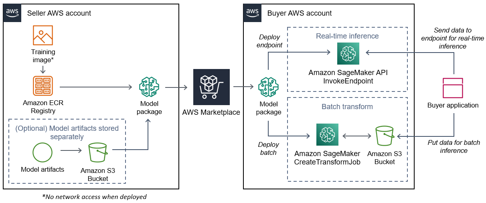

# Creating model package images

An Amazon SageMaker AI model package is a pre-trained model that makes predictions and does not require
any further training by the buyer. You can create a model package in SageMaker AI and publish your
machine learning product on AWS Marketplace. The following sections you how to create a model
package for AWS Marketplace. This includes creating the container image and building and testing the image
locally.

###### Topics

- [Overview](#ml-model-package-images-overview "#ml-model-package-images-overview")
- [Create an inference image
  for model packages](#ml-creating-an-inference-image-for-model-packages "#ml-creating-an-inference-image-for-model-packages")

## Overview

A model package includes the following components:

- An inference image stored in [Amazon Elastic Container Registry](https://aws.amazon.com/ecr/ "https://aws.amazon.com/ecr/") (Amazon ECR)
- (Optional) Model artifacts, stored separately in [Amazon S3](https://aws.amazon.com/s3/ "https://aws.amazon.com/s3/")

###### Note

Model artifacts are files your model uses to make predictions and are generally the
result of your own training processes. Artifacts can be any file type that is needed by your
model but must use.tar.gz compression. For model packages, they can either be bundled within
your inference image or stored separately in Amazon SageMaker AI. The model artifacts stored in Amazon S3 are
loaded into the inference container at runtime. When publishing your model package, those
artifacts are published and stored in AWS Marketplace owned Amazon S3 buckets that are inaccessible by the
buyer directly.

###### Tip

If your inference model is built with a deep learning framework such as Gluon, Keras,
MXNet, PyTorch, TensorFlow, TensorFlow-Lite, or ONNX, consider using Amazon SageMaker AI Neo. Neo can
automatically optimize inference models that deploy to a specific family of cloud instance
types such as `ml.c4`, `ml.p2`, and others. For more information, see
[Optimize model performance
using Neo](../../../sagemaker/latest/dg/neo.md "../../../sagemaker/latest/dg/neo.md") in the _Amazon SageMaker AI Developer Guide_.

The following diagram shows the workflow for publishing and using model package products.



The workflow for creating a SageMaker AI model package for AWS Marketplace includes the following steps:

1. The seller creates an inference image (no network access when deployed) and pushes it to
   the Amazon ECR Registry.

The model artifacts can either be bundled in the inference image or stored separately in
S3. 2. The seller then creates a model package resource in Amazon SageMaker AI and publishes their ML
product on AWS Marketplace. 3. The buyer subscribes to the ML product and deploys the model.

###### Note

The model can be deployed as an endpoint for real-time inferences or as a batch job
to get predictions for an entire dataset at once. For more information, see [Deploy Models for
Inference](../../../sagemaker/latest/dg/deploy-model.md "../../../sagemaker/latest/dg/deploy-model.md"). 4. SageMaker AI runs the inference image. Any seller-provided model artifacts not bundled in the
inference image are loaded dynamically at runtime. 5. SageMaker AI passes the buyer’s inference data to the container by using the container’s HTTP
endpoints and returns the prediction results.

## Create an inference image

for model packages

This section provides a walkthrough for packaging your inference code into an inference
image for your model package product. The process consists of the following steps:

###### Steps

- [Step 1: Create the container image](#ml-step-1-creating-the-container-image "#ml-step-1-creating-the-container-image")
- [Step 2: Build and
  testing the image locally](#ml-step-2-building-and-testing-the-image-locally "#ml-step-2-building-and-testing-the-image-locally")

The inference image is a Docker image containing your inference logic. The container at
runtime exposes HTTP endpoints to allow SageMaker AI to pass data to and from your container.

###### Note

The following is only one example of packaging code for an inference image. For more
information, see [Using Docker containers with SageMaker AI](../../../sagemaker/latest/dg/your-algorithms.md "../../../sagemaker/latest/dg/your-algorithms.md") and the [AWS Marketplace
SageMaker AI examples](https://github.com/aws/amazon-sagemaker-examples/tree/master/aws_marketplace "https://github.com/aws/amazon-sagemaker-examples/tree/master/aws_marketplace") on GitHub.

The following example uses a web service, [Flask](https://pypi.org/project/Flask/ "https://pypi.org/project/Flask/"), for simplicity, and is not considered production-ready.

### Step 1: Create the container image

For the inference image to be compatible with SageMaker AI, the Docker image must expose HTTP
endpoints. While your container is running, SageMaker AI passes buyer inputs for inference to the
container’s HTTP endpoint. The inference results are returned in the body of the HTTP
response.

The following walkthrough uses the Docker CLI in a development environment using a
Linux Ubuntu distribution.

- [Create the web server script](#ml-create-the-web-server-script "#ml-create-the-web-server-script")
- [Create the script for the
  container run](#ml-create-the-script-for-the-container-run "#ml-create-the-script-for-the-container-run")
- [Create the
  Dockerfile](#ml-create-the-dockerfile "#ml-create-the-dockerfile")
- [Package or upload the model
  artifacts](#ml-package-or-upload-the-model-artifacts "#ml-package-or-upload-the-model-artifacts")

#### Create the web server script

This example uses a Python server called [Flask](https://pypi.org/project/Flask/ "https://pypi.org/project/Flask/"), but you can use any web server that works for your framework.

###### Note

[Flask](https://pypi.org/project/Flask/ "https://pypi.org/project/Flask/") is used here for
simplicity. It is not considered a production-ready web server.

Create a Flask web server script that serves the two HTTP endpoints on TCP port 8080
that SageMaker AI uses. The following are the two expected endpoints:

- `/ping` – SageMaker AI makes HTTP GET requests to this endpoint to check if
  your container is ready. When your container is ready, it responds to HTTP GET
  requests at this endpoint with an HTTP 200 response code.
- `/invocations` – SageMaker AI makes HTTP POST requests to this endpoint for
  inference. The input data for inference is sent in the body of the request. The
  user-specified content type is passed in the HTTP header. The body of the response is
  the inference output. For details about timeouts, see [Requirements and best practices for
  creating machine learning products](ml-listing-requirements-and-best-practices.md "ml-listing-requirements-and-best-practices.md").

**`./web_app_serve.py`**

```
# Import modules
import json
import re
from flask import Flask
from flask import request
app = Flask(__name__)

# Create a path for health checks
@app.route("/ping")
def endpoint_ping():
  return ""
 
# Create a path for inference
@app.route("/invocations", methods=["POST"])
def endpoint_invocations():
  
  # Read the input
  input_str = request.get_data().decode("utf8")
  
  # Add your inference code between these comments.
  #
  #
  #
  #
  #
  # Add your inference code above this comment.
  
  # Return a response with a prediction
  response = {"prediction":"a","text":input_str}
  return json.dumps(response)
```

In the previous example, there is no actual inference logic. For your actual inference
image, add the inference logic into the web app so it processes the input and returns the
actual prediction.

Your inference image must contain all of its required dependencies because it will not
have internet access, nor will it be able to make calls to any AWS services.

###### Note

This same code is called for both real-time and batch inferences

#### Create the script for the

container run

Create a script named `serve` that SageMaker AI runs when it runs the
Docker container image. The following script starts the HTTP web server.

**`./serve`**

```
#!/bin/bash

# Run flask server on port 8080 for SageMaker
flask run --host 0.0.0.0 --port 8080
```

#### Create the

`Dockerfile`

Create a `Dockerfile` in your build context. This example uses
Ubuntu 18.04, but you can start from any base image that works for your framework.

`**./Dockerfile**`

```
FROM ubuntu:18.04

# Specify encoding
ENV LC_ALL=C.UTF-8
ENV LANG=C.UTF-8

# Install python-pip
RUN apt-get update \
&& apt-get install -y python3.6 python3-pip \
&& ln -s /usr/bin/python3.6 /usr/bin/python \
&& ln -s /usr/bin/pip3 /usr/bin/pip;

# Install flask server
RUN pip install -U Flask;

# Add a web server script to the image
# Set an environment to tell flask the script to run
COPY /web_app_serve.py /web_app_serve.py
ENV FLASK_APP=/web_app_serve.py

# Add a script that Amazon SageMaker AI will run
# Set run permissions
# Prepend program directory to $PATH
COPY /serve /opt/program/serve
RUN chmod 755 /opt/program/serve
ENV PATH=/opt/program:${PATH}
```

The `Dockerfile` adds the two previously created scripts to the
image. The directory of the `serve` script is added to the PATH so it
can run when the container runs.

#### Package or upload the model

artifacts

The two ways to provide the model artifacts from training the model to the inference
image are as follows:

- Packaged statically with the inference image.
- Loaded dynamically at runtime. Because it's loaded dynamically, you can use the
  same image for packaging different machine learning models.

If you want to package your model artifacts with the inference image, include the
artifacts in the `Dockerfile`.

If you want to load your model artifacts dynamically, store those artifacts
separately in a compressed file (.tar.gz) in Amazon S3. When creating the model package,
specify the location of the compressed file, and SageMaker AI extracts and copies the contents to
the container directory `/opt/ml/model/` when running your container.
When publishing your model package, those artifacts are published and stored in AWS Marketplace
owned Amazon S3 buckets that are inaccessible by the buyer directly.

### Step 2: Build and

testing the image locally

In the build context, the following files now exist:

- `./Dockerfile`
- `./web_app_serve.py`
- `./serve`
- Your inference logic and (optional) dependencies

Next build, run, and test the container image.

#### Build the image

Run the Docker command in the build context to build and tag the image. This example
uses the tag `my-inference-image`.

```
sudo docker build --tag my-inference-image ./
```

After running this Docker command to build the image, you should see output as Docker
builds the image based on each line in your `Dockerfile`. When it
finishes, you should see something similar to the following.

```
`Successfully built abcdef123456
Successfully tagged my-inference-image:latest`
```

#### Run locally

After your build has completed, you can test the image locally.

```
sudo docker run \
  --rm \
  --publish 8080:8080/tcp \
  --detach \
  --name my-inference-container \
  my-inference-image \
  serve
```

The following are details about the command:

- `--rm` – Automatically remove the container after it
  stops.
- `--publish 8080:8080/tcp` – Expose port 8080 to simulate the
  port that SageMaker AI sends HTTP requests to.
- `--detach` – Run the container in the background.
- `--name my-inference-container` – Give this running container a
  name.
- `my-inference-image` – Run the built image.
- `serve` – Run the same script that SageMaker AI runs when running the
  container.

After running this command, Docker creates a container from the inference image you
built and runs it in the background. The container runs the `serve`
script, which launches your web server for testing purposes.

#### Test the ping HTTP endpoint

When SageMaker AI runs your container, it periodically pings the endpoint. When the endpoint
returns an HTTP response with status code 200, it signals to SageMaker AI that the container is
ready for inference. You can test this by running the following command, which tests the
endpoint and includes the response header.

```
curl --include http://127.0.0.1:8080/ping
```

Example output is as follows.

```
`HTTP/1.0 200 OK
Content-Type: text/html; charset=utf-8
Content-Length: 0
Server: MyServer/0.16.0 Python/3.6.8
Date: Mon, 21 Oct 2019 06:58:54 GMT`
```

#### Test the inference HTTP

endpoint

When the container indicates it is ready by returning a 200 status code to your ping,
SageMaker AI passes the inference data to the `/invocations` HTTP endpoint via a
`POST` request. Test the inference point by running the following command.

```
curl \
  --request POST \
  --data "hello world" \
  http://127.0.0.1:8080/invocations
```

Example output is as follows.

`{"prediction": "a", "text": "hello
 world"}`

With these two HTTP endpoints working, the inference image is now compatible with
SageMaker AI.

###### Note

The model of your model package product can be deployed in two ways: real time and
batch. In both deployments, SageMaker AI uses the same HTTP endpoints while running the Docker
container.

To stop the container, run the following command.

```
sudo docker container stop my-inference-container
```

When your inference image is ready and tested, you can continue to [Uploading your images to Amazon Elastic Container Registry](ml-uploading-your-images.md "ml-uploading-your-images.md").
