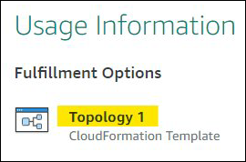

# Submitting your product for publication on AWS Marketplace

You use the product submission process to make your products available on AWS Marketplace.
Products can be simple, such as a single Amazon Machine Image (AMI) with one
price structure, or more complicated, with AWS CloudFormation templates,
and complex pricing options and payment schedules. You define your product offering and submit
it through the AWS Marketplace Management Portal in one of two ways:

- Using the **Products** tab – For products that are less complex,
  you use the **Products** tab to completely define and submit your
  request.
- Using the **Assets** tab – For products that are more complex
  and require more definition, you download a product load form (PLF), add product details,
  and then upload the completed form using the **File upload** option.

###### Note

Data product providers must use the AWS Data Exchange console to publish products. For more
information, see [Publishing a new
product](../../../data-exchange/latest/userguide/publishing-products.md "../../../data-exchange/latest/userguide/publishing-products.md") in the _AWS Data Exchange User Guide_.

We recommend that you start by using the **Products** tab to determine
which approach to use. The following table lists configurations and the approach you use to
submit your request. The first column is the pricing model for your product, and the other three
columns describe how the product is deployed to the customer.

| Pricing model                                 | Products launched using single-node AMI | Products launched with AWS CloudFormation | Products launched as software as a service (SaaS) |
| --------------------------------------------- | --------------------------------------- | ----------------------------------------- | ------------------------------------------------- | ---------------------------------------------------------------------------------------------------------------------------------------------------------------------------------------------------------------------------------------------------------------------------------------------------------------------------------------------------------------------------------------------------------------------------------------------------------------------------------------------------------------------------------------------------------------------------------------------------------------------------------------------------------------------------------------------------------------------------------------------------------------------------------------------------------------------------------------------------------------------------------------------------------------------------------------------------------------------------------------------------------------------------------------------------------------------------------------------------------------------------------------------------------------------------------------------------------------------------------------------------------------------------------------------------------------------------------------------------------------------------------------------------------------------------------------------------------------------------------------------------------------------------------------------------------------------------------------------------------------------------------------------------------------------------------------------------------------------------------------------------------------------------------------------------------------------------------------------------------------------------------------------------------------------------------------------------------------------------------------------------------------------------------------------------------------------------------------------------------------------------------------------------------------------------------------------------------------------------------------------------------------------------------------------------------------------------------------------------------------------------------------------------------------------------------------------------------------------------------------------------------------------------------------------------------------------------------------------------------------------------------------------------------------------------------------------------------------------------------------------------------------------------------------------------------------------------------------------------------------------------------------------------------------------------------------------------------------------------------------------------------------------------------------------------------------------------------------------------------------------------------------------------------------------------------------------------------------------------------------------------------------------------------------------------------------------------------------------------------------------------------------------------------------------------------------------------------------------------------------------------------------------------------------------------------------------------------------------------------------------------------------------------------------------------------------------------------------------------------------------------------------------------------------------------------------------------------------------------------------------------------------------------------------------------------------------------------------------------------------------------------------------------------------------------------------------------------------------------------------------------------------------------------------------------------------------------------------------------------------------------------------------------------------------------------------------------------------------------------------------------------------------------------------------------------------------------------------------------------------------------------------------------------------------------------------------------------------------------------------------------------------------------------------------------------------------------------------------------------------------------------------------------------------------------------------------------------------------------------------------------------------------------------------------------------------------------------------------------------------------------------------------------------------------------------------------------------------------------------------------------------------------------------------------------------------------------------------------------------------------------------------------------------------------------------------------------------------------------------------------------------------------------------------------------------------------------------------------------------------------------------------------------------------------------------------------------------------------------------------------------------------------------------------------------------------------------------------------------------------------------------------------------------------------------------------------------------------------------------------------------------------------------------------------------------------------------------------------------------------------------------------------------------------------------------------------------------------------------------------------------------------------------------------------------------------------------------------------------------------------------------------------------------------------------------------------------------------------------------------------------------------------------------------------------------------------------------------------------------------------------------------------------------------------------------------------------------------------------------------------------------------------------------------------------------------------------------------------------------------------------------------------------------------------------------------------------------------------------------------------------------------------------------------------------------------------------------------------------------------------------------------------------------------------------------------------------------------------------------------------------------------------------------------------------------------------------------------------------------------------------------------------------------------------------------------------------------------------------------------------------------------------------------------------------------------------------------------------------------------------------------------------------------------------------------------------------------------------------------------------------------------------------------------------------------------------------------------------------------------------------------------------------------------------------------------------------------------------------------------------------------------------------------------------------------------------------------------------------------------------------------------------------------------------------------------------------------------------------------------------------------------------------------------------------------------------------------------------------------------------------------------------------------------------------------------------------------------------------------------------------------------------------------------------------------------------------------------------------------------------------------------------------------------------------------------------------------------------------------------------------------------------------------------------------------------------------------------------------------------------------------------------------------------------------------------------------------------------------------------------------------------------------------------------------------------------------------------------------------------------------------------------------------------------------------------------------------------------------------------------------------------------------------------------------------------------------------------------------------------------------------------------------------------------------------------------------------------------------------------------------------------------------------------------------------------------------------------------------------------------------------------------------------------------------------------------------------------------------------------------------------------------------------------------------------------------------------------------------------------------------------------------------------------------------------------------------------------------------------------------------------------------------------------------------------------------------------------------------------------------------------------------------------------------------------------------------------------------------------------------------------------------------------------------------------------------------------------------------------------------------------------------------------------------------------------------------------------------------------------------------------------------------------------------------------------------------------------------------------------------------------------------------------------------------------------------------------------------------------------------------------------------------------------------------------------------------------------------------------------------------------------------------------------------------------------------------------------------------------------------------------------------------------------------------------------------------------------------------------------------------------------------------------------------------------------------------------------------------------------------------------------------------------------------------------------------------------------------------------------------------------------------------------------------------------------------------------------------------------------------------------------------------------------------------------------------------------------------------------------------------------------------------------------------------------------------------------------------------------------------------------------------------------------------------------------------------------------------------------------------------------------------------------------------------------------------------------------------------------------------------------------------------------------------------------------------------------------------------------------------------------------------------------------------------------------------------------------------------------------------------------------------------------------------------------------------------------------------------------------------------------------------------------------------------------------------------------------------------------------------------------------------------------------------------------------------------------------------------------------------------------------------------------------------------------------------------------------------------------------------------------------------------------------------------------------------------------------------------------------------------------------------------------------------------------------------------------------------------------------------------------------------------------------------------------------------------------------------------------------------------------------------------------------------------------------------------------------------------------------------------------------------------------------------------------------------------------------------------------------------------------------------------------------------------------------------------------------------------------------------------------------------------------------------------------------------------------------------------------------------------------------------------------------------------------------------------------------------------------------------------------------------------------------------------------------------------------------------------------------------------------------------------------------------------------------------------------------------------------------------------------------------------------------------------------------------------------------------------------------------------------------------------------------------------------------------------------------------------------------------------------------------------------------------------------------------------------------------------------------------------------------------------------------------------------------------------------------------------------------------------------------------------------------------------------------------------------------------------------------------------------------------------------------------------------------------------------------------------------------------------------------------------------------------------------------------------------------------------------------------------------------------------------------------------------------------------------------------------------------------------------------------------------------------------------------------------------------------------------------------------------------------------------------------------------------------------------------------------------------------------------------------------------------------------------------------------------------------------------------------------------------------------------------------------------------------------------------------------------------------------------------------------------------------------------------------------------------------------------------------------------------------------------------------------------------------------------------------------------------------------------------------------------------------------------------------------------------------------------------------------------------------------------------------------------------------------------------------------------------------------------------------------------------------------------------------------------------------------------------------------------------------------------------------------------------------------------------------------------------------------------------------------------------------------------------------------------------------------------------------------------------------------------------------------------------------------------------------------------------------------------------------------------------------------------------------------------------------------------------------------------------------------------------------------------------------------------------------------------------------------------------------------------------------------------------------------------------------------------------------------------------------------------------------------------------------------------------------------------------------------------------------------------------------------------------------------------------------------------------------------------------------------------------------------------------------------------------------------------------------------------------------------------------------------------------------------------------------------------------------------------------------------------------------------------------------------------------------------------------------------------------------------------------------------------------------------------------------------------------------------------------------------------------------------------------------------------------------------------------------------------------------------------------------------------------------------------------------------------------------------------------------------------------------------------------------------------------------------------------------------------------------------------------------------------------------------------------------------------------------------------------------------------------------------------------------------------------------------------------------------------------------------------------------------------------------------------------------------------------------------------------------------------------------------------------------------------------------------------------------------------------------------------------------------------------------------------------------------------------------------------------------------------------------------------------------------------------------------------------------------------------------------------------------------------------------------------------------------------------------------------------------------------------------------------------------------------------------------------------------------------------------------------------------------------------------------------------------------------------------------------------------------------------------------------------------------------------------------------------------------------------------------------------------------------------------------------------------------------------------------------------------------------------------------------------------------------------------------------------------------------------------------------------------------------------------------------------------------------------------------------------------------------------------------------------------------------------------------------------------------------------------------------------------------------------------------------------------------------------------------------------------------------------------------------------------------------------------------------------------------------------------------------------------------------------------------------------------------------------------------------------------------------------------------------------------------------------------------------------------------------------------------------------------------------------------------------------------------------------------------------------------------------------------------------------------------------------------------------------------------------------------------------------------------------------------------------------------------------------------------------------------------------------------------------------------------------------------------------------------------------------------------------------------------------------------------------------------------------------------------------------------------------------------------------------------------------------------------------------------------------------------------------------------------------------------------------------------------------------------------------------------------------------------------------------------------------------------------------------------------------------------------------------------------------------------------------------------------------------------------------------------------------------------------------------------------------------------------------------------------------------------------------------------------------------------------------------------------------------------------------------------------------------------------------------------------------------------------------------------------------------------------------------------------------------------------------------------------------------------------------------------------------------------------------------------------------------------------------------------------------------------------------------------------------------------------------------------------------------------------------------------------------------------------------------------------------------------------------------------------------------------------------------------------------------------------------------------------------------------------------------------------------------------------------------------------------------------------------------------------------------------------------------------------------------------------------------------------------------------------------------------------------------------------------------------------------------------------------------------------------------------------------------------------------------------------------------------------------------------------------------------------------------------------------------------------------------------------------------------------------------------------------------------------------------------------------------------------------------------------------------------------------------------------------------------------------------------------------------------------------------------------------------------------------------------------------------------------------------------------------------------------------------------------------------------------------------------------------------------------------------------------------------------------------------------------------------------------------------------------------------------------------------------------------------------------------------------------------------------------------------------------------------------------------------------------------------------------------------------------------------------------------------------------------------------------------------------------------------------------------------------------------------------------------------------------------------------------------------------------------------------------------------------------------------------------------------------------------------------------------------------------------------------------------------------------------------------------------------------------------------------------------------------------------------------------------------------------------------------------------------------------------------------------------------------------------------------------------------------------------------------------------------------------------------------------------------------------------------------------------------------------------------------------------------------------------------------------------------------------------------------------------------------------------------------------------------------------------------------------------------------------------------------------------------------------------------------------------------------------------------------------------------------------------------------------------------------------------------------------------------------------------------------------------------------------------------------------------------------------------------------------------------------------------------------------------------------------------------------------------------------------------------------------------------------------------------------------------------------------------------------------------------------------------------------------------------------------------------------------------------------------------------------------------------------------------------------------------------------------------------------------------------------------------------------------------------------------------------------------------------------------------------------------------------------------------------------------------------------------------------------------------------------------------------------------------------------------------------------------------------------------------------------------------------------------------------------------------------------------------------------------------------------------------------------------------------------------------------------------------------------------------------------------------------------------------------------------------------------------------------------------------------------------------------------------------------------------------------------------------------------------------------------------------------------------------------------------------------------------------------------------------------------------------------------------------------------------------------------------------------------------------------------------------------------------------------------------------------------------------------------------------------------------------------------------------------------------------------------------------------------------------------------------------------------------------------------------------------------------------------------------------------------------------------------------------------------------------------------------------------------------------------------------------------------------------------------------------------------------------------------------------------------------------------------------------------------------------------------------------------------------------------------------------------------------------------------------------------------------------------------------------------------------------------------------------------------------------------------------------------------------------------------------------------------------------------------------------------------------------------------------------------------------------------------------------------------------------------------------------------------------------------------------------------------------------------------------------------------------------------------------------------------------------------------------------------------------------------------------------------------------------------------------------------------------------------------------------------------------------------------------------------------------------------------------------------------------------------------------------------------------------------------------------------------------------------------------------------------------------------------------------------------------------------------------------------------------------------------------------------------------------------------------------------------------------------------------------------------------------------------------------------------------------------------------------------------------------------------------------------------------------------------------------------------------------------------------------------------------------------------------------------------------------------------------------------------------------------------------------------------------------------------------------- |
| Bring Your Own License (BYOL)                 | **Products** tab                        | **Assets** tab                            |                                                   |
| Free                                          | **Products** tab                        | **Assets** tab                            |                                                   |
| Paid Hourly                                   | **Products** tab                        | **Assets** tab                            |                                                   |
| Paid Hourly with Annual                       | **Products** tab                        | **Assets** tab                            |                                                   |
| Paid Monthly                                  | **Products** tab                        | **Assets** tab                            |                                                   |
| Hourly with Monthly                           | **Assets** tab                          | **Assets** tab                            |                                                   |
| Paid Usage (AWS Marketplace Metering Service) | **Products** tab                        | **Assets** tab                            |                                                   |
| Contract Pricing                              | **Products** tab                        |                                           |                                                   |
| SaaS Subscription                             |                                         |                                           | **Products** tab                                  |
| SaaS Contract                                 |                                         |                                           | **Products** tab                                  |
| SaaS Legacy                                   |                                         |                                           | **Assets** tab                                    | You can submit products individually or, if you use a product load form, you can submit multiple products or product updates at the same time. You cannot use the **Products** tab to submit multiple products. If you are unclear about which products to submit and how to submit them, start by using the **Products** tab. If you have any problems making your submissions, contact the [AWS Marketplace Seller Operations](https://aws.amazon.com/marketplace/management/contact-us/ "https://aws.amazon.com/marketplace/management/contact-us/") team. ###### Topics  • [Using the Products tab](#using-the-products-tab "#using-the-products-tab")  • [Company and product logo requirements](#seller-and-product-logos "#seller-and-product-logos")  • [Requirements for submitting paid repackaged software](#paid-repackaged-software "#paid-repackaged-software")  • [Requirements for products with a hardware component](#product-requirements-hardware "#product-requirements-hardware")  • [AWS CloudFormation-launched product (free or paid) or usage-based paid AMI product](#aws-cloudformation-launched-product-free-or-paid-or-usage-based-paid-ami-product "#aws-cloudformation-launched-product-free-or-paid-or-usage-based-paid-ami-product")  • [Product changes and updates](#product-changes-and-updates "#product-changes-and-updates")  • [Timing and expectations](#timing-and-expectations "#timing-and-expectations")  • [Submitting AMIs to AWS Marketplace](#submitting-amis-to-aws-marketplace "#submitting-amis-to-aws-marketplace")  • [Final checklist](#final-checklist "#final-checklist") ## Using the Products tab To access the **Products** tab, log in to the AWS Marketplace Management Portal. From the **Products** tab, choose either **Server**, **SaaS**, or **Machine learning**, depending on the type of product that you manage. A dashboard for that product type appears and displays your current products. If you choose the **Requests** tab, the dashboard displays any outstanding requests and your completed request history. Once you start creating a product request, you can save your work in progress, and if necessary, create your request in several different sessions. When you submit your product request, the AWS Marketplace team reviews it. You can monitor the status of your request on the product page for the type of product you requested. For new products, after your request is approved for publication, you receive a limited listing URL that you use to preview and approve your submission. Your product offer is not published until you approve the submission. When you request a product update, it's published without the need for you to review and approve the change. This includes adding or removing versions, and metadata changes. You track the status of your requests under the **Requests** tab. The tab displays one of the following:  • **Draft** – You have started the request process but have not submitted your request.  • **Submitted** – You have completed and submitted your request, and it is under review.  • **Action Required** – The AWS Marketplace team has reviewed your request and needs more information.  • **Approval Required** – The AWS Marketplace team has created the limited listing URL for your product. You must review and either approve or reject the URL before AWS Marketplace will publish. If you approve, the status changes to **Publishing Pending** while the site gets published. If you reject, the status returns to **Draft** so you can modify the request.  • **Publishing Pending** – You have approved the mock-up of your request and AWS Marketplace is publishing your product.  • **Expired** – You started the request process but did not complete it within six months, so the request expired. If you have an entry with a status of **Submitted**, you can retract the submission. If you have an entry with a status of **Draft**, you can delete the request. This will allow you to start over. When you delete a **Draft** entry, the entry is moved to the **Request History** tab. To add your product in the AWS GovCloud (US) AWS Region, you must [have an active AWS GovCloud (US) account](../../../govcloud-us/latest/UserGuide/getting-started-sign-up.md "../../../govcloud-us/latest/UserGuide/getting-started-sign-up.md") and comply with the AWS GovCloud (US) requirements, including export control requirements. ## Company and product logo requirements Your company logo and the logo for your products must conform to the following AWS Marketplace guidelines so that the user experience is uniform when browsing AWS Marketplace: **Product logo specifications** – Your product logo image should have a transparent or white background and be 120 to 640 pixels in size, with a 1:1 or 2:1 (wide) ratio. **Company logo specifications** – Your company logo image should have a transparent background and be 220 x 220 pixels in size, allowing for 10 pixels of padding on each side within. ## Requirements for submitting paid repackaged software Before you can submit a listing for repackaged software, you must meet the following requirements. In this case, _Repackaged software_ includes open-source AMIs or software created by another vendor, such as an AMI with Windows. ###### Requirements  • The product title must indicate the value added by your repackaging. Examples of product titles include: _Hardened <Product>_, _<Product> with added packages_, or _<Product1> on <Product2>_.  • The product title must not contain any other language that is not otherwise supported with documentation. For example, the product title may not use the words _certified_, _original_, or _free_ unless these are substantiated in the product details that you provide.  • The product short description must include a clear statement summarizing the product charges. The short description must begin with the phrase _This product has charges associated with it for..._. For example, if a product includes charges for support from the seller, then the product description should state: _This product has charges associated with it for seller support_.  • The product logo must be same as the company logo that was used during your seller registration process. The product logo can differ from your company logo only if you use the official software logo, whereby you must receive explicit permission from the original software vendor. If explicit permission is obtained, a link to that documentation must be included in the notes section of the change request, or in the **Enter a brief description** field of the **File Uploads** page when using the product load form.  • For AMI products, the AMI name must not be reused from the original product. The AMI name must begin with the seller name and follow this format: [Seller Name] [name-given-to-ami]. If the AMI name does not adhere to the naming convention, you can copy the AMI from the AWS console and rename it. For more information, see [Copy an Amazon EC2 AMI](../../../AWSEC2/latest/UserGuide/CopyingAMIs.md "../../../AWSEC2/latest/UserGuide/CopyingAMIs.md"), in the _Amazon EC2 User Guide_. If the paid listing is for a standalone software product that was not created by your company and there is no intellectual property added to the product, such as bundling additional software libraries or adding special configuration, then along with the earlier requirements, you must also meet the following requirements:  • Product title must include the seller name (along with the value added, as described earlier). The seller name is the name used during seller registration. For example, _<Product> with maintenance support by <seller>_.  • The first line of the product's long description must begin with the phrase _This is a repackaged software product wherein additional charges apply for..._ (or, if it's open source, _This is a repackaged open source software product wherein additional charges apply for..._). Then, the long description must include a clear statement summarizing what you are charging for, as well as additional details describing those features. For example, the long description of an open source product charging for additional support might start as: _This is a repackaged open source software product wherein additional charges apply for support with {SLA Details}_. ## Requirements for products with a hardware component The sale of hardware products isn't permitted on AWS Marketplace. If you're submitting a software product that requires a hardware component (for example, a SIM card, smart device, IoT device, or sensor), you must meet the following requirements:  • The hardware component can't be sold on AWS Marketplace.  • The cost of the hardware component can't be included in the listing price of your product.  • The **Product Overview** section of the listing must include the following statements: _Any hardware that may be required with this listing must be obtained separately. Review the product details for more information._ ## AWS CloudFormation-launched product (free or paid) or usage-based paid AMI product ###### Note Some pricing models no longer require you to use the product load form described in this section to publish AMI with CloudFormation products. When you create a **Amazon Machine Image (AMI) or AMI with CloudFormation** on the [server products](https://aws.amazon.com/marketplace/management/products/server "https://aws.amazon.com/marketplace/management/products/server") page in the seller portal, and are not immediately prompted to download the product load form, see [Creating AMI-based products](ami-single-ami-products.md "ami-single-ami-products.md") and [Add CloudFormation templates to your listing](cloudformation.md "cloudformation.md"). Use a product load form (PLF) to submit products that AWS Marketplace customers launch by using AWS CloudFormation templates. The PLF is available through the AWS Marketplace Management Portal. You follow these broad steps to submit a product:  • Choose a pricing model.  • Download a product load form (PLF), a Microsoft Excel spreadsheet.  • Fill out the product load form.  • Follow the instructions in the form to submit your product. For more information about completing each step, expand the sections in the order listed. You must select a pricing model for your product. The model you choose controls the pricing information that you enter into the PLF. For a list of supported pricing models, see [AMI product pricing for AWS Marketplace](pricing-ami-products.md "pricing-ami-products.md") in this guide. 1. Start the [AWS Marketplace Management Portal](https://aws.amazon.com/marketplace/management/products/? "https://aws.amazon.com/marketplace/management/products/?"). 2. On the **Assets** tab, in the right-hand pane, choose the [Single AMI with CloudFormation product](https://s3.amazonaws.com/awsmp-loadforms/ProductDataLoad-Current.xlsx "https://s3.amazonaws.com/awsmp-loadforms/ProductDataLoad-Current.xlsx") link. The form appears in your browser. 3. Choose **Download file**, then edit the file in Excel. —or— If you have Microsoft OneDrive, choose **Edit a copy**. That saves the PLF to OneDrive, and you can edit it there. ###### Note The spreadsheet contains several example products. You must delete those before you submit the form. ###### To download the form  • Start the AWS Marketplace Dashboard and choose **Download product load form**.  The spreadsheet contains data for the previous versions of your products. Leave that data in place and add the new product on the next blank row. The following steps explain how to complete a product load form (PLF). The steps apply to new and existing products. ###### To fill out the form 1. In the **SKU** to **Refund and Cancellation Policy** columns, enter all the information relevant to your product. ###### Note In the **Product Access Instructions** column, you must provide detailed, clear usage instructions . Follow the requirements listed at [Creating AMI and container product usage instructions for AWS Marketplace](ami-container-product-usage-instructions.md "ami-container-product-usage-instructions.md") in this guide. 2. In the **Type** to **Endpoint URL Relative URL** columns, enter the required information for your AMI. ###### Important You must share your AMI with AWS Marketplace. To do that, follow the steps at [Submitting AMIs to AWS Marketplace](#submitting-amis-to-aws-marketplace "#submitting-amis-to-aws-marketplace") in this guide. 3. The **End User License Agreement URL** column provides a link to the standard AWS Marketplace agreement. You can accept that agreement or enter a link to a EULA that you prefer to use. If you provide a link, it must allow customers to download the EULA, such as a link from an Amazon S3 bucket. For more information about the standard contract, see [Using standardized contracts in AWS Marketplace](standardized-license-terms.md "standardized-license-terms.md") in this guide. 4. In the **us-east-1 Availability** to **Make available for all future instance types** columns, enter `TRUE` or `FALSE` under each of the AWS Regions that you intend to use. ###### Note GovCloud Regions have extra requirements. For example, you must own a GovCloud account in order to use a GovCloud Region. For more information, see [Getting set up](../../../govcloud-us/latest/UserGuide/getting-set-up.md "../../../govcloud-us/latest/UserGuide/getting-set-up.md"), in the _AWS GovCloud User Guide_. 5. In the **Recommended Instance Type** column, accept the recommended instance type or choose another from the list. Ensure the instance type is available in the Regions that you want to use. ###### Note  • Most customers accept the recommended instance type.  • You must ensure that the instance type is available in the same Regions as the product. 6. In the columns between **Recommended Instance Type** and **Countries To Include**, enter `TRUE` under your instance types. This activates the instance types. Enter `FALSE` for the remaining types. For more information about instance types, see [https://aws.amazon.com/ec2/instance-types/](https://aws.amazon.com/ec2/instance-types/ "https://aws.amazon.com/ec2/instance-types/"). 7. In the **Countries to include** and **Countries to exclude** columns, enter the two-letter country code, such as US, of any countries you want to include or exclude. 8. In the **Pricing Model** column, enter the pricing model for your product. The following list describes the pricing models and any additional columns that you must complete.  • **BYOL URL** – Enter the license URL. No need to input pricing information.  • **Hourly** – Enter a price for any instance types that you set to TRUE. Leave all other columns empty. The columns related to this are the ones from **a1.medium Hourly Price** to **z1d.metal Hourly Price**  • **Hourly Annual Pricing** – Fill in the columns listed in the previous step, plus the columns that start in **a1.medium Annual Price** to **z1d.metal Annual Price**. Enter a price for any instance types that you set to TRUE. You can leave all other columns empty.  • **Usage** – Enter the information related to the usage dimensions in the columns **FCP Category** to **FCP Dimension24 Rate**.  • **Contract** – In the **Contracts Category** to **Contracts Dimension24 36-Month Rate** columns, enter the information related to the contract dimensions. 9. In the **Security Group Rule 1** to **Security Group Rule 12** columns, enter the information about your product’s security group. Follow the `tcp,#,#,0.0.0.0/0` format. For example, use `tcp,22,22,0.0.0.0/0` for SSH and `tcp,3389,3389,0.0.0.0/0` for RDP. 10. In the **Clusters and AWS Resources Topology 1: Title** to **Clusters and AWS Resources Topology 3: Architecture Diagram URL** columns, enter the CloudFormation data for your product. You must enter the following data:  • **Topology title** – The title of your deployment or fulfillment option. The title appears on the detail page of your product in the **Fulfillment Options** section. For example:   • In the **Pricing Estimate** column, enter a link to the [AWS Calculator](https://calculator.aws/#/ "https://calculator.aws/#/") with your values.  • **Short and Long Description** – Enter descriptions of your deployment option.  • **Template URL** – Provide a downloadable link to your Cloudformation template.  • **Architectural Diagram** – Provide a downloadable link to your CloudFormation’s topology architectural diagram. Each Deployment option must have a distinct diagram that shows what the stack launches. Diagrams must follow the requirements listed at [Architectural diagram](cloudformation.md#topology-diagram "cloudformation.md#topology-diagram"). The following steps explain how to submit a completed PLF. 1. Sign in to the [AWS Marketplace Management Portal](https://aws.amazon.com/marketplace/management/products/? "https://aws.amazon.com/marketplace/management/products/?"). 2. On the **Assets** tab, choose **File Upload**. 3. On the **File Uploads** page, upload your PLF and any AWS CloudFormation templates. The file uploader provides a secure transfer mechanism and a history of submitted files. The uploader automatically notifies the AWS Marketplace, which reviews your submission for policy and security compliance, software vulnerabilities, and product usability. If the team has any questions or issues with a request, they send you an email message. ### Updating your product For products that you created by using the product load form (PLF), you also use the PLF to make changes to those products. You can make changes to the original PLF you completed or, if it's not available, you can start with a new PLF. Just like using the **Products** tab, you can add a new version, remove existing versions, and update pricing, instance types, Region availability, and metadata. To make an update, you prepare any updated product the same way you prepare a new product. After the product update is prepared, follow these steps: 1. Use your existing PLF, or start the [AWS Marketplace Management Portal](https://aws.amazon.com/marketplace/management/ "https://aws.amazon.com/marketplace/management/"), and on the **Assets** tab, choose **File upload**. Under **Product load forms and seller guides**, you can download the PLF for your product. 2. Update the product in the PLF. 3. From the [AWS Marketplace Management Portal](https://aws.amazon.com/marketplace/management/products/? "https://aws.amazon.com/marketplace/management/products/?"), under the **Assets** tab, choose **File Upload**. 4. On the **File Uploads** page, upload your updated PLF and any AWS CloudFormation templates. The file uploader provides a secure transfer mechanism and a history of submitted files. The uploader automatically notifies the AWS Marketplace team to begin processing your request. Include a description of the submission (adding new version, changing price, changing metadata, and so forth). Your product submission is reviewed for policy and security compliance, software vulnerabilities, and product usability. If there are any questions or issues with a request, the AWS Marketplace team will contact you through an email message. Updates to existing product pages are processed and released directly without additional reviews. ## Product changes and updates Sellers can submit changes to their product at any time, and they will be processed as described earlier. However, some changes can only be made every 90 or 120 days, or when pending changes are in place. Examples include price changes and AWS Region or instance type changes. Common changes include:  • **New Version** – New versions of the software and roll outs of patches or updates. At your request, we can notify customers who have subscribed to your AWS Marketplace content about the availability of new versions or send upgrade instructions on your behalf.  • **Metadata change** – Changes to product information (Description, URLs, and Usage Instructions).  • **Pricing Change** – A change to the pricing amount. A notification to current customers is sent after the request is complete. Once the notification is sent, the price change will take effect on the first of the month following a 90-day window. For example, if you make a change on March 16, 90 days after would be approximately June 16, but the price change happens on the first of the following month. The actual date of the change would be July 1.  • **Pricing Model Change** – A change to the pricing model (for example, Hourly, Free, Hourly_Annual). Not all pricing model changes are supported, and all requests to change models must be reviewed and approved by the AWS Marketplace team. Any change from a free to a paid model presents significant impact to existing customers. An alternative is to propose a new product with additional features and encourage current customers to migrate.  • **Region or Instance change** – Adding or removing instances types or Regions.  • **Product takedown** – Remove a product page from AWS Marketplace to prevent new customers from subscribing. A notification to current customers is sent after the request is complete. ## Timing and expectations While we strive to process requests as quickly as possible, requests can require multiple iterations and review by the seller and the AWS Marketplace team. Use the following as guidance for the time needed to complete the process:  • Total request time normally takes 2–4 calendar weeks. More complex requests or products can take longer, due to multiple iterations and adjustments to product metadata and software.  • We require a completed product request and AMI at least 45 days in advance of any planned events or releases, so we can prioritize the request accordingly. If you have any questions about your request, contact the [AWS Marketplace Seller Operations](https://aws.amazon.com/marketplace/management/contact-us/ "https://aws.amazon.com/marketplace/management/contact-us/") team. ## Submitting AMIs to AWS Marketplace All AMIs built and submitted to AWS Marketplace must adhere to all product policies. We suggest a few final checks of your AMI prior to submission:  • Remove all user credentials from the system; for example, all default passwords, authorization keys, key pairs, security keys or other credentials.  • Ensure that root login is disabled or locked. Only sudo access accounts are allowed.  • If you are submitting an AMI to be deployed into the AWS GovCloud (US) Region, you need to [have an active AWS GovCloud account](../../../govcloud-us/latest/UserGuide/getting-started-sign-up.md "../../../govcloud-us/latest/UserGuide/getting-started-sign-up.md") and agree to the [AWS GovCloud Requirements](https://aws.amazon.com/service-terms/ "https://aws.amazon.com/service-terms/"), including applicable export control requirements. ### AMI self-service scanning AWS Marketplace offers AMI scanning within the AWS Marketplace Management Portal. For new products, the system automatically runs a scan and provides results upon submission. For new versions of existing products, use the Test 'Add Version' feature to initiate a scan. This process typically completes in less than an hour and delivers comprehensive feedback in a single, convenient location. ###### To begin sharing and scanning your AMI with self-service scanning 1. Navigate to [https://aws.amazon.com/marketplace/management/products/server](https://aws.amazon.com/marketplace/management/products/server "https://aws.amazon.com/marketplace/management/products/server"). 2. In the **Product title** column, choose the product. 3. On the product detail page, in the **Versions** section, choose **Test 'Add Version'.** 4. On the **Test 'Add Version'** page, enter the required version information and validation parameters. 5. Choose **Run test**. 6. View the scan result. After your AMI has successfully been scanned, you can follow the current process to submit it to the AWS Marketplace Seller Operations team by [uploading](https://aws.amazon.com/marketplace/management/product-load/ "https://aws.amazon.com/marketplace/management/product-load/") your product load form (PLF). If you have any issues, contact the [AWS Marketplace Seller Operations](https://aws.amazon.com/marketplace/management/contact-us/ "https://aws.amazon.com/marketplace/management/contact-us/") team. To include your AMI in the self-service scanning list, the AMI must be in the `us-east-1` (N. Virginia) Region and owned by your AWS Marketplace seller account. If you need to grant other accounts access to the AWS Marketplace Management Portal, you must register those accounts as sellers. For more information, see [Registration process](registration-process.md "registration-process.md"). ### AMI cloning and product code assignment After your AMI is submitted, AWS Marketplace creates cloned AMIs for each Region that you have indicated that software should be available in. During this cloning and publishing process, AWS Marketplace attaches a product code to the cloned AMIs. The product code is used to both control access and to meter usage. All submissions must go through this AMI cloning process. ## Final checklist To help avoid delays in publishing your product, use this checklist before you submit your product request. **Product usage**  • Production-ready.  • Does not restrict product usage by time or other restrictions.  • Compatible with 1-click fulfillment experience.  • The software contains everything required to use the product, including client applications.  • Default user uses a randomized password and/or creation of initial user requires verification that the buyer is authorized to use the instance using a value unique to the instance such as instance ID. **For free or paid products**  • No additional license is required to use the product.  • Paid repackaged software meets the AWS Marketplace [Requirements for submitting paid repackaged software](#paid-repackaged-software "#paid-repackaged-software").  • Buyer does not have to provide personally identifiable information (for example, an email address) to use the product. **AMI preparation**  • Use hardware virtual machine (HVM) virtualization and 64-bit architecture.  • Does not contain any known vulnerabilities, malware, or viruses.  • Buyers have operating system-level administration access to the AMI.  • Use Test 'Add Version' in the AWS Marketplace Management Portal to scan your AMI. **For Windows AMIs**  • Use the most recent version of `Ec2ConfigService`, as described in [Configuring a Windows instance using the EC2Config service](../../../AWSEC2/latest/WindowsGuide/ec2config-service.md "../../../AWSEC2/latest/WindowsGuide/ec2config-service.md") in the _Amazon EC2 User Guide_.  • The `Ec2SetPassword`, `Ec2WindowsActivate`, and `Ec2HandleUserData` plugins are enabled, as described in [Configuring a Windows instance using the EC2Config service](../../../AWSEC2/latest/WindowsGuide/ec2config-service.md "../../../AWSEC2/latest/WindowsGuide/ec2config-service.md") in the _Amazon EC2 User Guide_.  • No Guest Accounts or Remote Desktop Users are present. **For Linux AMIs**  • Root login is locked and disabled.  • No authorized keys, default passwords, or other credentials are included.  • All required fields are completed.  • All values are within specified character limits.  • All URLs load without error.  • Product image is at least 110px wide and between a 1:1 and 2:1 ratio.  • Pricing is specified for all enabled instance types (for hourly, hourly_monthly, and hourly_annual pricing models).  • Monthly pricing is specified (for hourly_monthly and monthly pricing models). If you have any questions or comments about automated AMI building, contact the [AWS Marketplace Seller Operations](https://aws.amazon.com/marketplace/management/contact-us/ "https://aws.amazon.com/marketplace/management/contact-us/") team. |
