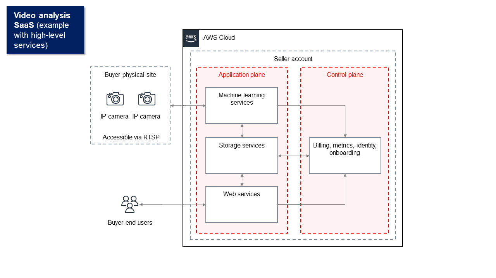

# SaaS product guidelines for AWS Marketplace

AWS Marketplace maintains the following guidelines for all software as a service (SaaS) products
and offerings on AWS Marketplace to promote a safe, secure, and trustworthy platform for our
customers. The following sections provide guidelines for SaaS products on AWS Marketplace.

All products and their related metadata are reviewed when submitted to ensure that they meet
or exceed current AWS Marketplace guidelines. These guidelines are reviewed and adjusted to meet our
evolving security requirements. In addition, AWS Marketplace continuously reviews products to verify
that they meet any changes to these guidelines. If products fall out of compliance, we might
require that you update your product and in some cases your product might temporarily be
unavailable to new subscribers until issues are resolved.

###### Topics

- [Product setup guidelines](#saas-guidelines-setup "#saas-guidelines-setup")
- [Customer information requirements](#saas-customer-information "#saas-customer-information")
- [Product usage guidelines](#saas-product-usage "#saas-product-usage")
- [Architecture guidelines](#saas-architecture "#saas-architecture")

## Product setup guidelines

All SaaS products must adhere to the following product setup guidelines:

- Pricing dimensions can't be limited to private offers only. Buyers should be able to
  subscribe to any of the pricing dimensions on public products.
- At least one pricing dimension must have a price greater than $0.00.
- All pricing dimensions must relate to actual software and cannot include any other
  products or services unrelated to the software.
- SaaS products offered exclusively in the AWS GovCloud (US) Regions must include
  `GovCloud` somewhere in the product title.

## Customer information requirements

All SaaS products must adhere to the following customer information requirements:

- SaaS products must be billed entirely through the listed dimensions on
  AWS Marketplace.
- You cannot collect customer payment information for your SaaS product at any time,
  including credit card and bank account information.
- The SaaS registration page must include an input field for the buyer's email address. You can include additional fields such as:

      + Name
      + ZIP code
      + Phone number
      + Company information
      + Product setup preferences

  If you plan to use multiple languages, you must provide an English-language view of the registration page.

## Product usage guidelines

All SaaS products must adhere to the following product usage guidelines:

- After subscribing to the product in AWS Marketplace, customers should be able to create an
  account within your SaaS application and gain access to a web console. If the customer
  cannot gain access to the application immediately, you must provide a message with
  specific instructions on when they will gain access. When an account has been created, the
  customer must be sent a notification confirming that their account has been created along
  with clear next steps.
- If a customer already has an account in the SaaS application, they must have the
  ability to log in from the fulfillment landing page.
- Customers must be able to see the status of their subscription within the SaaS
  application, including any relevant contract or subscription usage information.
- Customers must be able to easily get help with issues such as: using the application,
  troubleshooting, and requesting refunds (if applicable). Support contact options must be
  specified on the fulfillment landing page.
- Product software and metadata must not contain language that redirects users to other
  cloud platforms, additional products, upsell services, or free trial offers that aren't
  available on AWS Marketplace.

For information about free trials for SaaS products, see [Creating a SaaS free trial offer in AWS Marketplace](saas-free-trials.md "saas-free-trials.md").

- If your product is an add-on to another product or another ISV’s product, your product
  description must indicate that it extends the functionality of the other product and that
  without it, your product has very limited utility. For example, _This product
  extends the functionality of <product name> and without it, this product has very
  limited utility. Please note that <product name> might require its own license for
  full functionality with this listing._

## Architecture guidelines

The following topics list and describe the architecture guidelines for SaaS
products.

###### Topics

- [Guidelines](#march-saas-guidelines "#march-saas-guidelines")
- [Creating architecture diagrams](#arch-diagram "#arch-diagram")

### Guidelines

###### Note

The following guidelines are effective as of May 1, 2025.

- You can publish all SaaS architectures.
- Products that are deployed on AWS receive a special designation in the AWS Marketplace
  search results and their product details pages. For AWS Marketplace to consider your product as
  "deployed on AWS," your product must run entirely on AWS. This includes the
  application and control planes.

The _application plane_ can run in
the seller's AWS account, the buyer's AWS account, or both. For more information, refer to the
[Control plane vs. application plane](../../../whitepapers/latest/saas-architecture-fundamentals/control-plane-vs.md "../../../whitepapers/latest/saas-architecture-fundamentals/control-plane-vs.md") whitepaper.

Third-party services used by the product to transmit, store, or process application data—except
content delivery networks (CDNs), domain name systems (DNSs), and corporate identity
providers (IdPs)—must also run entirely on AWS.

###### Note

_Application data_ is data that belongs to or is generated for the buyer.

Agents or gateways used by the product for security, monitoring, data replication,
or migration can run on buyer-owned environments outside AWS, including on premises,
but must send data only to AWS for storage and analysis.

You must include an architecture diagram for review. You can't make the diagrams public. For more information, see [Creating architecture diagrams](#arch-diagram "#arch-diagram") in the next section.

- Sellers can publish products that do not entirely run on AWS.
- Applications that require resources in the buyer's infrastructure must follow these
  guidelines:
  - To be considered a SaaS product and not a managed service, your control plane—as defined in the [SaaS Architecture Fundamentals](../../../whitepapers/latest/saas-architecture-fundamentals/saas-architecture-fundamentals.md "../../../whitepapers/latest/saas-architecture-fundamentals/saas-architecture-fundamentals.md") AWS whitepaper—must reside in infrastructure that you manage. For more
    information, refer to the [SaaS vs. Managed Service Provider](../../../whitepapers/latest/saas-architecture-fundamentals/saas-vs.md "../../../whitepapers/latest/saas-architecture-fundamentals/saas-vs.md") whitepaper.
  - In the product description, you must notify customers that if they incur AWS
    infrastructure charges separate from their AWS Marketplace transaction, they must pay those
    charges.
  - You must provision resources in a secure way, such as using the AWS Security
    Token Service (AWS STS) or AWS Identity and Access Management (IAM).
  - You must follow the [principle of least
    privilege](../../../IAM/latest/UserGuide/LeastPrivilege.md "../../../IAM/latest/UserGuide/LeastPrivilege.md") when creating usage instructions or deployment templates that
    grant permissions to your application.
  - You must provide additional documentation that describes all provisioned AWS
    services, IAM policy statements, and how an IAM role or user is deployed and
    used in the customer's account.
  - You must provide instructions or deployment templates that enable buyers to
    deploy the required resources in their AWS accounts.
  - If you provide AWS CloudFormation templates (CFTs) for deploying resources to the buyer's
    AWS account, they must comply with [AWS Marketplace policies for CFTs](cloudformation.md#aws-cloudformation-template-preparation "cloudformation.md#aws-cloudformation-template-preparation"). You must publish those CFTs as part of your SaaS
    listing by following the method provided when you enable the [SaaS Quick Launch deployment option](saas-product-settings.md#saas-quick-launch "saas-product-settings.md#saas-quick-launch") for your buyers. SaaS Quick Launch
    makes it easier for your buyers to configure your SaaS solution.
  - If an Amazon Machine Image (AMI) is deployed into the buyer's AWS account,
    it must comply with the [AMI-based product requirements for AWS Marketplace](product-and-ami-policies.md "product-and-ami-policies.md").
    You must publish the AMI as a separate AMI-based product in AWS Marketplace and indicate that it's an add-on product
    as required in the [Product usage policies](product-and-ami-policies.md#product-usage "product-and-ami-policies.md#product-usage").
    You can price your AMI-based product as BYOL because it's an extension of your SaaS offering.
    AWS Marketplace scans AMI-based products for unpatched common vulnerabilities and exposures (CVEs) and security requirements.
    Your buyers must also subscribe to your AMI-based product before deploying it.
  - If a container image is deployed into a buyer's AWS account, it must
    comply with the [Container-based product requirements for AWS Marketplace](container-product-policies.md "container-product-policies.md").
    You must publish the container image as a separate container-based product in AWS Marketplace and indicate that it's an add-on product
    as required in the [Product usage requirements](container-product-policies.md#container-usage-requirements "container-product-policies.md#container-usage-requirements").
    You can price your container-based product as BYOL because it's an extension of your SaaS offering.
    AWS Marketplace scans container-based products for unpatched common vulnerabilities and exposures (CVEs) and security requirements.
    Your buyers must also subscribe to your container-based product before deploying it.

- Successfully call the AWS Marketplace APIs from the AWS account that registered as a
  provider and submitted the SaaS publishing request. The SaaS pricing model determines
  which APIs should be called:
  - SaaS contracts – [GetEntitlements](../../../marketplaceentitlement/latest/APIReference/API_GetEntitlements.md "../../../marketplaceentitlement/latest/APIReference/API_GetEntitlements.md") in the AWS Marketplace Entitlement Service.
  - SaaS contracts with consumption – [GetEntitlements](../../../marketplaceentitlement/latest/APIReference/API_GetEntitlements.md "../../../marketplaceentitlement/latest/APIReference/API_GetEntitlements.md") in the AWS Marketplace Entitlement Service and [BatchMeterUsage](../../../marketplacemetering/latest/APIReference/API_BatchMeterUsage.md "../../../marketplacemetering/latest/APIReference/API_BatchMeterUsage.md") in the AWS Marketplace Metering Service.
  - SaaS subscriptions – [BatchMeterUsage](../../../marketplacemetering/latest/APIReference/API_BatchMeterUsage.md "../../../marketplacemetering/latest/APIReference/API_BatchMeterUsage.md") in the AWS Marketplace Metering Service.

- SaaS products offered exclusively in the AWS GovCloud (US) Regions must explain the
  architectural boundaries between other AWS Regions and the AWS GovCloud (US) Regions, use
  cases for the product, and the workloads not recommended for the product.

For more information on SaaS architectures, refer to the [SaaS Architecture Fundamentals](../../../whitepapers/latest/saas-architecture-fundamentals/saas-architecture-fundamentals.md "../../../whitepapers/latest/saas-architecture-fundamentals/saas-architecture-fundamentals.md") AWS whitepaper.

### Creating architecture diagrams

To receive the special designation that your product is deployed on AWS, [update your product's architecture details](saas-product-settings.md#updating-architecture-details "saas-product-settings.md#updating-architecture-details")
in the AWS Marketplace Management Portal. Select a hosting pattern that is deployed on AWS and upload an
architecture diagram that AWS reviews. For hosting patterns that AWS Marketplace
considers deployed on AWS, see [Guidelines](#march-saas-guidelines "#march-saas-guidelines") in the previous section. If your hosting pattern changes, you must update your product's architecture details.

###### Note

- You can't make your diagrams public.
- You can publish products that don't run entirely on AWS.

Use the following criteria when creating a diagram:

- Group and label components as part of the [application plane or control plane](../../../whitepapers/latest/saas-architecture-fundamentals/control-plane-vs.md "../../../whitepapers/latest/saas-architecture-fundamentals/control-plane-vs.md").
- For any components outside of AWS that are part of the core business logic of your
  product, group them with the application plane.
- Components can represent low-level details (for example, compute instances and
  network subnets), or high-level services (for example, a data analytics
  platform).
- Components don’t need to identify the name of the AWS services or non-AWS
  services used.
- Place components where they logically run. For example, in the seller's AWS
  account, the buyer's AWS account, the seller’s non-AWS environment, or another
  environment.
- For data replication or workload migration products, include all supported source
  and target environments.

###### Note

The architecture diagram that you use to update the architecture details of your SaaS product is not published and not publicly available to buyers.

#### Level of detail

You can create a high-level diagram that shows main system components, includes basic
data flows, and focuses on the application plane and control plane services. Or, you can
create a low-level, detailed diagram that breaks down each component, shows specific
connections, and includes technical specifications with different levels of detail.

The following diagrams show the architecture of a hypothetical video-analysis SaaS
application. Each shows a different level of detail. Both are acceptable. Use them as
examples for the level of detail to include in your own diagrams.

The following is an example of a high-level diagram.

The following is an example of a low-level, detailed diagram.

For more information, see [What is Architecture
Diagramming?](https://aws.amazon.com/what-is/architecture-diagramming/ "https://aws.amazon.com/what-is/architecture-diagramming/"). After creating a diagram, update your architecture details in the
AWS Marketplace Management Portal (AMMP). For more information, see [Update architecture details](saas-product-settings.md#updating-architecture-details "saas-product-settings.md#updating-architecture-details").
