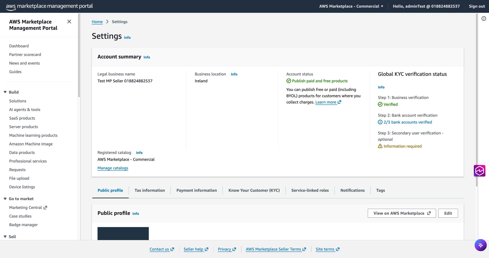
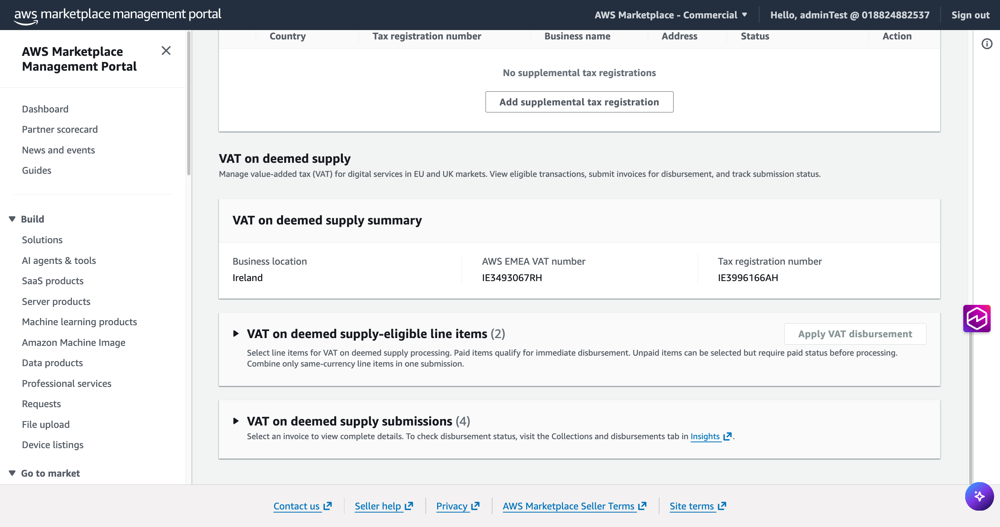
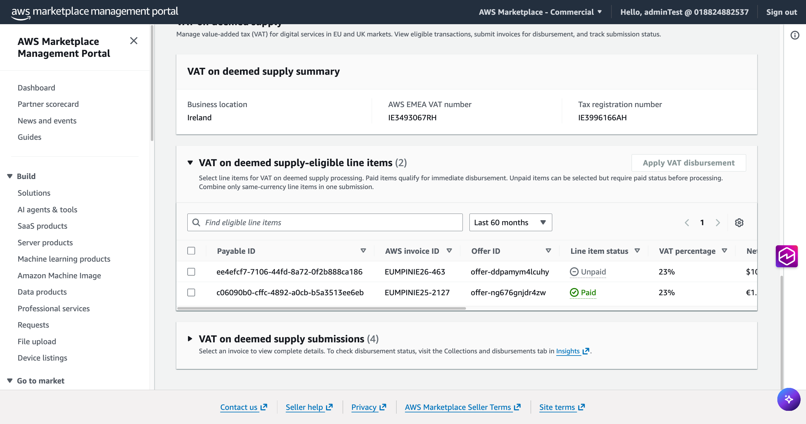
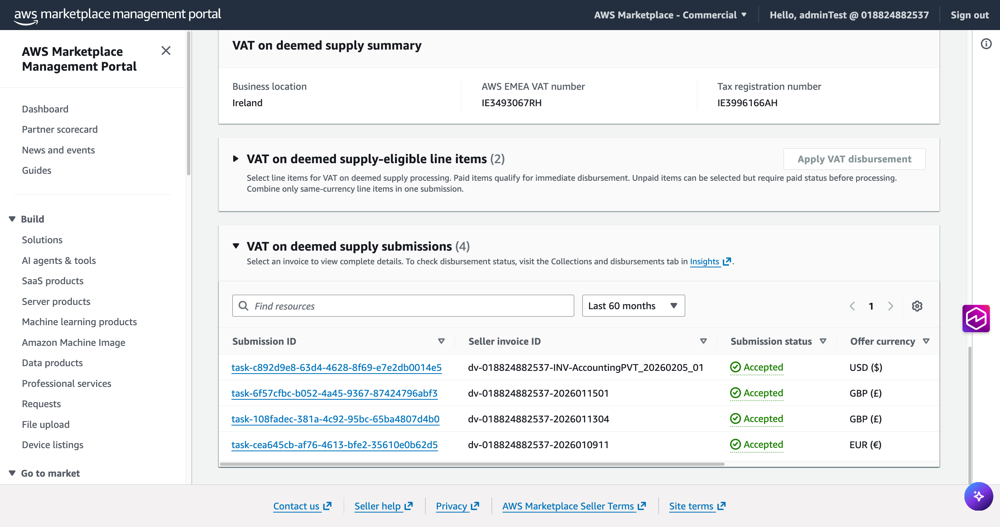
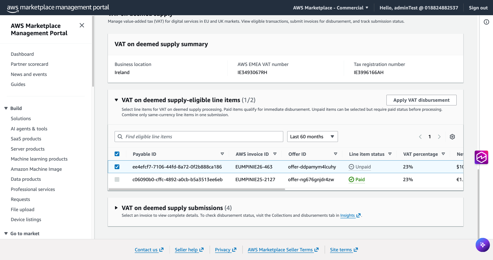
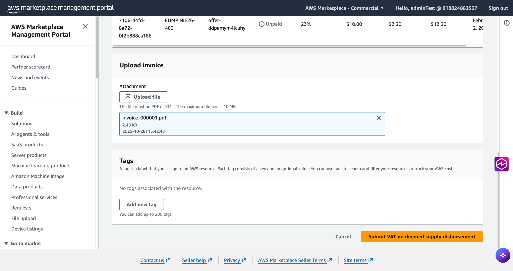

# VAT on Deemed Supply

Under EU, Norway and UK VAT rules, when AWS Marketplace facilitates the sale of Digital Services (e.g. SaaS, AMI), the law establishes two back-to-back supplies for VAT purposes only:

- **Deemed Sale 1:** The Seller is treated as having supplied the Digital Service to the applicable branch of Amazon Web Services EMEA SARL ("AWS EMEA") facilitating the transaction.
- **Deemed Sale 2:** The branch of AWS EMEA facilitating the transaction is treated as having supplied the Digital Service to the Buyer.
  As a result of the Deemed Supply provisions, when both the Seller and the Buyer are in the same EU Member State, Norway or in the UK, and the transaction is facilitated by the relevant AWS EMEA branch in the same country, the Seller is expected to issue a VAT invoice to that AWS EMEA branch. AWS EMEA will pay the VAT stated on the invoice, subject to receipt of a valid VAT invoice.

You can submit invoices for transactions of AWS Marketplace sales of Digital Services where all three of the following conditions are met:

1. The Seller AWS account is located in an EU Member State, the UK or Norway.
2. The Buyer AWS account is located in the same country as the Seller.
3. The AWS Marketplace sale is facilitated by the corresponding AWS EMEA SARL branch in that country.

## Getting Started — How to view and submit your invoices for VAT on deemed supply

### Step 1: Log in to AWS Marketplace Management Portal (AMMP) or AWS Partner Central

1. Go to the AWS Console and search for AWS Partner Central
2. Click Launch AWS Partner Central
3. In the bottom-left panel, select Marketplace Settings

### Step 2: Navigate to the VAT on deemed supply Section

1. Go to Settings in your AWS Marketplace Management Portal
2. Click on the Tax information tab
3. Scroll down to the VAT on deemed supply section

Here you can expand two tables:

- **VAT on deemed supply — eligible line items:** transactions eligible for VAT Invoicing

- **VAT on deemed supply submissions:** your submitted VAT invoices and their status

### Step 3: Select Line Items for Submission

1. Expand the VAT on deemed supply — eligible line items table, review your eligible transactions
2. Select one or more line items in the same currency (USD, EUR, or GBP)
   - Paid items qualify for immediate disbursement
   - Unpaid items can be selected but will only be disbursed once the buyer invoice is collected

3. Click Apply VAT Disbursement

###### Note

You can submit individual invoices for individual line items, or a single consolidated invoice covering multiple line items in the same currency.

### Step 4: Upload Your VAT Invoice

1. On the Apply VAT on deemed supply page, review your selected line items and disbursement summary
2. Upload your VAT invoice:
   - Accepted format: PDF only
   - Maximum file size: 10 MB
   - All selected line items must be included in a single uploaded file

3. Click Submit VAT on deemed supply disbursement

### Step 5: Track Your Submission

After submission, your line item will move from the Eligible Line Items table to the VAT on deemed supply Submissions table. Each submission is assigned a unique task ID. Submission statuses are:

- **Accepted** — Your invoice has been validated. No further action is required. A green banner is displayed for 7 days.
- **Rejected** — Your invoice could not be validated. Remediation action required, please verify reject reason and address in your next amended invoice upload. A yellow banner is displayed for 7 days with the reason for rejection.
- **Pending** — Your submission is under review and is pending AWS for approval. (SLA: up to 3 business days).

###### Note

To check your disbursement status, visit the Collections and Disbursements dashboard.

Refer to [Deemed Supply FAQs](vat-deemed-supply-faq.md "vat-deemed-supply-faq.md") for more details.

