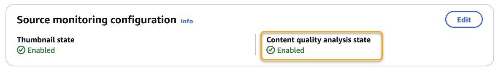
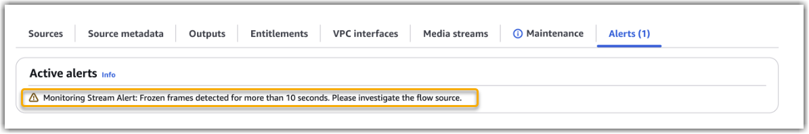

# Viewing content quality analysis settings and alerts

When you enable content quality analysis, MediaConnect starts
posting warnings and alerts for the enabled metrics in your AWS account.

This page guides you through the process of confirming your content quality
analysis settings, and viewing any warnings and alerts for the flows in your
account.

## Prerequisites

The following procedure assumes that you have already enabled content
quality analysis for a flow.

## Procedure

You can view content quality warnings and alerts through the AWS Management
Console, the AWS CLI, and the MediaConnect API.

Console

###### To check if content quality analysis is enabled

1. Open the MediaConnect console at [https://console.aws.amazon.com/mediaconnect/](https://console.aws.amazon.com/mediaconnect/ "https://console.aws.amazon.com/mediaconnect/").
2. From the **Flows**
   screen, select the flow you want to inspect.
3. On the flow details page, choose the **Configuration** tab.
4. Under **Source monitoring
   configuration**, you can find the content
   quality analysis state.



###### To check if quality alerts are present

1. Open the MediaConnect console at [https://console.aws.amazon.com/mediaconnect/](https://console.aws.amazon.com/mediaconnect/ "https://console.aws.amazon.com/mediaconnect/").
2. From the **Flows**
   screen, select the flow you want to inspect.
3. On the **Alerts** tab,
   alerts appear when content quality problems are detected
   in the flow source.



AWS CLI
To confirm if quality analysis metrics are enabled for a
given flow, run the [describe-flow](../../../cli/latest/reference/mediaconnect/describe-flow.md "../../../cli/latest/reference/mediaconnect/describe-flow.md") command:

```
aws mediaconnect describe-flow --flow-arn `flowARN`
```

The response shows which content quality analysis
metrics are enabled:

```
{
    "Flow": {
        "FlowArn": "flowARN",
        ...
        "SourceMonitoringConfig": {
            "ContentQualityAnalysisState": "ENABLED",
            "AudioMonitoringSettings": [
                {
                    "SilentAudio": {
                        "State": "DISABLED",
                        "ThresholdSeconds": 15
                    }
                }
            ],
            "VideoMonitoringSettings": [
                {
                    "BlackFrames": {
                        "State": "DISABLED",
                        "ThresholdSeconds": 10
                    },
                    "FrozenFrames": {
                        "State": "ENABLED",
                        "ThresholdSeconds": 5
                    }
                }
            ]
        },
        ...
    }
}
```

The response also shows messages about any warnings or alerts
that need your attention:

```
{
    ...
    "Messages": {
        "Errors": [
            "Monitoring Stream Alert: Audio Stream Missing. Please investigate the flow source.",
            "Monitoring Stream Alert: Video Stream Missing. Please investigate the flow source."
        ]
    }
}
```

Alternatively, if both audio and video streams are present but
experiencing issues, you might see something like this:

```
{
    ...
    "Messages": {
        "Errors": [
            "Monitoring Stream Alert: Black frames detected for more than 30 seconds. Please investigate the flow source.",
            "Monitoring Stream Alert: Frozen frames detected for more than 30 seconds. Please investigate the flow source.",
            "Monitoring Stream Alert: Silent audio detected for more than 30 seconds. Please investigate the flow source."
        ]
}
```

###### Note

These error messages are context-dependent. If an audio or video stream is missing, related
quality alerts for that stream (such as silent audio or
black/frozen frames) won't be triggered.

## Next steps

If you no longer want to analyze content quality for your flow,
you can disable the feature. For instructions, see [Disabling content quality analysis](disable-content-quality-analysis.md "disable-content-quality-analysis.md").
