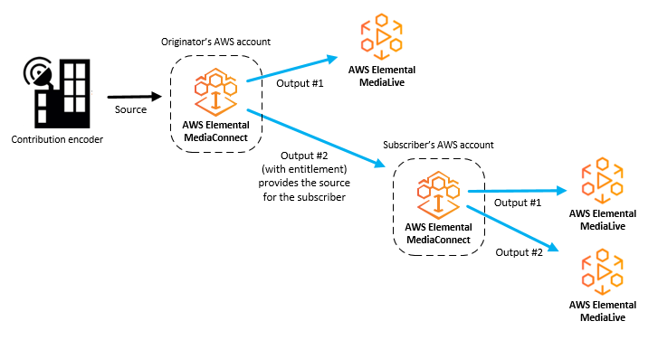

# Managing entitlements in MediaConnect

Content originators can grant entitlements to share their content with other AWS accounts (subscriber accounts). Subscribers can then set up their own AWS Elemental MediaConnect
flows using the originator's flow as their source. The following illustration shows this
process.

###### Note

MediaConnect doesn't support entitlements on CDI flows. You can only grant entitlements on
transport stream flows, with the exception of TR-07 sources.

###### Topics

- [Sharing content in your AWS Elemental MediaConnect flow with other AWS accounts](entitlements-originator.md "entitlements-originator.md")
- [Subscribing to streaming media content provided by another AWS account using MediaConnect](entitlements-subscriber.md "entitlements-subscriber.md")
