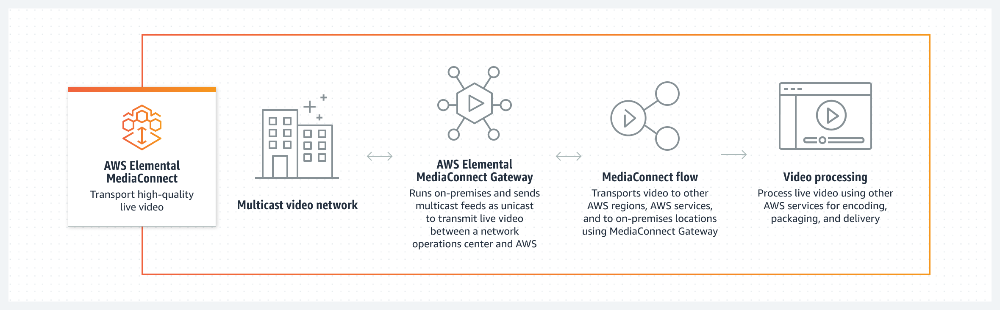
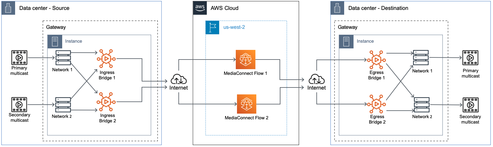

# AWS Elemental MediaConnect Gateway

_AWS Elemental MediaConnect Gateway_ is a feature of MediaConnect that deploys
on-premises resources for transporting live video to and from the AWS Cloud. MediaConnect Gateway allows
you to contribute live video to the AWS Cloud from on-premises hardware, as well as
distribute live video from the AWS Cloud to your local data center.

The following graphic depicts a workflow where AWS Elemental MediaConnect Gateway runs on-premises and sends
multicast feeds as unicast. This process transmits live video between the on-premises
operations center and the AWS Cloud. From there, AWS Elemental MediaConnect Gateway distributes that same content
to a different on-premises location.

###### Contents

- [Key points](#gateway-key-points "#gateway-key-points")
  - [Gateway components](#gateway-components "#gateway-components")
  - [MediaConnect Gateway terminology](#gateway-components-terminology "#gateway-components-terminology")

- [Next steps](#gateway-next-steps "#gateway-next-steps")
- [Additional resources](#gateway-additional-resources "#gateway-additional-resources")

## Key points

### Gateway components

AWS Elemental MediaConnect Gateway is made up of four major components: _gateways_, _networks_, _instances_, and _bridges_.
Each of these components are explained in greater detail in the following sections of
this guide. The following describes the basic relationship of these components:

- **Gateways**: A logical grouping of instances and
  bridges. Each gateway utilizes user-defined IP information for communication
  between data centers and the AWS Cloud.
- **Networks**: A MediaConnect Gateway network is a collection of
  IP information that instances and bridges use to communicate on your local data
  center network. The network information must match the local data center network
  that you are using to communicate with gateway. Each MediaConnect Gateway may contain a
  maximum of two networks. All gateways must contain at least one network.
- **Instances**: A compute instance running on
  equipment in your data center and managed by MediaConnect. This instance is an
  on-premises implementation of the MediaConnect service and is contained within a
  gateway. Instances use bridges to communicate between your data center and the
  AWS Cloud. You create instances by installing software on an on-premises
  server.
- **Bridges**: A connection between your data
  center's instances and the AWS Cloud. A bridge can be used to send video from
  the AWS Cloud to your data center or from your data center to the
  AWS Cloud.

The following graphic depicts the interactions of each component in a common workflow
scenario. In this workflow, multicast from the data center is ingested into a gateway
instance and contributed across a bridge to MediaConnect in the AWS Cloud. From the
AWS Cloud, the multicast is distributed to a different data center's gateway
instance.

### MediaConnect Gateway terminology

The following section provides details about MediaConnect Gateway concepts and
terminology.

- **Ingress**: In MediaConnect Gateway, ingress refers to
  content contributed to the AWS Cloud from an on-premises location. If the
  content is leaving your location using an ingress bridge, this means its
  destination is AWS.
- **Egress**: In MediaConnect Gateway, egress refers to
  content distributed to your on-premises location from the AWS Cloud. If
  the content is entering your location using an egress bridge, this means its
  source is AWS.
- **Cloud flow**: A MediaConnect flow that exists in
  the AWS Cloud. Typically, this will be an existing MediaConnect flow that you
  might already be using and want to distribute to an on-premises
  gateway.
- **Flow source**: A source that originates in
  the AWS Cloud. An egress bridge uses this type of source.
- **Network source**: A source that originates
  at your on-premises location. An ingress bridge uses this type of
  source.
- **Flow output**: An output that is delivered
  to the AWS Cloud. An ingress bridge uses this type of output.
- **Network output**: An output that is
  delivered to your on-premises location. An egress bridge uses this type of
  output.

## Next steps

Now that you have a basic understanding of MediaConnect Gateway, we recommend you review the
[Supported operating systems and system
architectures for using MediaConnect Gateway](gateway-prerequisites.md "gateway-prerequisites.md").

## Additional resources

- To learn more about gateway networks, see [MediaConnect Gateway networks](gateway-components-networks.md "gateway-components-networks.md").
- To learn more about gateway instances, see [Instances managed by MediaConnect Gateway](gateway-components-instances.md "gateway-components-instances.md").
- To learn more about gateway bridges, see [MediaConnect Gateway bridges](gateway-components-bridges.md "gateway-components-bridges.md").
