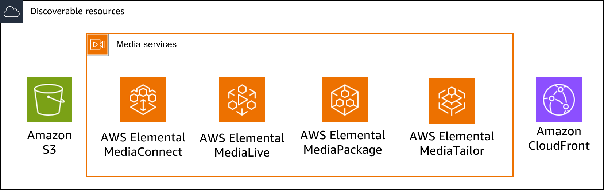
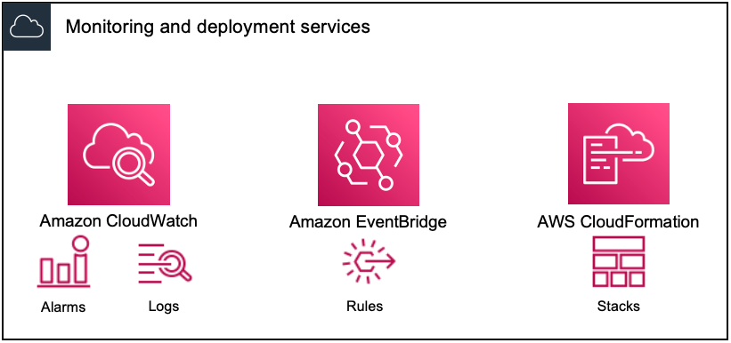

# Monitoring AWS media services with

workflow monitor

Workflow monitor is a tool for the discovery, visualization, and monitoring of AWS media
workflows. Workflow monitor is available in the AWS console and API. You can use workflow monitor to
discover and create visual mappings of your workflow's resources, called _signal maps_. You can create and manage Amazon CloudWatch alarm and Amazon EventBridge
rule templates to monitor the mapped resources. The monitoring templates you create are
transformed into deployable AWS CloudFormation templates to allow repeatability. AWS recommended
alarm templates provide predefined best-practice monitoring.

**Discover**

Utilize signal maps to automatically discover interconnected AWS resources
associated with your media workflow. Discovery can begin at any supported service
resource and creates an end-to-end mapping of the workflow. Signal maps can be used as
stand-alone visualization tools or enhanced with monitoring templates.

**Monitor**

You can create custom CloudWatch alarm and EventBridge rule templates to monitor the health and
status of your media workflows. Best practice alarm templates are available to import
into your workflow monitor environment. You can use the best practice alarm templates as they are,
or edit them to better fit your workflow. Any templates you create are transformed into
CloudFormation templates for repeatable deployment.

###### Note

There is no direct cost for using workflow monitor. However, there are costs associated with the resources created and used to monitor your workflow.

When monitoring is deployed, Amazon CloudWatch and Amazon EventBridge resources are created. When
using the AWS Management Console, prior to deploying monitoring to a signal map,
you will be notified of how many resources will be created. For more information
about pricing, see: [CloudWatch
pricing](https://aws.amazon.com/cloudwatch/pricing/ "https://aws.amazon.com/cloudwatch/pricing/") and [EventBridge pricing](https://aws.amazon.com/eventbridge/pricing/ "https://aws.amazon.com/eventbridge/pricing/").

Workflow monitor uses AWS CloudFormation templates to deploy the CloudWatch and EventBridge resources. These templates are stored in a
standard class Amazon Simple Storage Service bucket that is created on your behalf, by workflow monitor, during the deployment process and will incur object storage and recall charges.
For more information about pricing, see: [Amazon S3 pricing](https://aws.amazon.com/s3/pricing/ "https://aws.amazon.com/s3/pricing/").

Previews generated in the workflow monitor signal map for AWS Elemental MediaPackage channels are
delivered from the MediaPackage Origin Endpoint and will incur Data Transfer Out charges.
For pricing, see: [MediaPackage
pricing](https://aws.amazon.com/mediapackage/pricing/ "https://aws.amazon.com/mediapackage/pricing/").

## Components of workflow monitor

Workflow monitor has four major components:

- CloudWatch alarm templates - Define the conditions you would like to monitor using
  CloudWatch. You can create your own alarm templates, or import predefined
  templates created by AWS. For more information, see: [CloudWatch alarm groups and templates for monitoring your AWS media workflow](monitor-with-workflow-monitor-configure-alarms.md "monitor-with-workflow-monitor-configure-alarms.md")
- EventBridge rule templates - Define how EventBridge sends notifications when an alarm is
  triggered. For more information, see: [EventBridge rule
  groups and templates for monitoring your AWS media workflow](monitor-with-workflow-monitor-configure-notifications.md "monitor-with-workflow-monitor-configure-notifications.md")
- Signal maps - Use an automated process to create AWS Elemental workflow maps using
  existing AWS resources. The signal maps can be used to discover resources in
  your workflow and deploy monitoring to those resources. For more information,
  see: [Workflow monitor
  signal maps](monitor-with-workflow-monitor-configure-signal-maps.md "monitor-with-workflow-monitor-configure-signal-maps.md")
- Overview - The overview page allows you to directly monitor the status of
  multiple signal maps from one location. Review metrics, logs, and alarms for
  your workflows. For more information, see: [Workflow monitor
  overview](monitor-with-workflow-monitor-operate-overview.md "monitor-with-workflow-monitor-operate-overview.md")

## Supported services

Workflow monitor supports automatic discovery and signal mapping of resources associated
with the following services:

- AWS Elemental MediaConnect
- AWS Elemental MediaLive
- AWS Elemental MediaPackage
- AWS Elemental MediaTailor
- Amazon S3
- Amazon CloudFront

###### Topics

- [Configuring workflow monitor to monitor AWS media services](monitor-with-workflow-monitor-configure.md "monitor-with-workflow-monitor-configure.md")
- [Using workflow monitor](monitor-with-workflow-monitor-operate.md "monitor-with-workflow-monitor-operate.md")
