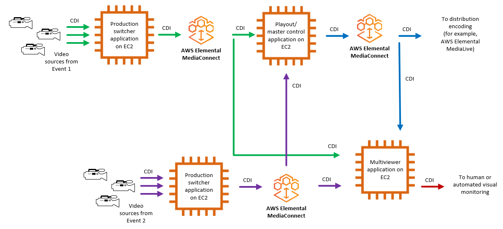

# MediaConnect use case: replication and

monitoring for CDI flows

You can use AWS Elemental MediaConnect to replicate and distribute video to multiple
destinations and monitor the multiple video signals in real time.

For example, you can switch between multiple live events that are happening at
different venues to create a single output broadcast. Using a MediaConnect CDI
workflow, you can take the outputs from multiple production switchers and send those to
a master control switcher and a multiviewer application. You can use another CDI flow to
send the final output to the distribution encoder (for example, AWS Elemental MediaLive), and also to
the multiviewer application. The production team receives the output from the
multiviewer, which enables them to monitor the multiple video signals in real time.

The following illustration shows how you can use MediaConnect CDI workflows to
replicate and distribute video to multiple destinations. You can create a single output
broadcast from video content coming from multiple events, and also send the output from
multiple signals for monitoring in real time.

