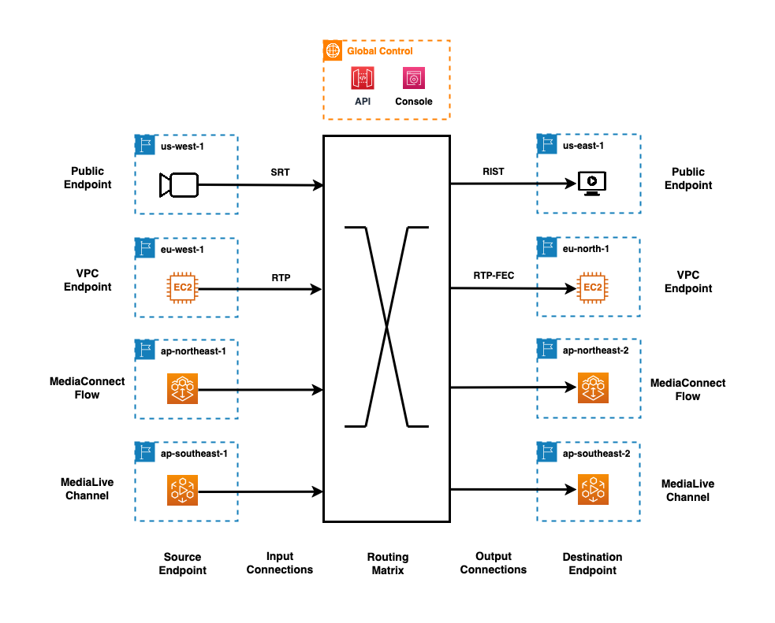

# Using the MediaConnect router

The AWS Elemental MediaConnect router enables you to manage live video and audio routing both within the
AWS Cloud and over the public internet.

When managing live media content, you need to control where your media streams flow and be
able to change these connections quickly as programming requires. The MediaConnect router helps you
perform these tasks in the AWS Cloud on a global scale. It brings familiar broadcast switching
concepts to the MediaConnect console, making it easier for you to manage multiple live media streams
and perform typical broadcast operations like source switching and destination management across
different AWS Regions worldwide. Like a traditional broadcast router, it serves as a central
control point for connecting your media sources to various destinations, but with the added
advantage of the global AWS infrastructure.

The router supports flexible routing options between many sources and destinations, enabling
you to quickly adjust routes paths as your programming requirements change. This functionality
works alongside existing MediaConnect flows to provide additional media stream management
capabilities.

## Key points

### Router concepts and terminology

Before working with the router, familiarize yourself with these key concepts and
terms.

**Source and input components**

- **Source (upstream endpoint)**

A physical or virtual connection point in your upstream environment that can
transmit content into MediaConnect.

- **Router input**

A connection point in the MediaConnect router that can receive content from your
source endpoint. Each input can be routed to multiple outputs. There are several
types of router input:

    + **Standard input**

    A basic router input that receives content from a single source
     endpoint.
    + **Failover input**

    A router input that can receive content from two source endpoints, allowing
     manual or automatic switching between them.
    + **Merge input**

    A router input that combines content from two source endpoints with
     configurable merge window timing.
    + **Flow input**

    A router input that can receive content from a MediaConnect flow.

**Destination and output components**

- **Destination (downstream endpoint)**

A physical or virtual connection point in your downstream environment that can
receive content from MediaConnect.

- **Router output**

A connection point in the MediaConnect router that can send content to your
destination endpoint.

    + **Standard output**

    A basic router output that sends content to a downstream destination
     endpoint.
    + **Flow output**

    A router output that can send content to a MediaConnect flow.
    + **MediaLive output**

    A router output that can send content to a MediaLive input.

**Routing system and operations**

- **Route**

The complete end-to-end path from an input to an output within the router.
Routes are defined by input-to-output assignments within the router.

- **Router I/O**

A connection point in the MediaConnect router that can either receive content (a
router input) or transmit content (a router output).

- **Router matrix**

A network that can connect media streams from multiple inputs to multiple
outputs in any combination. Each output can connect to only one input at a time,
but a single input can feed many outputs simultaneously.

- **Routing network interface**

The network configuration that determines how a router I/O connects to other
resources. Router I/Os can be associated with either a public interface (for
connecting to the internet) or a VPC interface (for connecting to resources within
your VPC).

- **Take**

The act of assigning an input to an output. For example, if you change an
output's source from input Camera1 to input Camera2, you would describe the output
as "taking" Camera2. You can undo a take by clearing the input assignment for an
output.

## How the router works

### Router setup

Building on these concepts, the following steps show how you set up and use the router at
a high level:

1. **Create network interfaces** - Set up public or VPC
   network interfaces to define the network security settings for how your router I/Os
   connect to other resources.
2. **Create router I/Os** - Set up I/Os that connect to your
   external endpoints, associating each one with a network interface.
3. **Start the router I/Os** - Change I/O status from
   Standby to Active when you're ready to begin streaming.
4. **Assign routes** - Define routes by assigning inputs to
   outputs. You can assign routes regardless of I/O status.

You can do these steps manually in the console, or programmatically using the MediaConnect API.
When the router is set up in this way, it can connect **every**
destination endpoint to **any** source stream. This gives you the
flexibility to instantly switch feeds between sources and destinations in real time, either
individually or in bulk.

The following diagram shows the anatomy of the MediaConnect router. The router system consists of
a collection of different sources and destinations. These external endpoints are connected to
router inputs and outputs. As you add or delete router I/Os, the size and shape of the routing
matrix adjusts accordingly.

### Stream Adaptive Multipath Routing

The MediaConnect router establishes persistent connections between upstream sources and downstream
destinations using your choice of transport protocols. These edge protocols are terminated in the
router I/O and the transport stream is carried within the routing matrix using a routing algorithm
that is optimized for high-bitrate video delivery using the shared AWS network environment.
You don’t need to set up or manage any network infrastructure and you can monitor the performance
of individual routes with Amazon CloudWatch metrics at the router output.

To maximize packet delivery reliability, MediaConnect router uses an adaptive multipath technique that
monitors multiple AWS network paths simultaneously and actively responds to network conditions.
Whereas other methods use a single path for routing, this multipath approach helps maintain video
quality and low latency in variable network conditions. It selects optimal paths for your packets,
maintains fixed end-to-end latency, and preserves packet ordering for live video workflows.
MediaConnect router provides fixed end-to-end latency for transfers both within the same AWS region
and across different regions. This constant delay between sender and receiver helps prevent buffering
and frame dropping in live video applications.

If packet loss is detected on one path, it immediately reroutes packets using alternate reliable paths.
Packets are only retransmitted as needed, making efficient use of network bandwidth while maintaining
stream integrity. This adaptive approach ensures consistent, high-quality video without interruptions,
even in demanding scenarios like live sports broadcasts where network conditions change rapidly.

## Router capabilities and management

The router provides several key capabilities for managing your media workflows. You
can:

- Route live feeds between any source and destination (whether within the AWS Cloud,
  or outside of it)
- Distribute your content across AWS Regions to public and VPC endpoints
- Freely mix and match endpoint types as needed
- Connect existing MediaConnect flows to your router inputs and outputs
- Use MediaLive inputs as a destination for your router outputs
- Use failover inputs with manual or automatic switching between two sources
- Use merge inputs that can combine content from two sources with configurable merge
  window timing

You manage these functions through the MediaConnect console, where you can:

- See all your active routes at a glance
- Make bulk changes to multiple routes at the same time
- Control routing across all AWS Regions from one place
  - For example, you can use the US West (Oregon) console to create router inputs in
    Europe (Dublin) and assign them to router outputs in Europe (London). This eliminates
    the need to switch between Regional consoles and manually manage your IP address and
    encryption settings.

MediaConnect manages router I/O maintenance through automated scheduling, with restarts occurring
every 60-66 days from the time when you start the I/O. You can customize these maintenance
windows by selecting your preferred day and start hour when you create or update your
I/Os. You can monitor when your next maintenance window begins by checking the countdown timer
in the console.

## Router considerations and limitations

As you plan your router implementation, keep these points in mind.

| Router features and considerations | Feature                                                                                                                                                                                                                                                                                                                                                                                                                                                                                                                                                                                                                                                                                                      | Description |
| ---------------------------------- | ------------------------------------------------------------------------------------------------------------------------------------------------------------------------------------------------------------------------------------------------------------------------------------------------------------------------------------------------------------------------------------------------------------------------------------------------------------------------------------------------------------------------------------------------------------------------------------------------------------------------------------------------------------------------------------------------------------ | ----------- |
| Supported protocols                | The MediaConnect router supports multiple protocols to enable compatibility across hybrid workflows. The following protocols are currently supported: SRT, RTP, RTP-FEC, RIST.                                                                                                                                                                                                                                                                                                                                                                                                                                                                                                                         |
| Internal routing                   | The MediaConnect router internally handles data delivery between router inputs and router outputs independent of the protocols used between the source and router inputs, or the router outputs and destination. For instance, you only need to configure router input protocol ARQ latency based on the distance between the source and the router input, not the distance to your final destinations. After your content reaches the router input, MediaConnect manages all subsequent delivery, including transfers across Regions. Similarly, you only need to configure router output protocol ARQ latency based on the distance between the router output and the destination. |
| Fault tolerance                    | The routing service provides tolerance to failures at the EC2, AZ, and Regional levels by automatically migrating and restoring I/O state.                                                                                                                                                                                                                                                                                                                                                                                                                                                                                                                                                                |
| Unified Region management          | You can manage your router resources across multiple AWS Regions from a single console.                                                                                                                                                                                                                                                                                                                                                                                                                                                                                                                                                                                                                   |
| Cross-Region routing               | The MediaConnect router supports cross-Region routing. This means you can route audio and video streams between inputs and outputs even if they're in different AWS Regions.                                                                                                                                                                                                                                                                                                                                                                                                                                                                                                                           |
| Router network interface capacity  | You can create up to five router network interfaces in each AWS Region. Each public router network interface can have up to 10 address ranges. For VPC interfaces, you can associate up to 5 security groups.                                                                                                                                                                                                                                                                                                                                                                                                                                                                                          |
| Router input capacity              | You can create up to 20 router inputs in each AWS Region. You can connect one input to up to 10 outputs simultaneously. Each input supports up to 50 Mbps.                                                                                                                                                                                                                                                                                                                                                                                                                                                                                                                                             |
| Router output capacity             | You can create up to 20 router outputs in each AWS Region. Each output supports up to 50 Mbps.                                                                                                                                                                                                                                                                                                                                                                                                                                                                                                                                                                                                            |
| Source failover and merge          | The MediaConnect router supports both automatic failover between redundant sources and merged content from two source endpoints. Supported protocols: • Failover: RTP, RIST, SRT-listener, SRT-caller • Merge: RTP, RIST Both sources must: • Use the same protocol configuration • Use the same network configuration (VPC or public) • Use different port numbers Merge inputs include configurable merge window timing. Converting between failover and merge types requires recreating the input.                                                                                                                                                                       |
| MediaLive integration              | The MediaConnect router supports integration with MediaLive inputs. For more details, see [Integrating router outputs with MediaLive inputs](integrate-eml-with-router.md "integrate-eml-with-router.md").                                                                                                                                                                                                                                                                                                                                                                                                                                                                                          |
| Flow integration                   | The MediaConnect router supports routing to or from MediaConnect flows. For more details on flow integration considerations, see [Integrating router I/Os with MediaConnect flows](integrate-flow-with-router.md "integrate-flow-with-router.md").                                                                                                                                                                                                                                                                                                                                                                                                                                                  |
| Maintenance schedule updates       | Unlike flows, router resources must be in standby mode before you can make any maintenance schedule changes. Once a router I/O is started, the schedule remains fixed until the next restart.                                                                                                                                                                                                                                                                                                                                                                                                                                                                                                          |

## Next steps

You can learn how to set up and use the router in the following pages of this
guide.

- [Managing router network interfaces in
  MediaConnect](managing-router-network-interfaces.md "managing-router-network-interfaces.md")
  - [Creating a router network interface in
    MediaConnect](creating-router-network-interfaces.md "creating-router-network-interfaces.md")
  - [Viewing router network interfaces in
    MediaConnect](viewing-router-network-interfaces.md "viewing-router-network-interfaces.md")
  - [Updating a router network interface in
    MediaConnect](editing-router-network-interface.md "editing-router-network-interface.md")
  - [Deleting a router network interface in
    MediaConnect](deleting-router-network-interface.md "deleting-router-network-interface.md")

- [Managing router I/Os in MediaConnect](managing-router-io.md "managing-router-io.md")
  - [Creating a router I/O in MediaConnect](creating-router-io.md "creating-router-io.md")
  - [Viewing router I/Os in MediaConnect](viewing-router-io.md "viewing-router-io.md")
  - [Updating a router I/O in MediaConnect](editing-router-io.md "editing-router-io.md")
  - [Starting a router I/O in MediaConnect](starting-router-io.md "starting-router-io.md")
  - [Stopping a router I/O in MediaConnect](stopping-router-io.md "stopping-router-io.md")
  - [Restarting a router I/O in MediaConnect](restarting-router-io.md "restarting-router-io.md")
  - [Deleting a router I/O in MediaConnect](deleting-router-io.md "deleting-router-io.md")
  - [MediaConnect router I/O states](io-state-changes.md "io-state-changes.md")
  - [Integrating router
    I/Os with MediaConnect
    flows](integrate-flow-with-router.md "integrate-flow-with-router.md")
  - [Integrating router
    outputs
    with MediaLive inputs](integrate-eml-with-router.md "integrate-eml-with-router.md")
  - [Source failover and merge for router inputs in
    MediaConnect](router-input-failover.md "router-input-failover.md")

- [Managing routes in MediaConnect](assigning-route.md "assigning-route.md")
  - [Using the router control panel view in
    MediaConnect](using-router-control-panel.md "using-router-control-panel.md")
  - [Using the router matrix view in MediaConnect](using-router-matrix-editor.md "using-router-matrix-editor.md")
