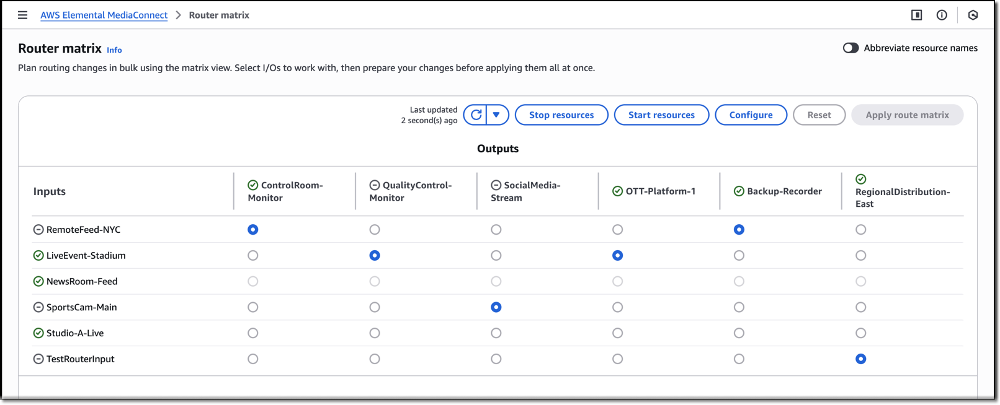
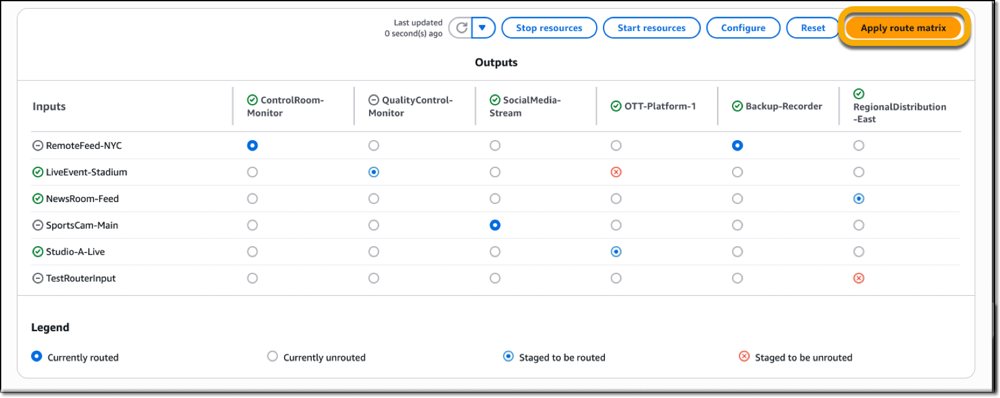

# Using the router matrix view in MediaConnect

The router matrix view helps you manage multiple routes efficiently. Unlike the control
panel where takes happen immediately, the matrix view lets you prepare multiple takes and
review them before applying them all at once.

When routing content, keep in mind the following:

- Each output can take content from only one input at a time.
- Each input can send content to multiple outputs.

###### Tip

If you need to change just one output, you can also take an input from the output
details page. This alternative method works well for individual changes, while the matrix
view is better suited for managing multiple routes.

## Prerequisites

Before you get started, ensure the following:

- You have one or more router inputs
- You have one or more router outputs
- The router inputs and outputs are compatible for pairing

###### Note

Outputs are checked for compatibility with inputs based upon routing scope and maximum bitrate.
When the routing scope is set to regional for a router I/O, it is only compatible with I/O resources
in the same AWS Region. To enable a router input or output for cross-region operation,
set the routing scope to global.

Also, router outputs are only compatible with router inputs of equal or lesser maximum bitrate.
For example, if an input is 20 Mbps, you can't route it to an output that's set up for less than 20 Mbps.

## Procedure

Follow these procedures to open the router matrix view and perform bulk takes.

###### To review the router matrix

1. Open the MediaConnect console at [https://console.aws.amazon.com/mediaconnect/](https://console.aws.amazon.com/mediaconnect/ "https://console.aws.amazon.com/mediaconnect/").
2. Choose **Router matrix**.
3. To see all your router I/Os in the router matrix view, choose **Auto-select resources**. This view supports up to 20 inputs and
   10 outputs.
   - Alternatively, you can manually select inputs and outputs in the **Configure router matrix** pane. This is useful when
     managing a subset of routes, like those for a particular event or program.

The router matrix view shows your available outputs and inputs in a grid
format:

- Rows represent router inputs (your available content sources)
- Columns represent router outputs (your available destinations)
- Each cell represents a potential output assignment

###### To perform a bulk take update

1. In the router matrix view, choose the routes that you want to change.
   - To create a new route, select an empty cell.
   - To remove an existing route, select a populated cell.

2. Choose **Apply route matrix** to save your changes.

 3. Review the outcome:

    1. While the takes are in progress: You'll see which routes are still being
     updated.
    2. If all takes succeed: You'll see a success message confirming the
     update.
    3. If any takes fail: You'll see which routes couldn't be changed and why they
     failed.

###### Note

Each take happens independently. This means some outputs might take their new inputs
faster than others, and if one take fails, the others will still proceed.
