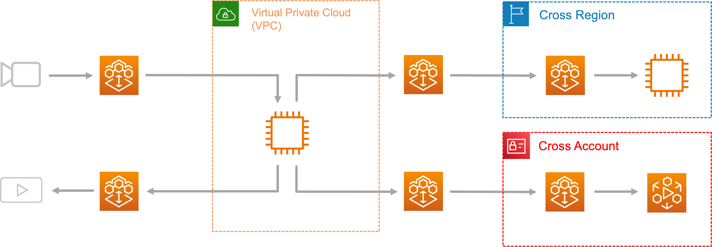

# What is AWS Elemental MediaConnect?

AWS Elemental MediaConnect is a high-quality, reliable live video transport and routing service
that you can use to ingest, distribute, and route live video within and beyond the AWS
Cloud. MediaConnect combines the reliability, security, and visibility of traditional
broadcast infrastructure with the flexibility, scalability, and cost-effectiveness of
cloud-based transmission.

In AWS Elemental MediaConnect, you can work with live video in two ways: you can create a
_flow_ to establish a transport between a source and one or more outputs,
or you can create _router inputs and outputs_ to dynamically route video
between sources and destinations in real time. You can also share content with other AWS
accounts by creating _entitlements_. This allows the receiving account to
create a flow using your content as the source.

With AWS Elemental MediaConnect, you can do the following:

- Ingest live video into the AWS Cloud from on-premises encoders or remote
  sources.
- Distribute live video to multiple destinations inside or outside the AWS
  Cloud.
- Dynamically route live video streams between cloud production tools, encoders,
  and third-party services by using the MediaConnect router.
- Transport uncompressed video at ultra-low latency by using AWS Cloud Digital Interface
  (AWS CDI).
- Receive and distribute video from NDI®-enabled devices and software by using
  Network Device Interface (NDI).
- Subscribe to a live video stream that is supplied by another AWS
  account.
- Send content from one AWS Region to another.
- Normalize diverse contribution protocols and formats for downstream cloud
  production services.

###### Topics

- [MediaConnect concepts and terminology](what-is-concepts.md "what-is-concepts.md")
- [Accessing MediaConnect](what-is-accessing.md "what-is-accessing.md")
- [Pricing for MediaConnect](what-is-pricing.md "what-is-pricing.md")
- [Regions and endpoints for MediaConnect](what-is-regions.md "what-is-regions.md")
- [AWS Elemental MediaConnect open-source attributions](mediaconnect-os-attributions.md "mediaconnect-os-attributions.md")
