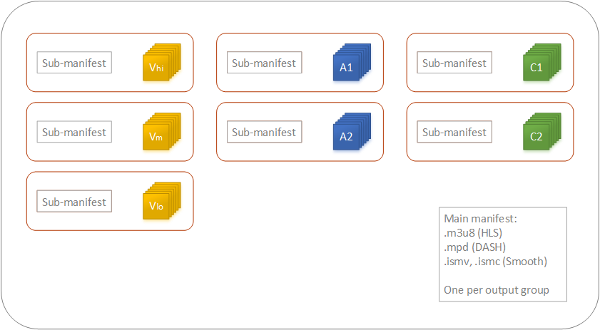
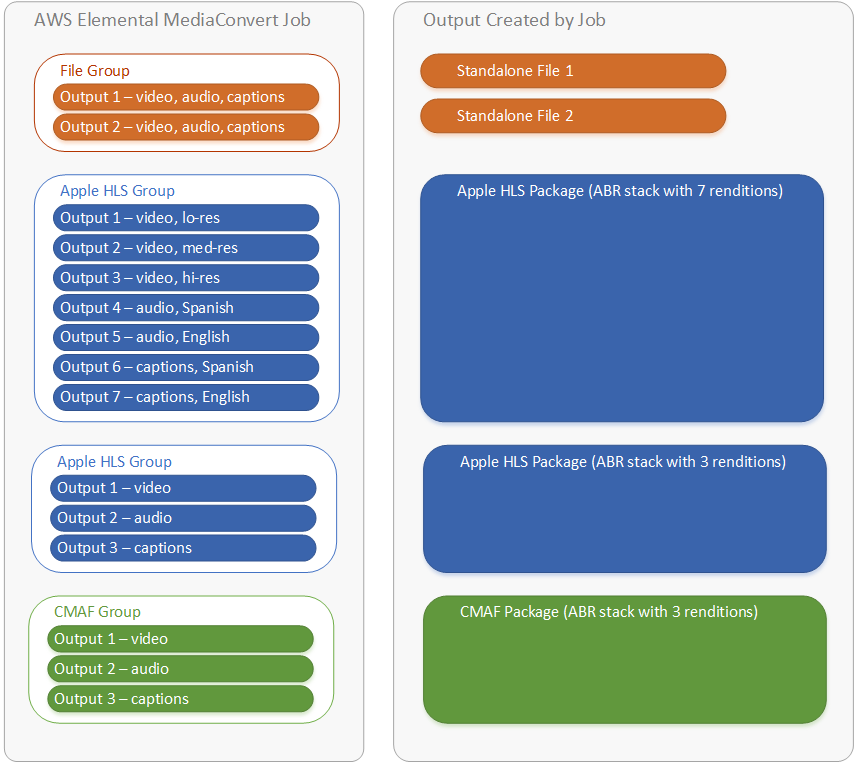

# Using output groups to specify a streaming package

type or standalone file

AWS Elemental MediaConvert output functions differ based on which type of output group it is a
part of.

File

In a **File** output group, each output that you set up
results in a standalone output file.

For example, you might set up one output that contains all the video,
audio, and captions together. You might also set up a separate output for
sidecar captions, such as TTML.

Streaming output packages

In the following output groups, the outputs that you set up are separate
parts of a single adaptive bitrate (ABR) streaming package:
CMAF, Apple HLS, DASH ISO,
and Microsoft Smooth Streaming.

In an ABR output group, each output is usually one element of the media. That is, each
output is one slice in the adaptive bitrate (ABR) stack.
For
example, you might have an output for each of three resolutions of video, an output for
each of two audio language tracks, and an output for each of two captions
languages.

The following illustration shows the relationship between outputs in an ABR output
group and the files that MediaConvert creates. Each
orange
box corresponds to an output within the output group. In this
example, there are three resolutions of video, audio in two languages, and captions in
two languages. The package contains segmented audio, video, and captions files,
plus
manifest files that tell the player which files to download and when
to play them.

A single job can generate zero to many

standalone files and zero to many streaming packages. To create more than one standalone
file, add a single file output group to your job and add multiple outputs to that output
group. To create more than one streaming package, add multiple
**CMAF**, **AppleHLS**, **DASH ISO**,
or **Microsoft Smooth Streaming** output groups to
your job.

The following illustration shows a MediaConvert job that generates two standalone .mp4 files,
two Apple HLS packages, and a CMAF package. A single file
output group with two outputs results in two standalone files. A single Apple HLS output
group with seven outputs results in a single viewable package with seven ABR slices.

For information about setting up output groups and outputs within your job, see [Tutorial: Configuring job settings](setting-up-a-job.md "setting-up-a-job.md").
