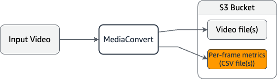

# Per-frame metric reports in AWS Elemental MediaConvert

Per-frame metric reports provide detailed video quality analysis for your MediaConvert outputs.
With these reports, you can analyze your output video quality on a frame-by-frame basis by using
industry-standard quality metrics.

Some use cases for per-frame metric reports might include:

- Evaluate encoding decisions with objective quality measurements.
- Compare different encoding settings across different outputs.
- Identify specific frames or scenes that have low video quality.
- Validate that your encoding settings meet quality thresholds.
  MediaConvert supports the following per-frame metric types:

**PSNR (Peak Signal-to-Noise Ratio)**

Measures the amount of noise (typically compression artifacts) after encoding. Higher
values indicate better quality. Measured in decibels (dB).

**PSNR HVS (Peak Signal-to-Noise Ratio, Human Visual System)**

A variation of PSNR that accounts for the characteristics of human visual perception.
Higher values indicate better quality. Measured in decibels (dB).

**SSIM (Structural Similarity Index Measure)**

Measures structural information like luminance, contrast, and structure. Values range
from 0 to 1, with 1 indicating perfect similarity.

**MS SSIM (Multi-Scale Structural Similarity Index Measure)**

An enhanced version of SSIM that evaluates image quality at multiple resolutions.
Values range from 0 to 1, with 1 indicating perfect similarity.

**VMAF (Video Multi-Method Assessment Fusion)**

A machine learning-based metric trained on human viewer data. VMAF can be a good
indicator of viewer satisfaction for streaming video quality. Values range from 0 to 100,
with higher values indicating better quality.

**QVBR (Quality-Defined Variable Bitrate)**

Represents the QVBR quality level for an individual frame. Values range from 1 to 10.
Higher values indicate better quality. This metric is only available when your output
settings include the QVBR rate control mode.

###### Topics

- [Generating per-frame metric reports](per-frame-metrics-enable.md "per-frame-metrics-enable.md")
- [Metric analysis techniques](per-frame-metrics-analysis.md "per-frame-metrics-analysis.md")
- [Requirements and processing impact](per-frame-metrics-requirements.md "per-frame-metrics-requirements.md")
- [Troubleshooting](per-frame-metrics-troubleshooting.md "per-frame-metrics-troubleshooting.md")
