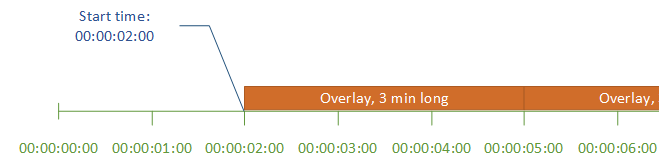

# Specify motion

graphic overlay start time and playback

You can specify motion graphic overlay **Start time** and
**Playback** settings instead of using the default setting.
The following information shows how to specify overlay start time for a video and to
repeat it continuously (loop).

In the following image, the motion graphic overlay setting is three minutes long.
The motion graphic playback is set to repeat until the end of the output.

###### Start time settings for motion overlays

Provide the timecode for the first frame where you want the motion overlay to
appear. This timecode is relative to your input timeline.

For input overlays, **Start time** is relative to the input
timeline. This timeline is affected by the input **Timecode
source** setting.

For more information about the input and output timelines, and the timecode
settings that affect them, see [How MediaConvert
uses timelines to assemble jobs](specifying-inputs.md#how-mediaconvert-uses-timelines-to-assemble-jobs "specifying-inputs.md#how-mediaconvert-uses-timelines-to-assemble-jobs"). For jobs with
multiple inputs, MediaConvert places the motion overlay on each input,
according to the input timeline for that input. After you specify
**Start time** once, MediaConvert applies that value to
all inputs.

###### Tip

To simplify setup, specify **Start time** counting from
00:00:00:00 as the first frame, and set both of the following settings to
**Start at 0**:

- **Timecode configuration**,
  **Source**, under the job-wide settings.
- **Timecode source**, in the **Video
  selector** settings for each input.

###### Playback settings for motion graphic overlays

For playback settings on motion graphic overlays, you have two options. You
can set your overlay to play once through the duration of the motion graphic or
to loop from the start time to the end of the output. The duration of a .mov
motion graphic is built into the .mov file, which has a set number of frames and
a defined frame rate.

When a motion graphic is a set of .png images, determine the duration of the
overlay by how many images you provide and the frame rate that you specify. The
duration in seconds is the number of frames divided by the frame rate, in frames per
second. For example, if your frame rate is 30 fps and you provide 600 images, the
duration of the motion overlay is 20 seconds.

For jobs with multiple inputs, MediaConvert places the motion overlay on each
input at the time that you specify for **Start time**. Depending on
what you choose for **Playback**, MediaConvert either plays the
overlay once or until the end of the input. When you specify
**Playback** once, MediaConvert applies that value to all
inputs.
