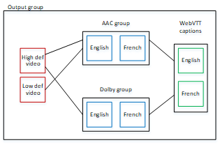
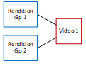
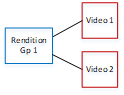

#

Identify the video and audio encodes

You must plan the requirements for the audio rendition group. You must identify
the video encodes that you want in the output group. You then decide on the
individual audio encodes. Finally, you identify the audio rendition groups you want
each encode to belong to.

###### To identify and map the encodes

1. Identify any video encodes that you require in the HLS output group. For
   example, one high-resolution encode and one low-resolution encode.
2. Identify the audio encodes that you require. For example, AAC in English
   and French, and Dolby Digital in English and French.
3. Decide how many audio renditions you require. Review the [rules](#ARG-rules "#ARG-rules") to ensure that you design a rendition
   group that is valid.
4. Give a name to each video, audio, and audio rendition group. For
   example:
   - A video output named `high
definition`.
   - A video output named `low definition`.
   - Audio English AAC named `AAC EN`.
   - Audio French AAC named `AAC FR`.
   - Audio English Dolby Digital named `DD
EN`.
   - Audio French Dolby Digital named `DD
FR`.
   - A rendition group named `AAC group` for AAC
     audio.
   - A rendition group named `DD group` for Dolby
     Digital audio.

5. Identify how you want the video to be associated with the audio rendition
   groups. For example:
   - Video `high definition` to be associated with
     `AAC group` and `DD
group`.
   - Video `low definition` to be associated only
     with `AAC group`.

6. (Optional) For completeness in designing the output group, identify the
   captions that you require.

## Rules for video and audio in rendition

groups

- Both video and captions are optional.
- A video encode can be associated with more than one rendition group.
  For example, _video high_ can be associated with both
  _Dolby audio_ and _AAC audio_.
  There is no need to create separate video encodes for each rendition
  group.

- All the rendition groups associated with the same video must contain
  the same audio encodes. For example, if both the AAC group and the Dolby
  group are associated with the high definition video encode, both these
  groups must contain the same audio languages (perhaps English, French,
  and Spanish).
- An audio encode can belong to only one audio rendition group.
- An audio rendition group can be associated with more than one video.
  For example, the Dolby group can be associated with the high definition
  video encode and the low definition video encode. There is no need to
  create separate rendition groups for each video.

