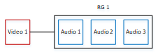
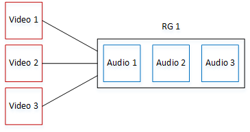
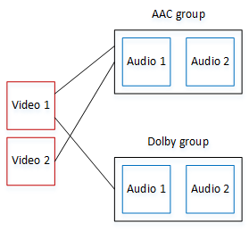

# About audio rendition groups

## Standards compliance

This MediaLive implementation of audio rendition groups is compliant with
_HTTP Live Streaming draft-pantos-http-live-streaming-18_
section 4.3.4.1.1.

## Examples

### Example 1

The HLS output group consists of:

- One video output.
- Three audio outputs (perhaps English, French, Spanish) that all belong
  to the same audio rendition group.

### Example 2

The HLS output group consists of:

- One _video high_ output.
- One _video medium_ output.
- One _video low_ output.
- Three audio outputs (English, French, Spanish) that all belong to the
  same audio rendition group.

### Example 3

The HLS output group consists of:

- One _video high_ output.
- One _video low_ output.
- Two audio outputs (English, French) that each use the AAC codec. These
  outputs both belong to the same audio rendition group, RG1.
- Two audio outputs (English, French) that each use the Dolby Digital
  codec. These outputs both belong to the same audio rendition group,
  RG2.
- The video high output is associated with both audio rendition
  groups.
- The video low output is associated only with the RG1 audio rendition
  group.

