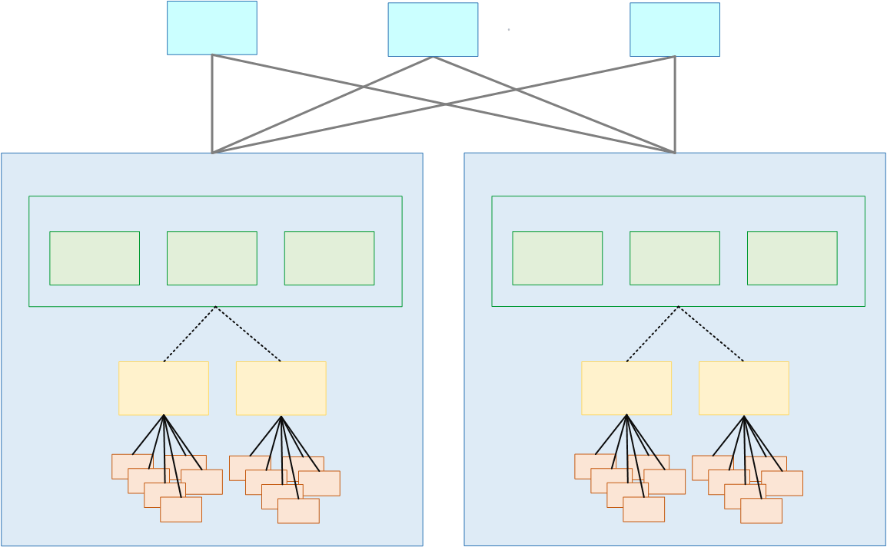

# How MediaLive Anywhere works

An AWS Elemental MediaLive Anywhere deployment involves several components:

- Networks in your organization. These networks are represented by the bright blue boxes
  in the diagram that follows.
- Clusters (blue boxes), which group channel placement groups, nodes, and
  channels.
- Nodes (green boxes), which represent the node hardware. Typically, your deployment
  includes enough nodes to handle the peak channel load, plus some backup nodes for node
  resiliency.
- Channel placement groups (yellow boxes), which group channels.
- Channels (orange boxes), which are the MediaLive channels running specifically on MediaLive Anywhere
  nodes.

A cluster is a collection of nodes. The cluster is associated with one or more networks.

Within each cluster, there are nodes, channel placement groups, and channels.

## Provisioning a MediaLive Anywhere cluster

When you provision the MediaLive Anywhere, you set up the following connections:

- The cluster contains one or more nodes (green boxes). In one cluster, all the nodes
  have identical processing capabilities and identical network interfaces and SDI
  interfaces. The nodes belong to the one cluster.
- A channel placement group (yellow box) is a collection of channels. The channels
  belong to the channel placement group.
- You attach a channel placement group to a node. When the cluster is in production,
  the video engineer creates channels (orange boxes) and attaches each to a specific
  channel placement group.

The nodes are all interchangeable. Any node can encode the channels in any channel
placement group in the cluster.

## MediaLive Anywhere at run time

When the MediaLive video engineer designs a channel, they specify the cluster for the
channel, and the channel placement group within the cluster. The video engineer chooses the
cluster and channel placement group carefully. This is not an ad-hoc decision.

When the MediaLive operator runs the first channel in a channel placement group, MediaLive
chooses a free node in the cluster to run the channel on. After that, whenever another
channel in the channel placement group starts, it always runs on that node.
