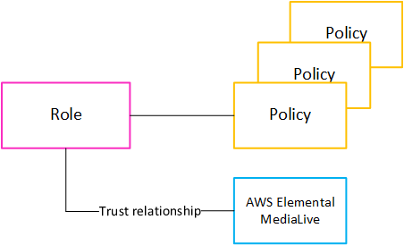

# About the trusted entity role

AWS Elemental MediaLive must be set up so that when a channel is running, MediaLive itself has access to
perform operations on resources that belong to your organization's AWS account. For example,
your deployment might use Amazon S3 as a source for files, such as blackout images, that MediaLive
requires during processing. For MediaLive to obtain these files, it must have read access to some or
all buckets in Amazon S3.

To perform the required operations on those resources, MediaLive must be set up as a
_trusted entity_ on your account.

MediaLive is set up as a trusted entity as follows: A role (that belongs to your AWS account)
identifies MediaLive as a trusted entity. The role is attached to one or more policies. Each policy
contains statements about allowed operations and resources. The chain between the trusted entity,
role, and policies makes this statement:

"MediaLive is allowed to assume this role in order to perform the operations on the resources
that are specified in the policies."

After this role is created, the MediaLive user attaches the role to a specified channel, when
they create or edit the channel. This attachment makes this statement:

"For this channel, MediaLive is allowed to assume this role in order to perform the operations
on the resources specified in the policies."

The attachment is at the channel level, which gives you the flexibility to create different
roles for different channels. Each role gives MediaLive access to different operations and,
especially, different resources.

