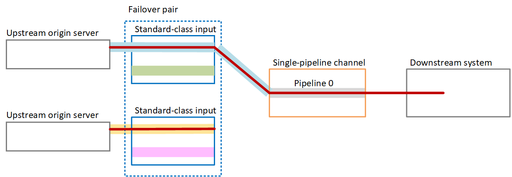
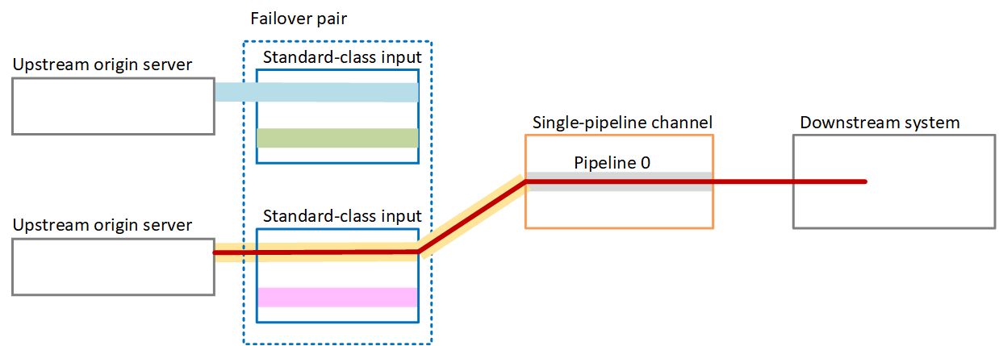

# Automatic input failover in a single-pipeline

channel

You can implement automatic input failover (AIF) in a single-pipeline channel to
protect the MediaLive channel from failure in the upstream system or the network connection
that is upstream of MediaLive.

You can implement automatic input failover in push inputs, but not in pull
inputs.

Keep in mind that the channel can't have more than two push inputs. This means that
you can implement one of these scenarios:

- If your channel has only one push input, you can implement automatic input
  failover for that input. Doing so will use up the limit of two push
  inputs.
- If your channel already has two different push inputs, you won't be able to
  implement automatic input failover for either of these inputs, because you have
  already created the maximum number of push inputs.

###### Note

Pay attention to use of the terms _single_ and
_standard_. The inputs are standard-class. The
channel is single-pipeline.

## How it works

To implement automatic input failover for the selected
input,
you create two standard-class inputs, in the usual way. When you create the channel,
you attach these two inputs and then set them up as a failover pair. Both these
steps are covered in the setting up sections later in this topic.

When you start the channel, the channel ingests the content from both inputs. In
the diagram, the red lines in the inputs indicate that MediaLive ingests both inputs.
But only one input (for example, the blue input in the diagram below) enters the
channel pipeline for processing. The other input (the yellow input) is ingested but
discarded immediately. The pipeline produces one output for the downstream system,
in the usual way.

As this diagram illustrates, there are two instances of the content source.

## Failure handling

If there is a failure, the behavior is as follows:

- If there is a failure upstream of the first input, then automatic input
  failover occurs. The channel immediately fails over to the yellow pipeline
  in the second input, which is already being ingested. The channel fails over
  and starts processing that input. There is no disruption in the channel
  pipeline or in the output.
- If there is a failure in the channel pipeline (for example, in pipeline
  0), MediaLive stops producing output. Switching the input would not help this
  failure because the problem is in the pipeline, not in the input.

This diagram illustrates the flow after there is a failure upstream of the first
input. MediaLive has failed over to the second input.

