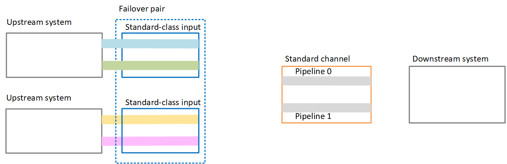
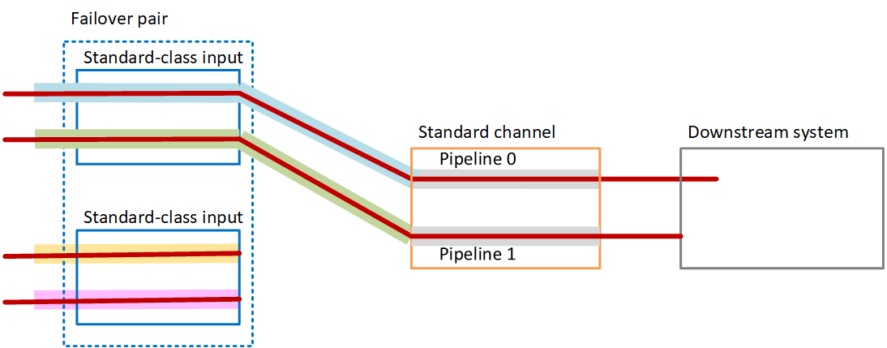
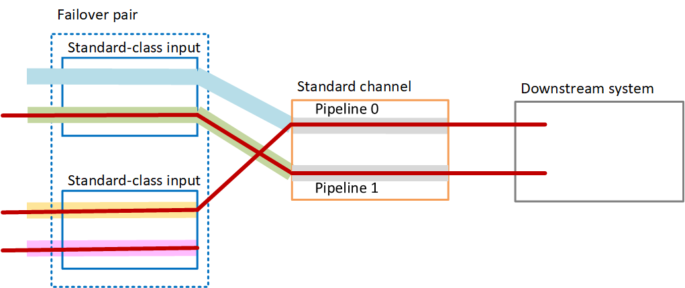
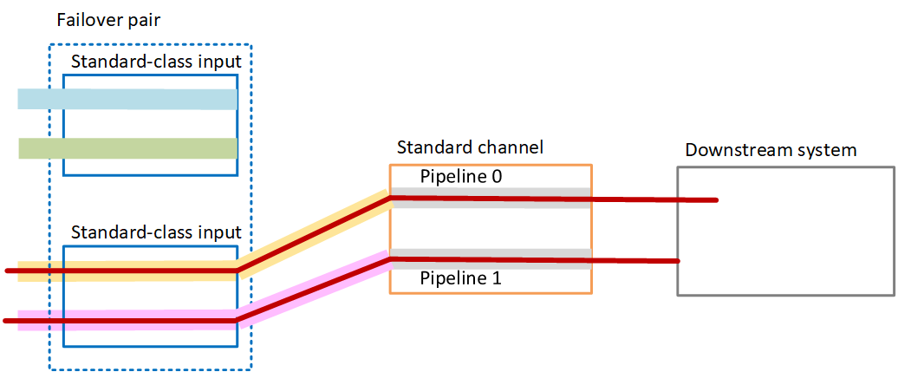

# Automatic input failover in a standard

channel

You can implement automatic input failover in a standard MediaLive channel to protect the
MediaLive channel from failure in the upstream system or the network connection that is
upstream of MediaLive.

You can implement automatic input failover in push inputs, but not in pull inputs.

Keep in mind that the channel can't have more than two push inputs. This means that
you can implement one of these scenarios:

- You can set up two push inputs in the channel, but you won't be able to
  implement automatic input failover for either of these inputs.
- You can set up one push input in the channel, and you can implement automatic
  input failover for that one input.

## How it works

To implement automatic input failover for the selected push input, you create two
standard-class inputs, in the usual way. When you create the channel, you attach
these two inputs and then set them up as a failover pair. Both these steps are
covered later in the setting up sections later in this topic.

When you start the channel, MediaLive ingests the content from both inputs. So it
ingests four sources (as shown by the red lines in the diagram). But only the
content from the first input goes to the channel pipeline. The content from the blue
pipeline goes to pipeline 0. The content from the green pipeline goes to pipeline 1.

The pipeline produces two outputs for the downstream system, in the usual way. The
downstream system chooses to handle one pipeline and to ignore the other
pipeline.

## Failure handling

### Failure scenario 1

If normal processing is in progress and there is a failure in pipeline 0 in
the active input, then the recovery behavior for pipeline redundancy
occurs:

- The channel immediately fails over to pipeline 0 in the second input
  (which is already being ingested) and starts processing that input. The
  channel processes the yellow line in pipeline 0, and the green line in
  pipeline 1. (So there is no change in pipeline 1.) The output is not
  affected.
- The downstream system continues to handle the output from the pipeline
  it had chosen before the problem. The downstream system is not affected
  by the failure in the pipeline 0.

### Failure scenario 2

If normal processing is in progress and there is a failure upstream of the
first input, then automatic input failover occurs:

- The channel immediately fails over to the second input (which is
  already being ingested) and starts processing that input. The yellow
  line is processed in pipeline 0, the pink line in pipeline 1. The output
  is not affected.
- The downstream system continues to handle the output from the pipeline
  it had chosen before the problem. The downstream system is not affected
  by the failure in the first input.

