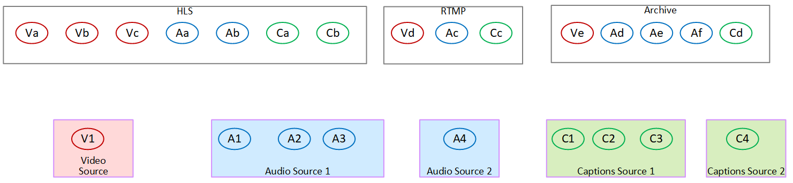
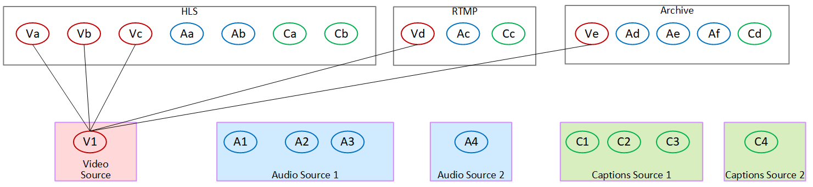
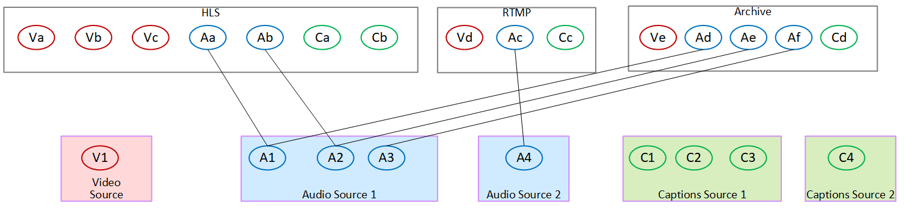
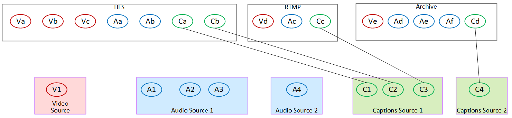

# Map the output encodes

to the sources

In the first step of planning the channel, you identified the number of
encodes you need in each output group. You must now determine which assets
from the source you can use to produce those encodes.

###### Result of this procedure

After you have performed this procedure, you will have identified the
following key components that you will create in the channel:

- The video input selectors
- The audio input selectors

- The captions input selectors
  Identifying these components is the last step in planning the _input_ side of the channel.

###### To map the output to the sources

1. Obtain the _list of output encodes_
   you want to produce. You created this list in the [previous step](planning-encodes.md "planning-encodes.md"). It is useful to
   organize this list into a table. For example:

| Example    | Output group                 | Type of encode                                            | Encode nickname          | Characteristics of the encode |
| ---------- | ---------------------------- | --------------------------------------------------------- | ------------------------ | ----------------------------- | --------------------------------------------------------------- | ------------------------------------------------------------------------------------------------------------------------------------------------------------------------------------------------------------------------------------------------------------------------------------------------------------------------------------------------------------------------------------------------------------------------------------------------------------------------------------------------------------------------------------------------------------------ | --------------------------------------------------------------- | ----------------------------------------------------- | ------------------------- | ------------------------------------------------------------------------------------------------------------------------------------------------------------------------------------------------------------------------------------------------------------------------------------------------------------------------------------------------------------------------------------------------------------------------------------------------------------------------------------------------------------------------------------------------------------------------------------------ | ------------------------------------------------------------------------------------------------------------------------------------------------------------------------------------------------------------------------------------------------------------------------------------------------------------------------------------------------------------------------------------------------------------------------------------------------------------------------------------------------------------------------------------------------------------------------------------------------------------------------------------------------------------------------------------------------------------------------------------------------------------------------------------------------------------------------------------------------------------------------------------------------------------------------------------------------------------------------------------------------------------------ | -------------------- | ------ | --------------- | -------------------- |
| HLS        | Video                        | VideoA                                                    | AVC 1920x1080, 5 Mbps    |
| VideoB     | AVC 1280x720, 3 Mbps         |                                                           | VideoC                   | AVC 320x240, 750 Kbps         |
| Audio      | AudioA                       | AAC 2.0 in English at 192000 bps                          |                          | AudioB                        | AAC 2.0 in French at 192000 bps                                 |
| Captions   | CaptionsA                    | WebVTT (object-style) converted from embedded, in English |                          | CaptionsB                     | WebVTT (object-style) converted from embedded, in French        |
| RTMP       | Video                        | VideoD                                                    | AVC 1920x1080, 5Mbps     |
| Audio      | AudioC                       | Dolby Digital 5.1 in Spanish                              |                          | Captions                      | CaptionsC                                                       | RTMP CaptionInfo (converted from embedded) in Spanish                                                                                                                                                                                                                                                                                                                                                                                                                                                                                                              |
| Archive    | Video                        | VideoE                                                    | AVC, 1920x1080, 8.5 Mbps |
| Audio      | AudioD                       | Dolby Digital 2.0 in Spanish                              |                          | AudioE                        | Dolby Digital 2.0 in French                                     |
| AudioF     | Dolby Digital 2.0 in English |                                                           | Captions                 | CaptionsD                     | DVB-Sub (object-style) converted from Teletext, in 6 languages. | 2. Obtain the _list of sources_ that you created when you assessed the source content and collected identifiers. For an example of such a list, see [Assess the upstream system](evaluate-upstream-system.md "evaluate-upstream-system.md") . 3. In your table of output encodes, add two more columns, labeled _Source_ and _Identifier in source_. 4. For each encode (column 2), find a line in the _list of sources_ that can produce that encode. Add the source codec and the identifier of that source codec. This example shows a completed table. Example | Output group                                                    | Type of encode                                        | Encode nickname           | Characteristics of the encode                                                                                                                                                                                                                                                                                                                                                                                                                                                                                                                                                              | Source                                                                                                                                                                                                                                                                                                                                                                                                                                                                                                                                                                                                                                                                                                                                                                                                                                                                                                                                                                                                             | Identifier in source |
| ---        | ---                          | ---                                                       | ---                      | ---                           | ---                                                             |
| HLS        | Video                        | VideoA                                                    | AVC 1920x1080, 5 Mbps    | HEVC                          | PID 600                                                         |
| VideoB     | AVC 1280x720, 3 Mbps         | HEVC                                                      | PID 600                  |                               | VideoC                                                          | AVC 320x240, 750 Kbps                                                                                                                                                                                                                                                                                                                                                                                                                                                                                                                                              | HEVC                                                            | PID 600                                               |
| Audio      | AudioA                       | AAC 2.0 in English at 192000 bps                          | AAC 2.0                  | PID 759                       |                                                                 | AudioB                                                                                                                                                                                                                                                                                                                                                                                                                                                                                                                                                             | AAC 2.0 in French at 192000 bps                                 | AAC 2.0                                               | PID 747                   |
| Captions   | CaptionsA                    | WebVTT (object-style) converted from embedded, in English | Embedded                 | Channel 4                     |                                                                 | CaptionsB                                                                                                                                                                                                                                                                                                                                                                                                                                                                                                                                                          | WebVTT (object-style) converted from embedded, in French        | Embedded                                              | Channel 2                 |
| RTMP       | Video                        | VideoD                                                    | AVC 1920x1080, 5Mbps     | HEVC                          | PID 600                                                         |
| Audio      | AudioC                       | Dolby Digital 5.1 in Spanish                              | Dolby Digital 5.1        | PID 720                       |                                                                 | Captions                                                                                                                                                                                                                                                                                                                                                                                                                                                                                                                                                           | CaptionsC                                                       | RTMP CaptionInfo (converted from embedded) in Spanish | Embedded                  | Channel 3                                                                                                                                                                                                                                                                                                                                                                                                                                                                                                                                                                                  |
| Archive    | Video                        | VideoE                                                    | AVC, 1920x1080, 5 Mbps   | HEVC                          | PID 600                                                         |
| Audio      | AudioD                       | Dolby Digital 2.0 in Spanish                              | AAC 2.0                  | PID 746                       |                                                                 | AudioE                                                                                                                                                                                                                                                                                                                                                                                                                                                                                                                                                             | Dolby Digital 2.0 in French                                     | AAC 2.0                                               | PID 747                   |
| AudioF     | Dolby Digital 2.0 in English | AAC 2.0                                                   | PID 759                  |                               | Captions                                                        | CaptionsD                                                                                                                                                                                                                                                                                                                                                                                                                                                                                                                                                          | DVB-Sub (object-style) converted from Teletext, in 6 languages. | Teletext                                              | PID 815                   | You will use this information when you create the channel:  • You will use the source and source identifier information when you [create the input selectors](input-video-selector.md "input-video-selector.md").  • You will use the characteristics information when you [create the encodes](creating-a-channel-step6.md "creating-a-channel-step6.md") in the output groups. 5. After you have identified the source assets, group those assets that are being used more than once, to remove the duplicates. 6. Label each asset by its type—video, audio, or captions. Example | Input asset                                                                                                                                                                                                                                                                                                                                                                                                                                                                                                                                                                                                                                                                                                                                                                                                                                                                                                                                                                                                        | Asset nickname       | Source | Characteristics | Identifier in Source |
| ---        | ---                          | ---                                                       | ---                      | ---                           |                                                                 | video 1                                                                                                                                                                                                                                                                                                                                                                                                                                                                                                                                                            | Video1                                                          | Video                                                 | HEVC                      | PID 600                                                                                                                                                                                                                                                                                                                                                                                                                                                                                                                                                                                    |
| audio 1    | Audio1                       | Audio                                                     | AAC 2.0 Spanish          | PID 746                       |                                                                 | audio 2                                                                                                                                                                                                                                                                                                                                                                                                                                                                                                                                                            | Audio2                                                          |                                                       | AAC 2.0 French            | PID 747                                                                                                                                                                                                                                                                                                                                                                                                                                                                                                                                                                                    |
| audio 3    | Audio3                       |                                                           | AAC 2.0 English          | PID 759                       |                                                                 | audio 4                                                                                                                                                                                                                                                                                                                                                                                                                                                                                                                                                            | Audio4                                                          |                                                       | Dolby Digital 5.1 Spanish | PID 720                                                                                                                                                                                                                                                                                                                                                                                                                                                                                                                                                                                    |
| captions 1 | Captions1                    | Captions                                                  | Embedded French          | Channel 2                     |                                                                 | captions 2                                                                                                                                                                                                                                                                                                                                                                                                                                                                                                                                                         | Captions2                                                       |                                                       | Embedded Spanish          | Channel 3                                                                                                                                                                                                                                                                                                                                                                                                                                                                                                                                                                                  |
| captions 3 | Captions3                    |                                                           | Embedded English         | Channel 4                     |                                                                 | captions 4                                                                                                                                                                                                                                                                                                                                                                                                                                                                                                                                                         | Captions4                                                       |                                                       | Teletext, all languages   | PID 815                                                                                                                                                                                                                                                                                                                                                                                                                                                                                                                                                                                    | ## Example of mapping The following diagrams illustrate the mapping of the output encodes back to source assets. The first diagram shows the outputs (at the top) and the sources (at the bottom). The other three diagrams shows the same outputs and sources with the mappings for video, for audio, and for captions. **Encodes and assets**  **Mapping video encodes to assets**  **Mapping audio encodes to assets**  **Mapping captions encodes to assets**  |
