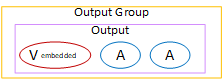
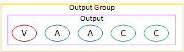

# Organize encodes in an Archive output

group

An Archive output group
can
contain
the following:

- One or
  more
  outputs.
  The output contains the following:

- One video encode.
- Zero or more audio encodes.
- Zero or more captions encodes. The captions are either embedded or
  object-style captions.
  Typically,
  the Archive output group mirrors the output structure of another output group. For
  example, it might mirror the ABR stack in an HLS output group.

This diagram illustrates an Archive output group that contains one output that holds
one video encode with embedded captions, and two audio encodes.

This diagram illustrates an Archive output group that contains one output that holds
one video encode, two audio encodes, and two object-style captions encode.

