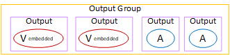
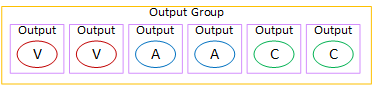

# Organize encodes in a CMAF Ingest output

group

A CMAF Ingest output group
typically
set up as a video ABR stack. A video ABR stack is an output group that contains the
following:

- More than one outputs.
  Each output can contain the following:

- One video
  encode (rendition). Typically, each video encode is a different resolution.
- Zero or more audio encodes.
- Zero or more captions encodes.
  The
  captions are
  embedded
  captions or sidecar captions.
  This diagram illustrates a CMAF Ingest output group when the captions are embedded in
  the video. Each video encode is in a separate output. The captions are in each video
  output. Each audio encode is in a separate output.

This diagram illustrates a CMAF Ingest output group when the captions are sidecar
captions. Each encode is in its own output.

