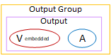
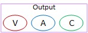

# Organize encodes in an RTMP output group

An RTMP output group
can
contain
the following:

- One or
  more
  outputs.
  Each output can contain the following:

- One video encode.
- Zero or one audio encodes.
- Zero or one captions encodes.
  This diagram illustrates an RTMP output group
  that contains one
  output where the captions are embedded in the video encode.

This diagram illustrates an RTMP output group
that contains one
output with object-style captions.

