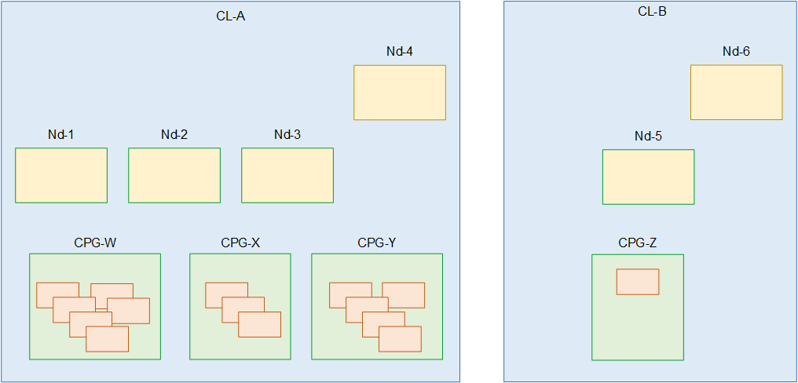

# Designing the cluster

This section is intended for the video engineer who is responsible for designing the
MediaLive Anywhere workflows. You must design the cluster and provide information to the network engineer
who is responsible for connecting the MediaLive Anywhere nodes to your organization's network.

## Assess your channels

1. Identify your encoding requirements for the MediaLive channels that you expect to
   create.
2. Identify the node hardware requirements for each channel, in terms of the SDI
   connections. For example, a channel might need an SDI quad-link connection.
3. Assess the processing power and memory that you need for each channel. Keep in mind
   that MediaLive Anywhere channels are all single-pipeline channels.

## Group your channels

1. Organize the channels into groups, based on identical node hardware requirements.
2. Then divide these sub-groups so one node can handle the processing power and memory
   demands for the maximum number of channels that you expect to run at one time. You must
   make sure that you don't get into a situation where the number of active channels
   overloads the node.
3. Each sub-group is a _channel placement group_.

Each node handles one channel placement group. Each channel placement group handles a
specific set of channels. Organize groups into clusters

## Organize groups into clusters

1. Identify the number of nodes that you will need for your deployment. This number is
   equal to the number of channel placement groups during your busiest period. In other
   words, it’s the maximum number of channel placements groups you need to be able to
   handle at the same time.

These nodes are collected into a _cluster_ of
active nodes. 2. Decide how many backup nodes you want in each cluster. This decision is a risk
assessment exercise. At one extreme, you could decide on one backup for each active
node. At the other extreme, you could identify one backup to serve all the active
nodes.

You now have a cluster of active and backup nodes.

The following diagram illustrates the possible design of a MediaLive Anywhere cluster.

CL stands for cluster. Nd stands for node. CPG stands for channel placement group. The
orange boxes are channels.

In this diagram, there are two clusters. Both clusters are associated with the same two
networks.

- In Cl-A, there are three active nodes and one backup node (Nd-4). All the nodes have
  the same processing power, memory, and physical interfaces.

In Cl-A there are also three channel placement groups. There are channels associated
with each channel placement group. One or more of the channels in any channel placement
group can run on any of the nodes in the cluster. Two channel placement groups can't run
on the same node at the same time. One node is capable of running all the channels in one
channel placement group simultaneously. Although note that you start each channel
individually.

- In Cl-B, there is one active node and one backup node.

In Cl-B there is only one channel placement group and only one channel. It's possible
that this is a channel with high processing demands so that it requires its own node
hardware, which means it belongs in a separate cluster. It's acceptable, there is no rule
that a channel placement group must have more than one channel attached to it. There is
only one active node in the cluster, for that single channel.
