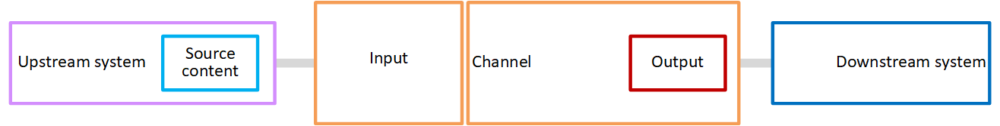
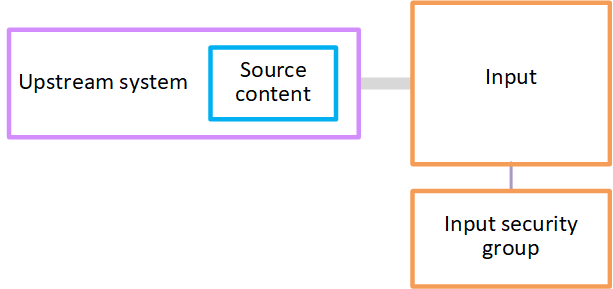
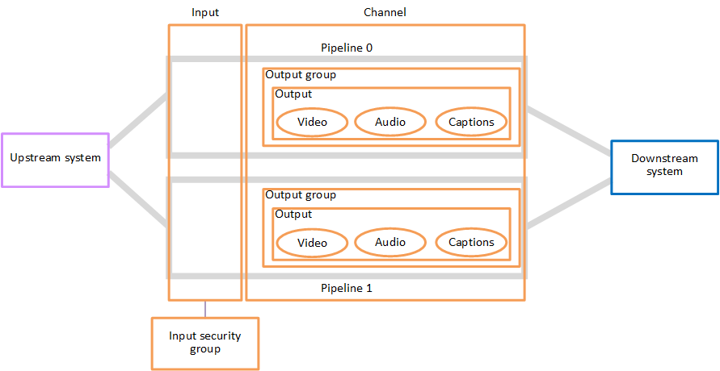

# How MediaLive works

From the point of view of AWS Elemental MediaLive, a live streaming workflow that includes MediaLive involves
three systems:

- A MediaLive _channel_, which ingests and transcodes source content.
- One or more _upstream systems_ that
  provide the _source content_ (the video and
  other media) to MediaLive.

Examples of an upstream system are a streaming camera or appliance that is directly
connected to the internet, or a contribution encoder that is located in a sports stadium where
a sports event is being held.

The source content is in a specific package format and protocol. For example, the source
content might be available as streaming HLS or streaming TS (transport stream). The source
content contains video, audio, and optional captions streams that are in specific codecs or
formats.

- One or more _downstream systems_ that are the
  destinations for the output that MediaLive produces.

A typical downstream system consists of an origin service or a packager that is connected
to MediaLive, a content distribution network (CDN) that is downstream of the origin service or the
packager, and a playback device or website where the users view the content. AWS Elemental MediaPackage is an
example of an origin service and packager. Amazon CloudFront is an example of a CDN.
To create a MediaLive workflow, you create one or more MediaLive inputs. The inputs contain
information about how MediaLive and the upstream system are
connected.
You also create a MediaLive channel and attach the inputs to the channel. The channel configuration
data includes information about how MediaLive connects to the downstream systems.

This setup connects the components as illustrated in this diagram.

To start processing the content, you start the channel. When the channel is running, it
ingests the source content from the upstream system that is identified by the input. The channel
then transcodes that video (and the related audio, captions, and metadata) and creates outputs.
MediaLive sends the outputs to the specified downstream systems.

###### Topics

- [MediaLive inputs](#input-side-overview "#input-side-overview")
- [MediaLive channels](#medialive-channel-overview "#medialive-channel-overview")
- [MediaLive pipelines](#what-is-pipeline "#what-is-pipeline")
- [MediaLive schedule](#schedule-overview "#schedule-overview")

## MediaLive inputs

An input contains information about how the upstream system and the channel connect to each
other. The connection between the input and the upstream system might be a push (the upstream
system pushes the content) or a pull (MediaLive pulls the content from the upstream system).

A push input has a MediaLive _input security group_ associated
with it. The input security group identifies a range of IP addresses that includes the source
addresses on the upstream system. IP addresses within this range are allowed to push content to
the input.

## MediaLive channels

A channel can have several inputs attached to it, but it only ingests source content from
one input at a time. (You use the channel [schedule](#schedule-overview "#schedule-overview") to set up the channel to switch from one input to
another.)

The channel ingests the source content, transcodes it (decodes and encodes it), and
packages it into _output groups_.

The channel contains one or more output groups. There are different types of output groups
to handle the requirements of different downstream systems.

The output group consists of one or more _outputs_. Each
output contains a specific combination of _encodes_. An encode
is one video stream, one audio stream, or one captions track. Different encodes have different
characteristics. The rules for combining encodes into outputs and for combining outputs into
output groups depend on the type of the output group.

The following diagram is a detailed illustration of the workflow.

The illustration shows a channel with only one output group.

As another example, the channel might contain one HLS output group and one RTMP output
group. The HLS output group might contain two outputs. One HLS output contains one
high-resolution video, one audio, and one captions encode. The other HLS output contains one
low-resolution video, one audio, and no captions. The RTMP output group contains one output that
contains one video and one audio.

For information about designing this workflow and creating a channel, see [Planning a MediaLive workflow](container-planning-workflow.md "container-planning-workflow.md").

## MediaLive pipelines

The processing within MediaLive occurs within one or two pipelines.

If you set up the workflow so that the channel and inputs have two
pipelines (recommended), both pipelines work independently of each other but
perform identical processing. Setting up with two pipelines provides
resiliency within MediaLive.

With two pipelines, the upstream system must be set up to provide two
sources, and the downstream system must be set up to receive two
outputs.

## MediaLive schedule

Each MediaLive channel has one schedule associated with it. You add actions to the schedule to
suit your requirements. There are different types of actions, including "switch input" (to
switch to ingesting a different input) and "insert image overlay" (to overlay an image that you
specify onto the video).

You can add these actions when the channel isn't running or when it is running. MediaLive sends
the actions to the channel at the time identified in the schedule, and the channel performs the
action.

For more information about schedules, see [Creating an AWS Elemental MediaLive
schedule](working-with-schedule.md "working-with-schedule.md")
