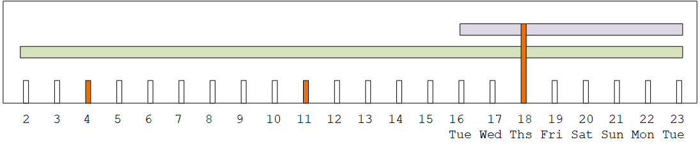

# Changing the maintenance window

There are two ways to change the maintenance window (red mark). You can edit the
maintenance window, or you can seta specific date. The method to choose depends on your
reasons for wanting the change. The following table compares the reason and period for the two
methods. Read across each row to compare the two methods.

|                                     | Edit the maintenance window                                                                                                                                              | Set a specific date                                                                                                                                                                                                                |
| ----------------------------------- | ------------------------------------------------------------------------------------------------------------------------------------------------------------------------ | ---------------------------------------------------------------------------------------------------------------------------------------------------------------------------------------------------------------------------------- |
| Reason for change                   | Use this method if you're happy to wait until the next maintenance opening (purple bar), but the current day of the week and/or time doesn't suit your operations. | Use this method if you don't want to wait until the next maintenance opening (purple bar) for maintenance. You want to move the maintenance window earlier in the maintenance event period (green bar).                      |
| Period when you can make the change | Any time from the minute that you create the channel until one minute before the start of the upcoming maintenance window (red mark).                                 | From the start of the maintenance event period (green bar) until one minute before the start of the upcoming maintenance window (red mark). You can't change the maintenance window outside of the maintenance event period. |

## Change the maintenance window

You can change the current maintenance window (red mark). The following rules
apply:

- You can change the window at any time from the minute that you create the channel
  until one minute before the maintenance window in the current or next maintenance event.
  Therefore, following our example, you can change the window at any time until Thursday,
  May 18 at 3:59 UTC.
- The new window applies to future maintenance events, not just to the next
  maintenance event. The maintenance window will change, for example, from every Thursday
  to every Saturday.
- You can move the maintenance window to an earlier day or a later day of the week.
  Maintenance will occur in that window during the maintenance opening (purple bar). For
  example, you can change the maintenance window to Saturdays, at 03:00 UTC. This specific
  maintenance event will occur on Saturday, May 20, some time from 03:00 to 05:00
  UTC.
- You can't change the window if doing so would mean that the current maintenance
  event won't occur. For example, on Thursday, May 17 at 1:00 UTC you can't change the
  window to Wednesdays because the next Wednesday is May 24, which is after the deadline.

1. Open the MediaLive console at [https://console.aws.amazon.com/medialive/](https://console.aws.amazon.com/medialive/ "https://console.aws.amazon.com/medialive/").
2. In the navigation pane, choose **Channels**, and select one or more
   channels. Select only channels that have the status **Maintenance
   Required**.
3. Choose **Channel actions**, and then choose **Edit channel
   maintenance window**.
4. On the dialog that appears, set **Start day** and **Start
   hour**. Choose **Save**.

## Set a specific date

You can set up a specific date and time for the maintenance window (red mark). The
following rules apply:

- You can change the window at any time from the start of the maintenance event period
  (green bar) until one minute before the start of the current maintenance window.
  Therefore, following our example, you can change the window at any time from 0.01 UTC on
  May 2 until Thursday, May 18 at 3:59 UTC.
- The specific date and time can be any time in the maintenance event period (green
  bar), so long as the new date is still in the future.
- This action sets a specific date for the maintenance, and it also changes the
  maintenance window changes to the day of the week of the specific date, and the time of
  the specific date. For example, if you specify Tuesday, May 9 at 2:00 UTC, then the
  maintenance window changes permanently to Tuesdays at 2:00 UTC.

1. Open the MediaLive console at [https://console.aws.amazon.com/medialive/](https://console.aws.amazon.com/medialive/ "https://console.aws.amazon.com/medialive/").
2. In the navigation pane, choose **Channels**, and select one or more
   channels. Select only channels that have the status **Maintenance
   Required**.
3. Choose **Channel actions**, and then choose **Edit channel
   maintenance window**.
4. On the dialog that appears, set a **Start hour**.
   Ignore **Start date**.
5. Expand **Additional maintenance settings** in the
   **Upcoming maintenance** section. In **Maintenance window
   date**, set the specific date. Choose **Save**.
