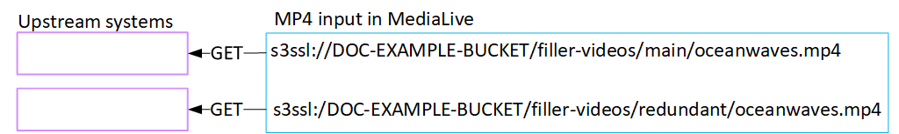

# Result of this procedure

As a result of this setup, a MediaLive input exists that specifies one or two
_source_ URLs. These sources are the URLs for
the source content on the upstream server.

When you start the channel, MediaLive will connect to the upstream system at this
source location or locations and pull the content:

- For a standard channel, MediaLive expects the upstream system to provide two
  sources and will therefore attempt to pull from both source
  locations.
- For a single-pipeline channel, MediaLive expects the upstream system to
  provide one source and will therefore attempt to pull from one source
  location.

