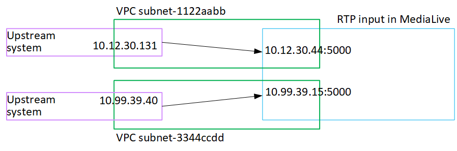

# Result of this procedure

As a result of this setup, an RTP input exists that specifies one or two _endpoint_ URLs. These endpoints are elastic network
interfaces (ENIs) on your VPC. MediaLive has permission to use these ENIs for its inputs.
MediaLive has permission (through the IAM trusted entity role) to automatically manage the
ENIs for its inputs. The upstream system has permission, through the Amazon VPC security
group, to push content to these endpoints.

Each address is in one of those subnets. In this way, the delivery of the content from
the upstream system to MediaLive takes place within the security of the VPC.

The upstream system or systems have been set up to push the source content to the two
endpoints (if you are setting up for a standard channel) or to one endpoint (if you are
setting up for a single-pipeline channel). At least one VPC security group has been
associated with each subnet. The CIDR block in each security group covers the two URLs
that the upstream system pushes from, which ensures that MediaLive accepts the pushed
content.

Each output of the upstream system has an IP address in one of the specified subnets
in your VPC. The RTP input has two IP addresses, and each address is in one of those
subnets. In this way, the delivery of the source content from the upstream system to
MediaLive takes place within the privacy of the VPC.

Keep in mind that with a push input, the upstream system must be pushing the video
source to the input when you start the channel. The upstream system does not need to be
pushing before then.

At runtime of the channel, MediaLive reacts to the content that is being pushed and
ingests it.

