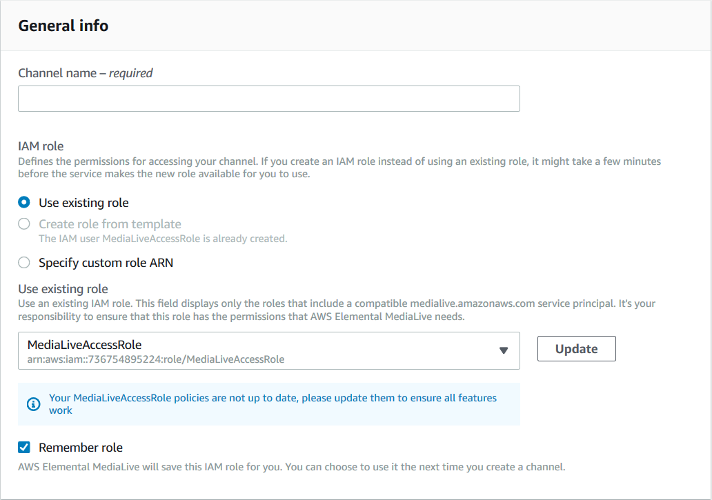

# Create the trust entity – simple option

Read this section if you decided that you should use the [simple option](scenarios-for-medialive-role.md "scenarios-for-medialive-role.md") for setting up the trusted entity.

With the simple option, MediaLive users must have permissions to use the trusted entity wizard,
which is in the **IAM Role** section on the **Channel and input
details** pane:

You
must set up all MediaLive users with permissions to use the wizard to perform two
types of activities:

- Create and update the MediaLiveAccessRole trusted entity. The first user to create a
  MediaLive channel creates the trusted entity. Then each time MediaLive releases a new feature that
  requires new permissions, a user must press a button that automatically updates the trusted
  entity.
- Use the wizard to attach the MediaLiveAccessRole trusted entity to a channel. Every time a
  user creates a channel, they must attach this trusted entity to the channel.
  You must give all users the access described in the following table. All the actions are in
  the IAM service. Include all these actions in the policy (or in one of the policies) that you
  create for the users.

| Fields in the wizard                 | Description                                                                                                                                                                                                                                                                      | Actions                                            |
| ------------------------------------ | -------------------------------------------------------------------------------------------------------------------------------------------------------------------------------------------------------------------------------------------------------------------------------- | -------------------------------------------------- |
| Use existing role                    | Users must be able to select `MediaLiveAccessRole` from the selection field that accompanies the **Use existing role** field.                                                                                                                                                    | `ListRole` `PassRole`                              |
| **Create role from template option** | Users must be able to select the **Create role from template** field. (The role needs to be created only once, by the first user to create a channel. But it is easiest to give these permissions to all users.)                                                                 | `CreateRole` `PutRolePolicy` `AttachRolePolicy`    |
| **Specify custom role ARN**          | Users don't need to be able to select this field. They will use `MediaLiveAccessRole`. They will never use a custom role.                                                                                                                                                        | None                                               |
| **Update** button                    | This button appears only if `MediaLiveAccessRole` isn't up to date. Users must be able to select this button so that MediaLive updates the `MediaLiveAccessRole` with new permissions. Permissions must sometimes be added to the role when a new feature is added to MediaLive. | `GetRolePolicy` `PutRolePolicy` `AttachRolePolicy` |
